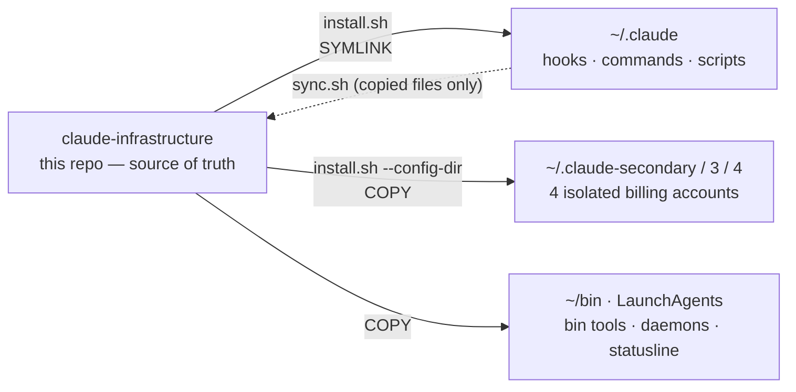

<div align="center">

# Claude Code Infrastructure

**Make one machine behave like a fleet — dozens of parallel Claude Code sessions across four accounts, versioned so updates never break a running session, with every Write recoverable and every past session one search away.**

[](#find-any-past-session-in-milliseconds)
[](#lifecycle-hooks-on-every-tool-call)
[](#deploy-model)

[Deploy model](#deploy-model) · [Parallel sessions](#run-unlimited-parallel-sessions) · [Updates](#never-break-a-running-session-on-update) · [Hooks](#lifecycle-hooks-on-every-tool-call) · [Backups](#every-write-is-recoverable) · [Search](#find-any-past-session-in-milliseconds) · [Install](#install)

</div>

Custom infrastructure for [Claude Code](https://claude.ai/code) — **11,500+ lines across 90+ files** that turn `~/.claude` from a pile of machine state into a deployable, version-controlled system. Parallel sessions never corrupt each other, updates never break a running session, every Write is recoverable, and any past session is one search away. Battle-tested across **4,300+ sessions**.

---

## Deploy model

**The repo is the source of truth; your `~/.claude` is its deployment.** Claude Code reads its behavior from `~/.claude/` — but that directory tangles machine state (transcripts, caches, logs) with the *portable system* that drives it (hooks, commands, scripts, agents). This repo **is** that portable system, and `install.sh` deploys it:



- **Primary `~/.claude` → symlinks.** Edits to a live hook, command, or script land in this repo directly, so nothing silently drifts out of version control. (The failure that motivated the 2026-07-03 hardening: a *copied* `handoff-fire.sh` had drifted +198 lines in the deployment and was one `install.sh` from being clobbered.)
- **The four account dirs → copies**, kept independent so a rate-limited account can't perturb another.
- **Global surfaces → copies** (`~/bin`, LaunchAgents, `statusline.sh`); `sync.sh` pulls hand-edits of those copied files back.

<details>
<summary><b>What actually lives in <code>~/.claude/</code></b></summary>

<br>

```
~/.claude/                       # config dir — machine state + the deployed system
├── settings.json · .mcp.json    # permissions, hooks, env · MCP servers
├── CLAUDE.md                    # global instructions (synced)
├── model-config.yaml            # model / effort / frontier SSOT (per-machine)
├── hooks/  commands/  scripts/  # SYMLINKED from this repo (edits go live)
├── bin/it2                      # iTerm2 teammate wrapper (copied)
├── backups/                     # auto-backups (10/file, 30-day TTL)
├── plan-history/                # plan snapshots (separate git repo)
├── session-index.db             # FTS5 session search
└── projects/                    # per-project memory + transcripts

~/.claude-versions/   current -> 2.1.114      # atomically-symlinked installs
~/bin/                claude-latest · claude-update · claude-versions
~/Library/LaunchAgents/   session-search sweep (60s) + backfill (weekly)
```

</details>

## What's inside

Six subsystems, each fixing one way a single-machine Claude workflow breaks down:

| Subsystem | The problem it removes | Entry point |
|---|---|---|
| **Parallel sessions** | Concurrent sessions corrupt a shared git index | [`handoff-fire.sh`](scripts/handoff-fire.sh) · [`WORKTREE_WORKFLOW.md`](docs/WORKTREE_WORKFLOW.md) |
| **Versioned updates** | npm overwrites the binary under running sessions | [`bin/claude-latest`](bin/claude-latest) |
| **Lifecycle hooks** | No guardrails or automation on tool calls | [30+ hooks](hooks/) across 8 events |
| **Backup & recovery** | An overwrite loses work silently | [`backup-before-write.sh`](hooks/backup-before-write.sh) |
| **Plan & task persistence** | Plans and tasks scatter and get lost | [`plan-version-commit.sh`](hooks/plan-version-commit.sh) |
| **Session search** | `/resume` is a flat, unsearchable list | [claude-session-search](https://github.com/renchris/claude-session-search) |

---

## Run unlimited parallel sessions

The subsystem this repo is named for. One machine runs a lead, Agent-Teams teammates, and N autonomous handoff tracks across four accounts — safely, because every writer is worktree-isolated and both launch (`/handoff`) and landing (`/ship`) collapse to a single command. Full derivation: **[`docs/WORKTREE_WORKFLOW.md`](docs/WORKTREE_WORKFLOW.md)**.

```mermaid
flowchart LR
    subgraph Launch["/handoff — launch"]
      direction TB
      H["/handoff<br/>readiness-gated"] --> Claim["worktree-pool.sh claim<br/>~3s warm slot"]
      Claim --> Pane["split the FIRING window<br/>(⌘D-style, not app-frontmost)"]
      Pane --> Sess["fresh session:<br/>account · model · effort · prompt"]
    end
    Sess --> Work["work in the worktree"]
    Work --> Ship
    subgraph Ship["/ship — land"]
      direction TB
      S["/ship"] --> Lock["land-lock<br/>one pusher, machine-wide"]
      Lock --> Rec["reconcile onto origin/main<br/>migration-safe"]
      Rec --> Push["CI=true push HEAD:main"]
    end
    Push --> Deploy["origin/main →<br/>Path F + Amplify"]
```



Three traps make naive automation fail; the tooling defeats each:

- **Concurrent sessions share one git index** → bare commits sweep another session's staged files, ref-lock races, clobber. Fix: every writer gets its own **worktree**, and a warm **pool** (`worktree-pool.sh`) hands one out in ~3 s pre-provisioned (node_modules, codegen, `.env.local`, seeded DB).
- **Launchers are zsh functions** (`claude-next*`, `claude-fable*`, carrying per-account isolation) that no script can `exec`. Fix: `handoff-fire.sh` **types** the launch command into a fresh iTerm2 surface via osascript — anchored to the **firing agent's own window** (via `$ITERM_SESSION_ID`), so the split lands where you're looking, not in whatever window happens to be frontmost.
- **A hot trunk means N landers race**, each re-running the gate. Fix: `/ship` folds fetch → reconcile → gate → push into ONE machine-wide-locked child (`land-lock.sh`), so exactly one gate runs per landing and the trunk can't move under the push; reconcile is migration-journal-aware (rebase vs reset + cherry-pick + renumber).

| Command | What it does | Detail |
|---|---|---|
| `/handoff` | Bridge context to a fresh session; **fire** it autonomously when nothing's open | [`commands/handoff.md`](commands/handoff.md) |
| `handoff-fire.sh --split-right` | Split the firing window; launch account + model + effort + prompt | script header |
| `handoff-fire.sh --recycle` | Exit + relaunch the CURRENT pane in place | script header |
| `handoff-fire.sh self-close` | Retire this session's pane once its work is away | script header |
| `/ship` *(project-side)* | Reconcile onto `origin/main` + push `HEAD:main`, serialized | [WORKTREE_WORKFLOW.md](docs/WORKTREE_WORKFLOW.md) |

> **Portable vs project-specific.** `handoff-fire.sh`, the isolation policy, and the workflow doc are the **portable** half and live here. The pool, `/ship`, and `land-lock` are **project-specific** (trunk, tenants, migrations) and live in the project repo — this workflow just documents how they connect. Account/model/effort routing reads `~/.claude/model-config.yaml` (per-machine, not synced).

---

## Never break a running session on update

**Problem**: npm overwrites Claude's binary in-place during updates, causing `ENOTEMPTY` errors when live sessions hold file handles.

**Solution**: Homebrew-style parallel installations — each version lives in its own directory, a symlink points to the active one, and old sessions keep their loaded binaries untouched.

```
~/.claude-versions/
├── 2.1.113/          # previous version (rollback target)
├── 2.1.114/          # current version
└── current -> 2.1.114 # atomic symlink (rename(2), NOT ln -sfn)
```

The `claude` shell function calls `claude-latest` instead of the binary directly. `claude-latest` ([`bin/claude-latest`](bin/claude-latest)) rotates its log, checks npm (10-min cache), cleans stale versions *before* install (disk-full resilience), installs to an isolated dir under a `mkdir` lock, validates the binary, swaps the symlink **atomically via `rename(2)`**, and execs with `DISABLE_AUTOUPDATER=1`.

**Why `ln -sfn` is wrong**: it is two syscalls (`unlink` + `symlink`) with an ENOENT window. The correct atomic swap:

```bash
ln -s "$new_version" "${current}.tmp_$$"
mv -f "${current}.tmp_$$" "$current"   # rename(2) is POSIX-atomic
```

**Auto-GC** runs on a dual trigger (threshold in `claude-latest` + a secondary trigger on `session-end.sh`), always background/non-blocking:

| Safety layer | Mechanism |
|---|---|
| Never delete current | GC root = `readlink(current)`, always excluded |
| Process guard | `pgrep -f "claude-versions/$v"` skips in-use versions |
| Concurrent-install lock | `mkdir` atomic lock + PID-based stale detection |
| Pre-exec recovery | if current is broken, scan for ANY working version |
| Post-install validation | binary must exist + be executable, else rollback |
| Disk-full resilience | clean BEFORE install, not after |

Running processes survive `rm -rf` via POSIX vnode semantics — the kernel keeps the `mmap`'d binary alive until the last fd closes.

| Command | Purpose |
|---|---|
| `claude` | Auto-update + GC + launch (via `claude-latest`) |
| `claude-update [version]` | Install latest, or pin a specific version |
| `claude-update --cleanup` | Manual GC (keep current + N previous) |
| `claude-versions` | List installed versions with disk usage |
| `CLAUDE_SKIP_UPDATE=1 claude` | Skip the update check for one invocation |

Shell aliases (`~/.zshrc`): `claude` (auto-update + auto mode + task-list persistence) · `claude-default` (no auto mode) · `claude-plan` (plan mode + "ultrathink") · `claude2`/`3`/`4` (isolated `CLAUDE_CONFIG_DIR` per account) · `claude-fable*` (frontier tier) · `claude-which` (active config dir).

---

## Lifecycle hooks on every tool call

30+ hooks across 8 lifecycle events. All are non-blocking (`exit 0`) — a hook failure never prevents tool execution, except deliberate `PreToolUse` denials.

```
SessionStart   session-start · setup-plan-symlinks · setup-task-symlinks · session-index-start
PreToolUse     validate-bash (block rm -rf /, sudo rm, fork bombs) · backup-before-write (OVERWRITE GUARD)
PostToolUse    post-file-edit (auto-format) · plan-index-update · validate-plan-structure ·
               plan-version-commit · log-bash · task-mutation-index
TaskCompleted  task-completed-index
TeammateIdle   teammate-auto-shutdown (exit 2 = force shutdown, zero orphan panes)
SessionEnd     session-end · session-index-end (rich metadata)
Notification   notify (audio + desktop)
PreCompact     log auto/manual compact events
```

| Hook | Trigger | Key feature |
|---|---|---|
| [`backup-before-write.sh`](hooks/backup-before-write.sh) | Write/Edit/MultiEdit | Nanosecond+PID timestamps, symlink-aware, auto-prune to 10/file, injects OVERWRITE GUARD + plan rules |
| [`setup-task-symlinks.sh`](hooks/setup-task-symlinks.sh) | SessionStart | Active-UUID auto-detect, `TASKS.md` generation, stale-symlink pruning |
| [`plan-version-commit.sh`](hooks/plan-version-commit.sh) | Write/Edit on plans | Dual-layer: `MANIFEST.jsonl` + git-repo snapshots |
| [`teammate-auto-shutdown.sh`](hooks/teammate-auto-shutdown.sh) | TeammateIdle | Exit code 2 → immediate shutdown; zero orphan panes |
| [`validate-bash.sh`](hooks/validate-bash.sh) | Bash | Pattern-block dangerous commands + audit log |

---

## Every Write is recoverable

Every `Write` and `Edit` auto-creates a timestamped backup before modifying the file.

| File | Purpose |
|---|---|
| [`hooks/backup-before-write.sh`](hooks/backup-before-write.sh) | PreToolUse hook — backup + OVERWRITE GUARD injection |
| [`scripts/restore-file.sh`](scripts/restore-file.sh) | Restore (latest, `--list`, `--diff`, `--pick N`, `--recent`) |
| [`scripts/prune-backups.sh`](scripts/prune-backups.sh) | Daily cleanup (10/file cap, 30-day TTL, orphan `.path` cleanup) |

```bash
restore-file /path/to/file           # restore latest backup
restore-file /path/to/file --diff    # unified diff vs latest
restore-file /path/to/file --pick 3  # restore 3rd most recent
restore-file --recent 10             # 10 most recent across all files
```

**Design**: nanosecond+PID timestamps (parallel-agent-safe), sidecar `.path` files resolve basename collisions, atomic restore via `mktemp` + `mv`, symlink-following (`cp -L`), graceful failure (warns, never blocks the Write).

---

## Plans and tasks persist

**Plan versioning** — every edit to a plan file is tracked in two layers: an append-only `MANIFEST.jsonl` (timestamp, session, SHA256, line count) and a git repo (`~/.claude/plan-history/`, full snapshots). Browse with `cd ~/.claude/plan-history && git log --oneline`. Plans are indexed by project and symlinked into each repo as `.claude-plans/`. The backup hook injects plan conventions into context on edit (compact completed sections, expand upcoming, Phase 0 mandatory, never delete rationale).

**Task persistence** — Claude Code uses UUID-based task dirs and ignores `CLAUDE_CODE_TASK_LIST_ID`. `setup-task-symlinks.sh` (SessionStart) auto-detects the active list, symlinks it to `.claude-tasks/_current/`, and generates a human-readable `TASKS.md`. The shell function sets a project-scoped list id from the cwd basename.

---

## Find any past session in milliseconds

Full-text search across every session via SQLite FTS5 — standalone repo: **[claude-session-search](https://github.com/renchris/claude-session-search)**.

```bash
claude-search "replicache mutation"    # full-text search
claude-search --fzf                    # interactive picker
claude-search --stats                  # database statistics
```

Three hooks keep the index self-maintaining: `session-index-start` (crash-safe stub on SessionStart), `session-index-end` (rich metadata on SessionEnd), and `session-index-sweep` (60 s LaunchAgent daemon catching misses). Source priority: `sessions-index.json (100) > session-end (50) > sweep (25) > stub (0)`.

---

## Status line and notifications

[`statusline.sh`](statusline.sh) displays `dir (commit) branch* · N%`. Context % applies a 48% offset to the input-only token percentage to approximate effective remaining (output buffer ~32%, auto-compact ~6.5%, warning ~10%). Thresholds: `<60%` gray, `60–90%` default, `>90%` red.

[`hooks/notify.sh`](hooks/notify.sh) plays system sounds + desktop alerts, 2 s debounce:

| Event | Sound | Desktop |
|---|---|---|
| Permission required | Funk | Yes |
| Question from Claude | Blow | Yes |
| Plan ready for review | Glass | Yes |
| Task complete | Purr | No |

---

## Agent Team support

- **Teammate auto-shutdown** — the `TeammateIdle` hook exits code 2 on idle, forcing immediate shutdown (no orphaned panes).
- **iTerm2 integration** — [`bin/it2-wrapper`](bin/it2-wrapper) (deployed as `~/.claude/bin/it2`) injects `--profile Claude-Teammate` on `session split` and forces modal-free `async_close(force=True)` on forced closes, so teammate panes close cleanly from the UI and from the auto-shutdown hook.
- **Custom agents** — `schema-migration` (Drizzle, worktree-isolated), `visual-design-iterator`, `north-star-design-agent`, `fresh-eyes-evaluator`.
- **Custom commands** — `/commit`, `/deploy-status`, `/amplify-build`, `/cleanup-team`, `/handoff`, `/harvest-skill`, and more (see [`commands/`](commands/)).

---

## Auto mode and permissions

**Auto mode** (`claude --permission-mode auto`) lets the classifier decide `ask`-tier calls instead of prompting. All safety layers still apply:

| Layer | Behavior in auto mode |
|---|---|
| `deny` rules | Always enforced — the classifier cannot override |
| `ask` rules | Classifier decides instead of a user prompt |
| PreToolUse hooks | Always fire — a hook deny is an absolute block |
| PostToolUse hooks | Always fire — logging, plan versioning, task indexing |
| Backup-before-write | Always fires before every Write/Edit |

Teammate models must be on the Max auto-mode allowlist (currently `claude-opus-4-8` / `claude-fable-5`); a non-allowlisted model silently demotes to `acceptEdits`. Inspect the classifier with `claude auto-mode defaults | config | critique`.

**Permissions** — three tiers in `settings.json`:

| Tier | Behavior |
|---|---|
| `allow` (340+) | Auto-approved (read-only commands, WebFetch domains, Edit/Write, MCP tools) |
| `ask` (45) | Prompt the user (git commit/push, curl, deploy, rm, install) |
| `deny` (19) | Hard block (force push, sudo, eval/exec, git clean, secrets) |

Key deny rules (always enforced, even in auto mode): `git push --force`, `sudo`/`su`, `eval`/`exec`, `git clean`, `wget`, `dd`, and reads of `.env*` / `*.key` / `*.pem`.

---

## Background daemons

| Plist | Schedule | Purpose |
|---|---|---|
| `com.claude.session-search-sweep` | every 60 s | catch missed session transcripts |
| `com.claude.session-search-backfill` | Sunday 3 am | full backfill of all sessions |

Both are low-priority. Install via `launchctl load ~/Library/LaunchAgents/com.claude.*.plist` (the installer does this).

---

## Browser automation

[`bin/browsermcp-wrapper.sh`](bin/browsermcp-wrapper.sh) wraps [BrowserMCP](https://browsermcp.io) to load the NVM environment consistently (fixing the majority of MCP connection failures), registered in `~/.claude/.mcp.json`:

```json
{ "mcpServers": { "browsermcp": { "command": "~/bin/browsermcp-wrapper.sh", "timeout": 15000 } } }
```

Workflow: `navigate → snapshot → click/type` by element ref. `agent-browser` is the CLI fallback when the MCP server is unavailable.

---

## Install

```bash
git clone https://github.com/renchris/claude-infrastructure.git
cd claude-infrastructure
./install.sh --dry-run   # preview
./install.sh             # idempotent — safe to re-run
```

The installer **symlinks** hooks, commands, and scripts into `~/.claude` (edits go live and stay in version control), **copies** bin tools + `statusline.sh` + LaunchAgents, loads the daemons, and validates `settings.json`. For an alternate account: `./install.sh --config-dir ~/.claude-secondary` (copies instead of symlinks, skips global items).

## Sync

Symlinked surfaces (hooks, commands, scripts on the primary) need no sync — editing the live file edits the repo. For the remaining **copied** surfaces (`bin/`, `statusline.sh`, LaunchAgents, and the alt-account dirs), pull hand-edits back with:

```bash
./sync.sh          # copy changed copied-files into the repo
./sync.sh --diff   # preview only
./sync.sh --commit # copy + auto-commit
```

## Stats

- **11,500+ lines** of infrastructure across **90+ files**
- **30+ hooks** across 8 lifecycle events; **19 deny / 45 ask / 340+ allow** rules
- **Atomic** version swap (`rename(2)`) + dual-trigger auto-GC
- **4,300+ sessions** indexed and FTS5-searchable (<5 ms)
- **4 isolated accounts** + unlimited worktree-isolated parallel sessions
