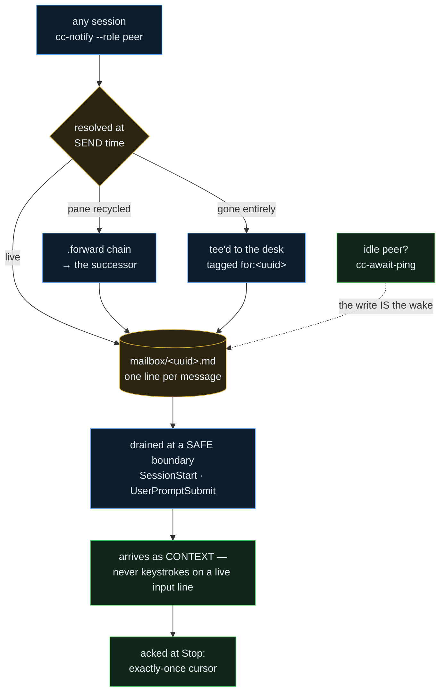
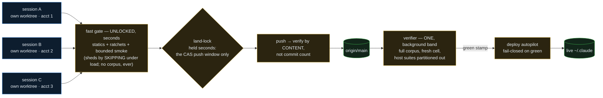
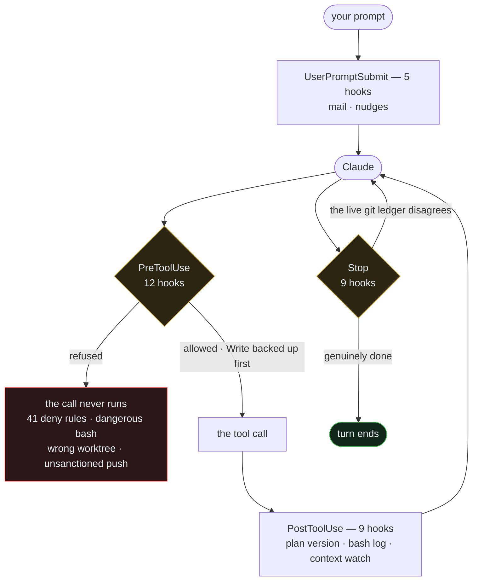

<div align="center">


<sub><b>One four-minute loop — the title never leaves, and five things happen around it.</b> A session <b>summons</b> a subagent, which hands work back and removes itself; a hook <b>refuses</b> a turn that tried to end early, and the world is pulled back one footprint and has to re-walk it; and a decision with no default <b>stops everything</b> until a human answers. Two are the sky's own and are meant to be missed: a <b>meteor</b> that burns out in mid-air instead of leaving the frame, leaving the trail behind it fading on after the head has gone, and a <b>constellation</b> traced between six stars the field already contained. Nothing here is decoration: the ground's scroll rate is the only gauge the piece owns, so every beat is spoken in it, and a stop or a rewind must be repaid inside the loop at a whole-number rate or the footprints stop landing in their own prints. Generated by <a href="tools/banner/gen.py"><code>tools/banner/gen.py</code></a>, which refuses to emit rather than ship a subtly wrong asset, and gated by <a href="scripts/banner-verify.sh"><code>banner-verify.sh</code></a> — where <code>t=0</code> and <code>t=240</code> must render <b>pixel-identical</b>, so the loop cannot have a visible restart. <code>prefers-reduced-motion</code> gets a frame the animation genuinely passes through.</sub>

# Claude Code Infrastructure

### `~/.claude` becomes a system you deploy — and the sessions become the schedulers.

[](#4-nothing-a-session-did-dies-with-it)
[](#3-autonomy-is-bounded)
[](#5-the-whole-system-deploys-from-git)
[](#2-parallel-work-cannot-collide)

[**1 · Sessions run each other**](#1-sessions-run-each-other) · [**2 · No collisions**](#2-parallel-work-cannot-collide) · [**3 · Bounded autonomy**](#3-autonomy-is-bounded) · [**4 · Nothing is lost**](#4-nothing-a-session-did-dies-with-it) · [**5 · Deploys from git**](#5-the-whole-system-deploys-from-git) · [**Install**](#install)

</div>

Claude Code reads everything it does — permissions, hooks, commands, agents — from `~/.claude`.
But `~/.claude` is machine state: unversioned, unreviewable, and the moment a second session starts,
the two share one git index, one binary, and one operator's attention. **So how do you run many at
once, safely, unattended?**

Make `~/.claude` a *deployment* of a git repo — and make the sessions themselves the schedulers.
That is this repo: **620 files, ~119,000 lines**, held to ground truth by a **2,358-test** bats suite
and exercised across **5,709 sessions**.

<div align="center">


<sub><b>An unedited screen recording — two real Claude sessions, one window.</b> A session fires a peer, the pane <b>splits</b>, the peer answers <code>origin/main = bebd9580</code> and <b>pings back</b>; the ping arrives <b>inside the originator's chat</b> (<code>PING RECEIVED FROM PEER</code>) and the peer <b>closes its own pane</b>. One human keystroke: the first prompt. <a href="assets/demo/handoff-live.mp4">Full-resolution video</a> — 1920×1144, 60 fps.</sub>

</div>

| | The property | What it removes |
|---|---|---|
| **1** | [**Sessions run each other**](#1-sessions-run-each-other) | You are no longer the scheduler. Sessions open, message, and retire one another — and page you only when a human must decide. |
| **2** | [**Parallel work cannot collide**](#2-parallel-work-cannot-collide) | A worktree per writer, an account per lane, and exactly one machine-wide lock on landing. |
| **3** | [**Autonomy is bounded**](#3-autonomy-is-bounded) | 69 hooks on 12 lifecycle events refuse the calls that lose work — including a false "done". |
| **4** | [**Nothing a session did dies with it**](#4-nothing-a-session-did-dies-with-it) | Every Write, plan, task and transcript outlives the pane that made it. |
| **5** | [**The whole system deploys from git**](#5-the-whole-system-deploys-from-git) | No drift, no un-reviewable machine state, and an update that can't break a running session. |

---

## 1. Sessions run each other

**A session is not a terminal you babysit — it is an addressable process that can open, message, and retire its peers.** The recording above is the whole loop; the mechanics are four commands.

| Touchpoint | Command | What happens |
|---|---|---|
| **Self-open** | `/handoff` → [`handoff-fire.sh --split-right`](scripts/handoff-fire.sh) | Claims a warm worktree (~3 s), ranks the four accounts on live quota, ⌘D-splits **the firing pane** (anchored to `$ITERM_SESSION_ID`, never whatever window is frontmost), then types and submits the brief. |
| **Self-recycle** | `handoff-fire.sh --recycle` | Exits and relaunches **this** pane in place — arm a detached watcher, type `/exit`, let it re-launch into the plain shell once `claude` is gone. |
| **Self-close** | `handoff-fire.sh self-close --successor <uuid>` | Retires the pane once the work is away. The successor must be **verified engaged** — resolvable, `claude` on its tty, *and* a real assistant turn in its transcript — before `/exit` is typed and again at the close instant. Focus lands on the survivor. |
| **Two-way** | [`cc-notify`](bin/cc-notify) · `--notify-back` · [`cc-await-ping`](bin/cc-await-ping) | Peers exchange messages, so a fired session can report completion, a decision gate, or a blocker back to the session that fired it. |

> **Why `/exit` and not `/clear` + a queued payload.** Claude Code's queue is type-asymmetric: a built-in slash command holds until the calling turn ends, but *plain text* is steered into the still-running turn at the next tool-result boundary — which the firing script's own Bash call guarantees. A queued payload therefore ran inline in the **old** context while `/clear` stayed armed behind it. Exit-and-relaunch has no such race.

<div align="center">


<sub><b>One 7-second loop — the session changes its own battery.</b> The creature is genuinely <b>off</b> for 1.85 s of it: the screen, the eyes, the mouth and the light it throws on the ground all derive from a single window whose edges <i>are</i> the cell leaving and re-entering the socket, so a lit face with nothing seated is a <b>build error</b> rather than something to catch in review. Generated by <a href="tools/banner/recycle.py"><code>tools/banner/recycle.py</code></a>, which imports the hero banner's own palette so the two can never drift apart, and gated by <a href="scripts/banner-verify.sh"><code>banner-verify.sh</code></a> — where <code>t=0</code> and <code>t=7</code> must render <b>byte-identical</b>, so the loop cannot have a visible restart. The two cells say their state twice — <b>three lit segments</b> when charged, <b>three hollow slots</b> when flat, plus a longer terminal on the live one — because hue alone says <i>which</i> cell and never <i>how full</i>, and at this size a coloured block reads as a block. <code>prefers-reduced-motion</code> gets the idle frame, which is a frame the animation genuinely passes through rather than a separate still that could drift from it. <a href="assets/demo/recycle-bmo.mp4">Video loop</a> — 1920×480, 24 fps, 168 frames sampled from this same file by <a href="scripts/banner-video.sh"><code>banner-video.sh</code></a>, so it cannot disagree with what you see above.</sub>

</div>

The same three touchpoints at the command line — every line below is real output from the scripts in this repo:


<sub>Recorded with <a href="https://github.com/charmbracelet/vhs">VHS</a> from <a href="assets/demo/handoff-real.tape"><code>assets/demo/handoff-real.tape</code></a> — re-runnable, so it can never drift from the scripts it documents. The <code>/handoff</code> and <code>self-close</code> scenes run <code>--dry-run</code> (nothing is launched or closed); the mailbox round trip is real and completes against a temp inbox.</sub>

### A message is a file, not a keystroke

`cc-notify` never types into a live input line. It appends one line to the target's inbox; the target drains it at a boundary where nothing can be corrupted, and acks it exactly once.

<!-- Diagram source: assets/diagrams/session-comms.mmd — edit it, run `npm run diagrams`, commit the regenerated SVGs. -->
<picture>
  <source media="(prefers-color-scheme: dark)" srcset="assets/diagrams/session-comms-dark.svg">
  
</picture>

<details>
<summary>Interactive Diagram</summary>

<!-- mermaid-fence: assets/diagrams/session-comms.mmd (auto-synced by `npm run diagrams`) -->

```mermaid
flowchart TB
    Box[("mailbox/&lt;uuid&gt;.md<br/>one line per message")]
    Send["any session<br/>cc-notify --role peer"] --> Res{"resolved at<br/>SEND time"}
    Res -->|"live"| Box
    Res -->|"pane recycled"| Fwd[".forward chain<br/>→ the successor"]
    Res -->|"gone entirely"| Desk["tee'd to the desk<br/>tagged for:&lt;uuid&gt;"]
    Fwd --> Box
    Desk --> Box
    Box --> Drain["drained at a SAFE boundary<br/>SessionStart · UserPromptSubmit"]
    Drain --> Ctx["arrives as CONTEXT —<br/>never keystrokes on a live input line"]
    Ctx --> Ack["acked at Stop:<br/>exactly-once cursor"]
    Wake["idle peer?<br/>cc-await-ping"] -.->|"the write IS the wake"| Box
    classDef k fill:#2b2410,stroke:#d4af37,color:#e6edf3
    classDef b fill:#0d1d2e,stroke:#58a6ff,color:#e6edf3
    classDef g fill:#12261a,stroke:#3fb950,color:#e6edf3
    class Res,Box k
    class Send,Fwd,Desk,Drain b
    class Ctx,Ack,Wake g
```

<sup><a href="assets/diagrams/session-comms-dark.svg?raw=true">full-screen dark</a> · <a href="assets/diagrams/session-comms-light.svg?raw=true">light</a> · <a href="assets/diagrams/session-comms.mmd">source</a></sup>

</details>

Three failures shaped that design, and each is now structural rather than remembered:

- **A pane UUID is a stale address the moment that pane recycles.** Forensics found 570 pages looping into one dead former-desk inbox for three days. Automated senders now address a **role**, re-resolved at send time; a `.forward` chain follows successions; an undeliverable line is still recorded *and* tee'd to the desk, which is where triage happens.
- **An enqueue to a dead inbox is not a delivery.** Liveness decides the verdict, and a reroute never upgrades it — `cc-notify` reports "mailbox only" honestly, and [`cc-inbox-guard`](bin/cc-inbox-guard) fails loud on mail nothing will ever drain.
- **A drain is not a read.** The `.seen` cursor advances on delivery, but `.acked` only at the Stop *after* a turn provably carried the mail. Dup-biased by design: a crash mid-turn re-surfaces the message instead of silently losing it.

### It pages you only when a human must decide

The same addressing runs outward. Operator-owned steps are rendered as **runnable commands from disk truth**, never prose — a `▶ <exact command>` block at every turn close ([`operator-readout.sh`](hooks/operator-readout.sh)), a one-glance board of everything blocking on you ([`cc-blockers`](bin/cc-blockers)), durable decision packets that survive a recycle ([`cc-decide`](bin/cc-decide)), a daily digest with phone push ([`cc-digest`](bin/cc-digest)), and sound + desktop alerts ([`notify.sh`](hooks/notify.sh)).

<details>
<summary><b>The standing desk — what runs the machine between check-ins</b></summary>

<br>

A standing **desk** session orchestrates; launchd daemons dispatch and watch.

- **Work ledger → dispatch.** [`cc-backlog`](bin/cc-backlog) is an append-only JSONL ledger with event-keyed idempotent ids and claim/reap/thrash guards. It feeds [`cc-dispatch`](bin/cc-dispatch), which plans quota-aware waves via [`cc-wave-plan`](bin/cc-wave-plan) and [`claude-accounts`](bin/claude-accounts) ranking across the four accounts.
- **Lifecycle.** Every session self-registers ([`session-register.sh`](hooks/session-register.sh)) with [`cc-reconcile`](bin/cc-reconcile) backfill healing. [`cc-reaper`](bin/cc-reaper) classifies idle sessions against a cause taxonomy with never-reap defaults; only identity-pinned, landed, clean panes are closed, via [`cc-teardown`](bin/cc-teardown).
- **Crash supervision.** [`lead-crash-watchdog.sh`](hooks/lead-crash-watchdog.sh) classifies per-session death (including binary-version telemetry); [`lead-supervisor.sh`](scripts/lead-supervisor.sh) pages on stalls, permission prompts, and past-threshold runs; [`cc-crash-report`](bin/cc-crash-report) keeps the ledger and dashboard.
- **Agent Teams.** The `TeammateIdle` hook exits code 2 on idle, forcing immediate shutdown so no pane is orphaned; [`bin/it2-wrapper`](bin/it2-wrapper) injects the teammate profile on split and forces modal-free closes.

This layer is audited adversarially — most recently a 15-agent verified audit: [`docs/research/infra-reliability-audit-2026-07-22/`](docs/research/infra-reliability-audit-2026-07-22/synthesis.md).

</details>

---

## 2. Parallel work cannot collide

**Concurrent sessions share one git index and one trunk — so isolation is not a convenience, it is the precondition for everything above.** Every writer gets its own worktree and account; every landing passes through exactly one machine-wide lock.

<!-- Diagram source: assets/diagrams/parallel-lanes.mmd — edit it, run `npm run diagrams`, commit the regenerated SVGs. -->
<picture>
  <source media="(prefers-color-scheme: dark)" srcset="assets/diagrams/parallel-lanes-dark.svg">
  
</picture>

<details>
<summary>Interactive Diagram</summary>

<!-- mermaid-fence: assets/diagrams/parallel-lanes.mmd (auto-synced by `npm run diagrams`) -->

```mermaid
flowchart LR
    A["session A<br/>own worktree · acct 1"] --> G
    B["session B<br/>own worktree · acct 2"] --> G
    C["session C<br/>own worktree · acct 3"] --> G
    G["fast gate — UNLOCKED, seconds<br/>statics + ratchets + bounded smoke<br/>(sheds by SKIPPING under load; no corpus, ever)"]
    G --> Lock{"land-lock<br/>held seconds:<br/>the CAS push window only"}
    Lock --> Push["push → verify by CONTENT,<br/>not commit count"]
    Push --> Trunk[("origin/main")]
    Trunk --> V["verifier — ONE, background band<br/>full corpus, fresh cell,<br/>host suites partitioned out"]
    V -->|"green stamp"| D["deploy autopilot<br/>fail-closed on green"]
    D --> Live[("live ~/.claude")]
    classDef w fill:#0d1d2e,stroke:#58a6ff,color:#e6edf3
    classDef k fill:#2b2410,stroke:#d4af37,color:#e6edf3
    classDef t fill:#12261a,stroke:#3fb950,color:#e6edf3
    class A,B,C w
    class G,Lock,Push,V,D k
    class Trunk,Live t
```

<sup><a href="assets/diagrams/parallel-lanes-dark.svg?raw=true">full-screen dark</a> · <a href="assets/diagrams/parallel-lanes-light.svg?raw=true">light</a> · <a href="assets/diagrams/parallel-lanes.mmd">source</a></sup>

</details>

Three traps make naive automation fail. Each is defeated by a mechanism, not by discipline:

- **A shared index means a bare `git commit` sweeps another session's staged files** — plus ref-lock races and shared-file clobber. Every writer therefore gets its **own worktree**, handed out warm (`node_modules`, codegen, `.env.local`, seeded DB already built) in about three seconds.
- **The launchers are zsh functions**, carrying per-account isolation, so no script can `exec` them. `handoff-fire.sh` **types** the launch command into a fresh iTerm2 surface through the it2 Python API with echo-verified keystrokes — anchored to the firing agent's own window, so the split lands where you are looking.
- **A hot trunk means N landers race — and a per-land test corpus means they starve each other.** A week of measurement proved the frame, not the tree, was the blocker: full-corpus-per-land collapsed P(green) to ~2.3% under fleet load (one branch died 37 straight times on a tree that was never red). So the verdict is **inverted** ([`docs/plans/LAND_PIPELINE_V2.md`](docs/plans/LAND_PIPELINE_V2.md)): [`ship-land.sh`](scripts/ship-land.sh) lands in seconds-to-minutes with only O(diff) statics, ratchets and a ≤120s direct-suite smoke that *skips* under load — nothing heavy can enter [`land-lock.sh`](scripts/land-lock.sh), which holds for seconds around the CAS push window. The full-suite claim belongs to one background verifier ([`postland-verify.sh`](scripts/postland-verify.sh) — fresh cell per run, [`host-suites.manifest`](scripts/host-suites.manifest) partition, progress-keyed stall bound, auto-revert of bisected culprits), and the live layer only ever advances to its green stamp ([`deploy-live.sh`](scripts/deploy-live.sh) on a launchd tick). Landing is still verified **by content** ([`land-verify.sh`](scripts/land-verify.sh)) — a commit-count check reads "landed" for work that was silently dropped, which is exactly how a 5-file commit went missing on 2026-07-11.

> **Portable vs project-specific.** `handoff-fire.sh`, the isolation policy, [`docs/WORKTREE_WORKFLOW.md`](docs/WORKTREE_WORKFLOW.md), and this repo's fail-closed landing rail are the **portable** half and live here. App repos keep their own warm pool and migration-aware `/ship` variants. Account, model and effort routing reads `~/.claude/model-config.yaml`, which is per-machine and deliberately not synced.

---

## 3. Autonomy is bounded

**Every prompt, tool call and turn-ending passes through hooks that can refuse it.** This repo ships 60 hook scripts; the live config wires **69 hook entries across 12 lifecycle events**. All exit 0 by default — a hook failure never blocks a tool — *except* deliberate `PreToolUse` denials and fact-bound `Stop` blocks.

<!-- Diagram source: assets/diagrams/guardrail-pipeline.mmd — edit it, run `npm run diagrams`, commit the regenerated SVGs. -->
<picture>
  <source media="(prefers-color-scheme: dark)" srcset="assets/diagrams/guardrail-pipeline-dark.svg">
  
</picture>

<details>
<summary>Interactive Diagram</summary>

<!-- mermaid-fence: assets/diagrams/guardrail-pipeline.mmd (auto-synced by `npm run diagrams`) -->

```mermaid
flowchart TB
    P(["your prompt"]) --> UPS["UserPromptSubmit — 5 hooks<br/>mail · nudges"]
    UPS --> M(["Claude"])
    M --> Pre{"PreToolUse<br/>12 hooks"}
    Pre -->|"refused"| No["the call never runs<br/>41 deny rules · dangerous bash<br/>wrong worktree · unsanctioned push"]
    Pre -->|"allowed · Write backed up first"| Tool["the tool call"]
    Tool --> Post["PostToolUse — 9 hooks<br/>plan version · bash log · context watch"]
    Post --> M
    M --> Stop{"Stop<br/>9 hooks"}
    Stop -->|"the live git ledger disagrees"| M
    Stop -->|"genuinely done"| End(["turn ends"])
    classDef gate fill:#2b2410,stroke:#d4af37,color:#e6edf3
    classDef no fill:#2b1618,stroke:#f85149,color:#e6edf3
    classDef ok fill:#12261a,stroke:#3fb950,color:#e6edf3
    class Pre,Stop gate
    class No no
    class End ok
```

<sup><a href="assets/diagrams/guardrail-pipeline-dark.svg?raw=true">full-screen dark</a> · <a href="assets/diagrams/guardrail-pipeline-light.svg?raw=true">light</a> · <a href="assets/diagrams/guardrail-pipeline.mmd">source</a></sup>

</details>

| Hook | Fires on | What it refuses, or guarantees |
|---|---|---|
| [`backup-before-write.sh`](hooks/backup-before-write.sh) | Write · Edit | No file is modified before a nanosecond+PID-stamped backup exists; injects the OVERWRITE GUARD and plan rules into context. |
| [`validate-bash.sh`](hooks/validate-bash.sh) | Bash | Pattern-blocks destructive commands, and audit-logs the rest. |
| [`git-worktree-guard.sh`](hooks/git-worktree-guard.sh) | Bash · Write | Refuses writes aimed at the wrong worktree. |
| [`completion-assert.sh`](hooks/completion-assert.sh) | Stop | **Refuses a false "done"** that contradicts the live git and gate ledger. |
| [`operator-readout.sh`](hooks/operator-readout.sh) | Stop | Renders every operator-owned step as a `▶ runnable command`, from disk truth. |
| [`teammate-auto-shutdown.sh`](hooks/teammate-auto-shutdown.sh) | TeammateIdle | Exit code 2 → immediate shutdown; zero orphaned panes. |

<details>
<summary><b>Full hook roster, by lifecycle event</b></summary>

<br>

```
SessionStart (14)     session-start · session-register · live-session-registry · desk-brief-inject · dod-persist ·
                      mailbox-drain · setup-plan/task-symlinks · session-index-start · pre-session-validate ·
                      config-mirror-assert · activation-watch · frontier-status · lead-crash-watchdog
UserPromptSubmit (5)  mailbox-drain · handoff-intent-nudge · research-precognition-nudge · memory-nudge · cache-expiry-warning
PreToolUse (12)       validate-bash · backup-before-write (OVERWRITE GUARD) · git-worktree-guard · agent-teams-enforce ·
                      rm-safe-allowlist · check-edit-boundary · plan-agent-teams-default · frontier-spawn-gate ·
                      cc-unattended-ask-guard · keychain-guard · curl-gate · enforce-email-formatting
PostToolUse (9)       post-file-edit · plan-index-update · plan-version-commit · plan-pin-session · validate-plan-structure ·
                      log-bash · task-mutation-index · teammate-checkpoint · waiting-recycle
Stop (9)              completion-assert (blocks a false "done") · operator-readout · session-continue · boundary-handoff ·
                      anti-deference-nudge · dispatch-assert · teammate-checkpoint · cache-expiry-tracker · notify
SessionEnd (6)        session-end (watchdog handshake) · session-deregister · session-index-end · session-save-id ·
                      live-session-registry · harvest-skill-end
Notification (2)      notify (audio + desktop) · push-critical        PermissionRequest (3)  notify ×3 (Bash · question · plan)
                      cc-permission-beacon is NOT wired — staged only (pending-activation/17-…); cc-blockers raises beacon-inert
PreCompact (3)        dod-persist · compact logging                   TeammateIdle (1)       teammate-auto-shutdown
WorktreeCreate (1)    worktree-setup                                  TaskCompleted (1)      task-quality-gate
```

</details>

<details>
<summary><b>Permissions and auto mode — what the classifier may and may not decide</b></summary>

<br>

`claude --permission-mode auto` lets the classifier resolve `ask`-tier calls instead of prompting you. Every other layer still applies:

| Layer | Count | Behavior in auto mode |
|---|---|---|
| `deny` rules | 41 | **Always enforced** — the classifier cannot override |
| `ask` rules | 6 | Classifier decides instead of prompting (collapsed from 45 as autonomy moved routine calls behind classifier + hook rails) |
| `allow` rules | 350 | Auto-approved: read-only commands, WebFetch domains, Edit/Write, MCP tools |
| PreToolUse hooks | 12 | Always fire — a hook deny is an absolute block |
| PostToolUse hooks | 9 | Always fire — logging, plan versioning, task indexing |

Key deny rules, enforced even in auto mode: `git push --force`, `sudo`/`su`, `eval`/`exec`, `git clean`, `wget`, `dd`, and reads of `.env*` / `*.key` / `*.pem`.

Teammate models must be on the account's auto-mode allowlist, or the spawn silently demotes to `acceptEdits`. That allowlist is deliberately **not** written down here: it lives in `~/.claude/model-config.yaml` under `auto_mode_allowlist`, the single source of truth for model, effort and frontier routing — and [`claude-lint-models.sh`](scripts/claude-lint-models.sh) fails any file in this repo that pins a superseded model literal, this README included. Inspect the classifier with `claude auto-mode defaults | config | critique`.

</details>

---

## 4. Nothing a session did dies with it

**Panes are disposable; their output is not.** Four independent layers outlive the session that produced them.

| What survives | How | Recover it with |
|---|---|---|
| **Every file version** | [`backup-before-write.sh`](hooks/backup-before-write.sh) stamps a backup before every Write/Edit — nanosecond+PID names (parallel-agent-safe), sidecar `.path` files for basename collisions, atomic `mktemp`+`mv` restore, capped at 10/file with a 30-day TTL by [`prune-backups.sh`](scripts/prune-backups.sh) | [`restore-file`](scripts/restore-file.sh) `<path>` · `--diff` · `--pick N` · `--recent 10` |
| **Every plan revision** | [`plan-version-commit.sh`](hooks/plan-version-commit.sh) writes two layers: an append-only `MANIFEST.jsonl` (timestamp, session, SHA256, line count) and full snapshots in a separate git repo | `cd ~/.claude/plan-history && git log` |
| **Every task list** | Claude Code uses UUID task dirs and ignores `CLAUDE_CODE_TASK_LIST_ID`; [`setup-task-symlinks.sh`](hooks/setup-task-symlinks.sh) detects the active list at SessionStart, symlinks it to `.claude-tasks/_current/`, and generates a readable `TASKS.md` | `.claude-tasks/_current/TASKS.md` |
| **Every conversation** | SQLite FTS5 index over all 5,709 sessions, kept self-maintaining by three hooks — a crash-safe stub at SessionStart, rich metadata at SessionEnd, and a 60-second sweep daemon catching misses | `claude-search "<query>"` · `--fzf` · `--stats` |

```bash
restore-file path/to/file --diff     # unified diff against the latest backup
restore-file --recent 10             # 10 most recent backups across all files
claude-search "replicache mutation"  # full-text across every session, <5 ms
```

Session search is its own project: **[claude-session-search](https://github.com/renchris/claude-session-search)**.

---

## 5. The whole system deploys from git

**The repo is the source of truth; your `~/.claude` is its deployment.** The primary config dir is *symlinked*, so editing a live hook edits this repo and nothing can silently drift out of version control.

<!-- Diagram source: assets/diagrams/deploy-model.mmd — edit it, run `npm run diagrams`, commit the regenerated SVGs. -->
<picture>
  <source media="(prefers-color-scheme: dark)" srcset="assets/diagrams/deploy-model-dark.svg">
  
</picture>

<details>
<summary>Interactive Diagram</summary>

<!-- mermaid-fence: assets/diagrams/deploy-model.mmd (auto-synced by `npm run diagrams`) -->
```mermaid
flowchart TB
    Repo["claude-infrastructure<br/>620 files · one reviewable history"]
    Repo &lt;--&gt;|"install.sh · SYMLINK<br/>editing the live hook IS editing the repo"| Prim["~/.claude<br/>hooks · commands · scripts"]
    Repo -->|"--config-dir · COPY"| Alt["~/.claude-secondary … 4<br/>4 billing-isolated accounts"]
    Repo -->|"COPY<br/>sync.sh pulls hand-edits back"| Glob["~/bin · LaunchAgents<br/>45 tools · 13 daemons · statusline"]
    classDef src fill:#2b2410,stroke:#d4af37,color:#e6edf3
    classDef dep fill:#0d1d2e,stroke:#58a6ff,color:#e6edf3
    class Repo src
    class Prim,Alt,Glob dep
```

<sup><a href="assets/diagrams/deploy-model-dark.svg?raw=true">full-screen dark</a> · <a href="assets/diagrams/deploy-model-light.svg?raw=true">light</a> · <a href="assets/diagrams/deploy-model.mmd">source</a></sup>

</details>

The symlink rule was bought with a real failure: on 2026-07-03 a *copied* `handoff-fire.sh` had drifted +198 lines in the deployment and was one `install.sh` away from being clobbered. The four account dirs stay **copies** so a rate-limited account cannot perturb another; global surfaces are copies too, and `sync.sh` pulls hand-edits of those back.

**Landed is not live — the gap is closed by proof, not by hand.** Because the primary dir symlinks into the checkout, a trunk commit only reaches running sessions when the checkout advances — and it advances *autonomously and fail-closed*: a launchd verifier ([`postland-verify.sh`](scripts/postland-verify.sh), every 5 min) proves each trunk tree with the full corpus in a fresh cell and stamps it; a deploy autopilot ([`deploy-live.sh`](scripts/deploy-live.sh)` --auto`, every 10 min) fast-forwards the checkout **only to a green-stamped tree**, re-runs `install.sh` (so brand-new files get their symlinks), and then runs the [host suites](scripts/host-suites.manifest) against the live layer — the one place suites that assert the deployed world can honestly run. A red trunk auto-reverts its bisected culprit; a dead verifier or a lagging deploy is surfaced by fact-bound alarms in [`cc-blockers`](bin/cc-blockers) rather than assumed healthy.

<details>
<summary><b>What actually lives in <code>~/.claude/</code></b></summary>

<br>

```
~/.claude/                       # config dir — machine state + the deployed system
├── settings.json · .mcp.json    # permissions, hooks, env · MCP servers
├── CLAUDE.md                    # global instructions (synced)
├── model-config.yaml            # model / effort / frontier SSOT (per-machine, NOT synced)
├── hooks/  commands/  scripts/  # SYMLINKED from this repo — edits go live
├── skills/  agents/             # SYMLINKED — 12 skills, 4 custom agents
├── bin/it2                      # iTerm2 teammate wrapper (copied)
├── mailbox/  cc-roles/          # per-pane inboxes · role → pane resolution
├── backups/                     # auto-backups (10/file, 30-day TTL)
├── plan-history/                # plan snapshots (its own git repo)
├── session-index.db             # FTS5 session search
└── projects/                    # per-project memory + transcripts

~/.claude-versions/   current -> 2.1.114      # atomically-symlinked installs
~/bin/                claude-latest · claude-update · claude-versions · 45 cc-* fleet tools
~/Library/LaunchAgents/   13 daemons — dispatcher · discovery · reapers · regression · search · …
```

</details>

### Install

```bash
git clone https://github.com/renchris/claude-infrastructure.git
cd claude-infrastructure
./install.sh --dry-run   # preview
./install.sh             # idempotent — safe to re-run
```

It symlinks hooks, commands and scripts into `~/.claude`; copies `bin/` tools, `statusline.sh` and the LaunchAgents; loads the daemons; and validates `settings.json`. For an alternate account: `./install.sh --config-dir ~/.claude-secondary`. Re-run it after every trunk fast-forward — it links **brand-new** files, which per-file symlink directories otherwise never pick up. `--wire-hooks` additively merges the template hook roster into a live `settings.json`, with backup and validation.

```bash
./sync.sh          # pull hand-edits of COPIED surfaces back into the repo
./sync.sh --diff   # preview only
```

### An update can't break a running session

npm overwrites Claude's binary in place, which throws `ENOTEMPTY` when live sessions hold file handles. The fix is Homebrew-style parallel installs — every version in its own directory, one symlink pointing at the active one:

```
~/.claude-versions/
├── 2.1.113/           # rollback target
├── 2.1.114/           # current
└── current -> 2.1.114 # atomic symlink — rename(2), NOT ln -sfn
```

`ln -sfn` is wrong because it is two syscalls (`unlink` + `symlink`) with an ENOENT window between them. The correct swap is atomic:

```bash
ln -s "$new_version" "${current}.tmp_$$"
mv -f "${current}.tmp_$$" "$current"   # rename(2) is POSIX-atomic
```

Running processes survive `rm -rf` of their own version via POSIX vnode semantics — the kernel keeps the `mmap`'d binary alive until the last fd closes. [`bin/claude-latest`](bin/claude-latest) wraps all of it: rotate log → check npm (10-min cache) → clean stale versions *before* install (disk-full resilience) → install under a `mkdir` lock → validate the binary → swap → `exec` with `DISABLE_AUTOUPDATER=1`. GC never deletes the symlink target, skips versions with live processes (`pgrep`), and recovers by scanning for any working version if `current` is broken.

| Command | Purpose |
|---|---|
| `claude` | Auto-update + GC + launch (via `claude-latest`) |
| `claude-update [version]` | Install latest, or pin a specific version |
| `claude-update --cleanup` | Manual GC (keep current + N previous) |
| `claude-versions` | List installed versions with disk usage |
| `CLAUDE_SKIP_UPDATE=1 claude` | Skip the update check once |

### Held to ground truth

**2,358 bats tests across 144 files (31,841 lines)** prove every tree — continuously by the background verifier ([`postland-verify.sh`](scripts/postland-verify.sh), the sole owner of the full-suite claim), plus a nightly full-suite regression daemon. Diagrams have their own guard: `npm run diagrams:check` fails CI if a rendered SVG or an embedded mermaid fence has drifted from its `.mmd` source.

---

<details>
<summary><b>Reference</b> — daemons, browser automation, shell aliases, agents and commands</summary>

<br>

**13 launchd daemons** (`launchd/`, all low-priority; `install.sh` copies and loads them):

| Plist | Schedule | Purpose |
|---|---|---|
| `com.claude.dispatcher` | 15 min | open backlog → quota-aware wave plan → fire worker sessions |
| `com.claude.discovery` | 60 min | scan ledgers, plans and gates for new work → feed the backlog |
| `com.chrisren.autonomy-sweep` | 5 min | alarms, pages and decision-packet sweep → operator escalation |
| `com.claude.desk-invariant` | 5 min | desk liveness + recycle-armedness fail-loud monitor |
| `com.claude.boot-resume` | 5 min | post-reboot ghost-session detection + consolidated resume |
| `com.claude.team-orphan-reaper` | 10 min | archive dead teammate panes and worktrees (identity-pinned) |
| `com.claude.postland-verify` | 5 min | assert a landing actually reached trunk, by content |
| `com.claude.log-rotation` | 60 min | size-gated rotation of `idl.jsonl` + bash command logs |
| `com.claude.caffeinate-floor` | KeepAlive | sleep-prevention floor while sessions run |
| `com.claude.power-policy-verify` | 60 min | assert pmset/caffeinate continuity posture |
| `com.claude.nightly-regression` | 4 am | full bats suite against the live deployment |
| `com.claude.session-search-sweep` | 60 s | catch missed session transcripts |
| `com.claude.session-search-backfill` | Sun 3 am | full backfill of all sessions |

**Status line.** [`statusline.sh`](statusline.sh) shows `dir (commit) branch* · N%`. The context percentage applies a 48% offset to the input-only token share to approximate what is actually left (output buffer ~32%, auto-compact ~6.5%, warning ~10%). Under 60% gray, 60–90% default, over 90% red. [`notify.sh`](hooks/notify.sh) pairs a system sound with a desktop alert, 2 s debounce — Funk for a permission request, Blow for a question, Glass for a plan ready to review, Purr for task completion (sound only).

**Browser automation.** [`bin/browsermcp-wrapper.sh`](bin/browsermcp-wrapper.sh) wraps [BrowserMCP](https://browsermcp.io) to load the NVM environment consistently — which fixes most MCP connection failures — registered in `~/.claude/.mcp.json`:

```json
{ "mcpServers": { "browsermcp": { "command": "~/bin/browsermcp-wrapper.sh", "timeout": 15000 } } }
```

Workflow: `navigate → snapshot → click/type` by element ref. `agent-browser` is the CLI fallback when the MCP server is unavailable.

**Shell aliases** (`~/.zshrc`): `claude` (auto-update + auto mode + task-list persistence) · `claude-default` (no auto mode) · `claude-plan` (plan mode + "ultrathink") · `claude2`/`3`/`4` (isolated `CLAUDE_CONFIG_DIR` per account) · `claude-fable*` (frontier tier) · `claude-which` (active config dir).

**22 commands** (`commands/`) — `/handoff`, `/ship`, `/wrap`, `/desk`, `/accounts`, `/limit-recover`, `/research`, `/review`, `/commit`, `/harvest-skill` and more. **12 skills** (`skills/`) — agent-teams, research-subagents, frontier-routing, coding-standards, plan-conventions, cc-upgrade-gate and others. **4 agents** (`agents/`) — `deep-research` (frontier/adversarial research), `deep-research-sonnet` (bulk-fan-out worker, currently benched), `frontier-derivation` (baseline-blind derivation panelist for `/frontier-run`), `research-decomposition-critic` (pre-spawn decomposition critic). Deployed by COPY into each config dir's `agents/`, never by symlink.

**Editing the diagrams.** Sources live in `assets/diagrams/*.mmd` and render through [beautiful-mermaid](https://www.npmjs.com/package/beautiful-mermaid) — the ELK-based engine behind Cursor's agent panel — into per-mode SVGs, because GitHub cannot swap its own dagre renderer. Edit the `.mmd`, run `npm run diagrams`, commit the regenerated SVGs.

**Re-recording the demos.** `assets/demo/handoff-real.webp` regenerates from its committed tape — `vhs assets/demo/handoff-real.tape`, then `gif2webp -m 6 -min_size` — so the command output in the README can never drift from the scripts. `assets/demo/handoff-live.webp` is a screen recording of an actual `/handoff`; it is captured by hand (`screencapture -v`, cropped to the iTerm2 window with `ffmpeg`) because it depends on a live fleet, so there is no script for it, and it is encoded `img2webp -near_lossless 40`. Both are WebP but by different routes, and the reason matters: the VHS clip is flat terminal output, so `gif2webp` converts it losslessly and 10.6 % smaller, whereas the live recording must be **near-lossless** — an ordinary lossy WebP encodes each frame as a partial update rectangle, and the flat grey of an unfocused pane re-quantizes differently inside that rectangle than outside, leaving a visible vertical seam at its edge. Near-lossless costs 21 % more than the GIF it replaced and buys ~3× better colour fidelity. Measurements in the `demo-recording` skill.

**Rebuilding the banners.** Both are generated, never hand-drawn: `python3 tools/banner/gen.py --out assets/banner` for the hero set, `python3 tools/banner/recycle.py --out assets/banner` for the self-recycle loop. Each generator refuses to emit rather than ship a subtly wrong asset — periods that do not divide the master loop, a loop whose first and last frame differ, an arm pose that would render as a severed stub, a lit face with no battery seated. Verify one with `scripts/banner-verify.sh <asset> --period <P>` (six checks, all able to fail; the self-recycle loop is `--period 7`), and prove every beat is actually VISIBLE with `scripts/banner-beat-ink.py assets/banner/v6*.svg` — it renders each beat whole and again with that beat suppressed, and requires a real pixel difference at the README's own 838 px width. That gate exists because every other one is structural: a meteor trail once shipped painting **zero pixels** — a horizontal path's bounding box has no height, so the gradient filling it was never drawn — and the markup parsed, the animation was singular and the loop still sealed shut. Sabotage every gate at once with `scripts/banner-gate-redproof.py` (24 cases, each required to fire on its own message). The mp4 is a sampling of the committed SVG rather than a separate recording: `scripts/banner-video.sh assets/banner/recycle-bmo.svg --period 7 --out assets/demo`. **The animated SVG is the deliverable, not a fallback** — GitHub serves it through camo as an image, and CSS animations inside an SVG loaded as an image do run, which is why the inline asset is vector and the mp4 is only a link.

</details>

<div align="center">
<sub>Structure of this README derived with the full Minto Pyramid Principle — audit trail in <a href="docs/research/README-rewrite-2026-07-28.pyramid-worklog.md"><code>docs/research/README-rewrite-2026-07-28.pyramid-worklog.md</code></a></sub>
</div>
