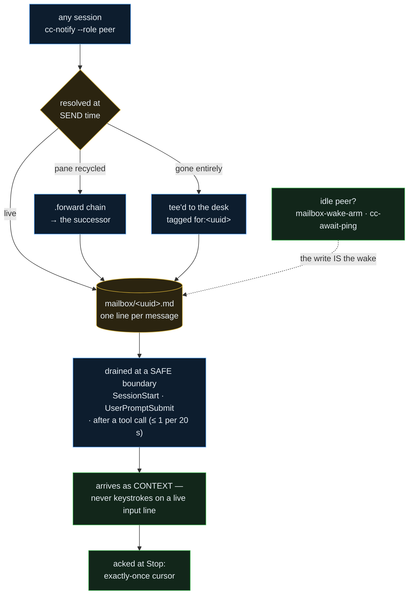
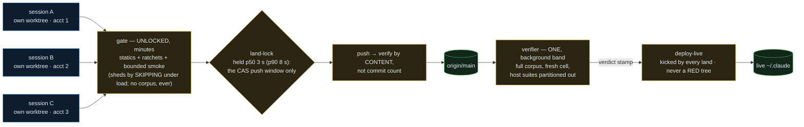
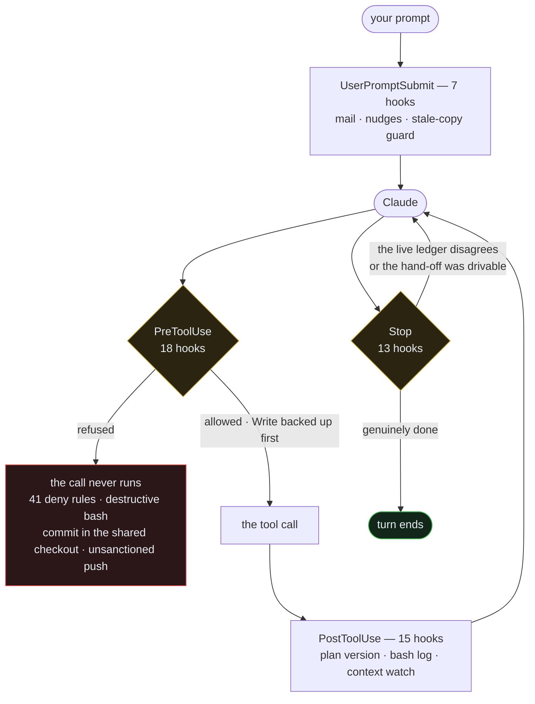
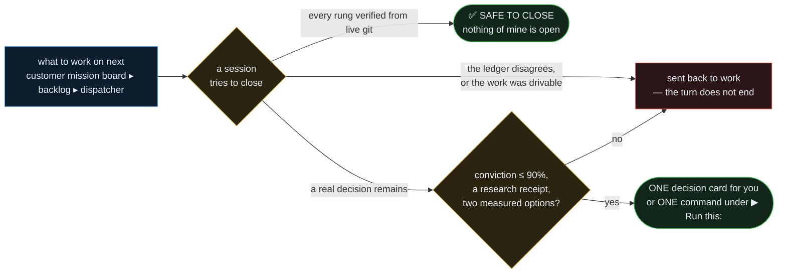
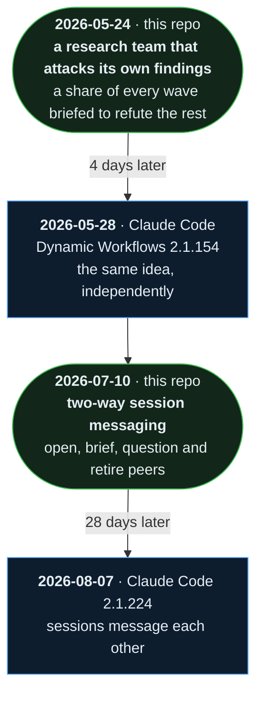

<div align="center">

<picture>
  <source media="(prefers-color-scheme: dark)" srcset="assets/hero/hero-dark.webp">
  
</picture>

<sub>Every string on screen is real: a session fires a peer, each works on its own branch and account, commits land one at a time through the land-lock, a false “done” is sent back, and only the decision reaches you. <a href="assets/hero/launch-film.mp4">The 30-second film</a> (1920×1080, 60 fps) · <a href="tools/hero-film/README.md">how it was made</a>.</sub>

## `~/.claude`, deployed from git.<br>The sessions run each other.<br>You only decide.

[](#every-trunk-tree-is-proven-in-the-background-and-a-red-one-is-bisected)
[](#every-session-works-on-its-own-branch-and-account-and-lands-through-one-lock)
[](#any-command-a-session-runs-can-be-refused)
[](#nothing-a-session-did-dies-with-its-pane)

[**1 · Deployed from git**](#1-the-whole-system-deploys-from-git) · [**2 · The sessions run each other**](#2-the-sessions-run-each-other) · [**3 · You only decide**](#3-you-only-decide) · [**Where it stops**](#measured-not-claimed--including-where-it-falls-short) · [**Install**](#install) · [**Map**](#map--where-everything-lives)

</div>

Claude Code reads everything it does from `~/.claude`, and it is built for one session that a person
watches. Run thirty sessions at once and three jobs land on that person. They must keep `~/.claude`
working, though it is unversioned machine state that every session depends on. They must keep the
sessions out of each other's way, though all of them share one git index and one trunk. And they
must judge when each session is really done, and which of its questions really need an answer.

**This repo takes those three jobs over.** `~/.claude` is deployed from this git repo. The sessions
start, place, message and retire one another. A session reaches you only with a decision it cannot
make. One job is still yours, noticing a session stuck on a permission prompt, and
[the last section](#measured-not-claimed--including-where-it-falls-short) measures how long that
takes. The repo is 6,311 files and 5,732 commits since 2026-03-24, checked by 15,570 tests, running
on one Mac across four Claude accounts. [Install](#install) takes five commands.

| | What the system does | The job it takes off you |
|---|---|---|
| **1** | [**The whole system deploys from git.**](#1-the-whole-system-deploys-from-git) Every change to the running system, from a hook to the Claude Code binary itself, is tested, landed, proven live, and can be reverted. | Keeping a hand-edited config dir alive |
| **2** | [**The sessions run each other.**](#2-the-sessions-run-each-other) A session opens new sessions in new terminal panes, gives each its own branch and account, and hears back when they finish. Hooks can refuse any single command, and files, plans and transcripts outlive the pane. | Starting, placing and supervising sessions |
| **3** | [**You only decide.**](#3-you-only-decide) A session cannot call itself done while git says otherwise, and cannot hand you a task it could do itself. What reaches you is one decision or one command. | Judging "done", and sorting real questions from parked work |

---

## 1. The whole system deploys from git

**A system that edits its own controller has to be versioned, tested and revertible like any other
software, down to the binary it runs on.** This repo is the source of truth, and `~/.claude` is its
deployment.

<!-- Diagram source: assets/diagrams/deploy-model.mmd — edit it, run `npm run diagrams`, commit the regenerated SVGs. -->
<picture>
  <source media="(prefers-color-scheme: dark)" srcset="assets/diagrams/deploy-model-dark.svg">
  
</picture>

<details>
<summary>Interactive Diagram</summary>

<!-- mermaid-fence: assets/diagrams/deploy-model.mmd (auto-synced by `npm run diagrams`) -->
```mermaid
flowchart TB
    Repo["claude-infrastructure<br/>6,311 files · one reviewable history"]
    Repo &lt;--&gt;|"install.sh · SYMLINK<br/>editing the live hook IS editing the repo"| Prim["~/.claude<br/>hooks · commands · scripts"]
    Repo -->|"--config-dir · code SYMLINKED<br/>auth + settings per-account"| Alt["~/.claude-secondary … 4<br/>4 billing-isolated accounts"]
    Repo -->|"COPY<br/>sync.sh pulls hand-edits back"| Glob["~/bin · LaunchAgents<br/>101 cc-* tools · 28 daemons · statusline"]
    classDef src fill:#2b2410,stroke:#d4af37,color:#e6edf3
    classDef dep fill:#0d1d2e,stroke:#58a6ff,color:#e6edf3
    class Repo src
    class Prim,Alt,Glob dep
```

<sup><a href="assets/diagrams/deploy-model-dark.svg?raw=true">full-screen dark</a> · <a href="assets/diagrams/deploy-model-light.svg?raw=true">light</a> · <a href="assets/diagrams/deploy-model.mmd">source</a></sup>

</details>

### `~/.claude` is a symlink deployment of this repo

**Editing a live hook edits this repo, because the live hook is a symlink into it.** The rule came
from a failure: on 2026-07-03 a *copied* `handoff-fire.sh` had drifted 198 lines from the repo and was
one `install.sh` away from being overwritten. `~/.claude` is the primary deployment. Each of the four
accounts has its own config dir (`~/.claude-next`, `-secondary`, `-tertiary`, `-quaternary`), which
keeps its own login and settings but links its `hooks/`, `commands/` and `scripts/` back into this
checkout, so one land reaches every account. Changes to settings, launchd jobs or credentials go
through numbered, idempotent **migrations** ([`migrations/`](migrations), 44 so far). Almost all of
them wait for you to run, because an agent must not rewrite its own permissions.

### Every trunk tree is proven in the background, and a red one is bisected

**The full test corpus runs on every tree that reaches trunk, just not inside the land.** There are
15,570 bats tests in 756 files. A land runs only the suites its change touches. The whole corpus
belongs to one background verifier, [`postland-verify.sh`](scripts/postland-verify.sh), which runs
each trunk tree in a fresh checkout. When a tree goes red it bisects down to the one failing test,
and re-runs the suspect commit's own tree before reverting it, so a flaky test cannot get an innocent
commit reverted. Diagrams have their own check: `npm run diagrams:check` fails if a rendered SVG or an
embedded mermaid block has drifted from its `.mmd` source.

### Landed is not live until the running processes load it

**A commit on trunk changes nothing until the shared checkout moves, and
[`deploy-live.sh`](scripts/deploy-live.sh) moves it after every land.** Before that trigger, the median
time from commit to live was 2.31 hours, and 40% of advances were run by hand. It moves to the newest
tree the verifier has passed. If none is recent, it takes the newest tree not known to be red, with a
banner and a page. If trunk is red all the way down, it refuses. It then re-runs `install.sh` so new
files get their links, runs the host test suites against the live layer, and checks what the
**running processes** actually loaded. A long-lived daemon can no longer run day-old code while the
deploy reports success. A dead verifier or a lagging deploy is raised on
[`cc-blockers`](bin/cc-blockers) rather than assumed healthy.

### A Claude Code update cannot break a running session

**Every Claude Code version installs into its own directory, and one atomic symlink picks the active
one.** npm overwrites the binary in place, which throws `ENOTEMPTY` while live sessions hold its
files. A symlink swapped by `rename(2)` is atomic where `ln -sfn` is not, and the kernel keeps a
running binary alive even after its directory is deleted. [`claude-latest`](bin/claude-latest) wraps
the install and the clean-up. Before a version or model is promoted,
[`cc-upgrade-gate.sh`](scripts/cc-upgrade-gate.sh) runs **15 checks** against the candidate: model
registration, auto mode, effort levels, spawn-depth limits, teammate, workflow and subagent spawns,
hooks, resume, MCP servers and credential safety. It returns one GREEN or RED verdict. Then
[`cc-lr upgrade`](bin/cc-lr) moves idle sessions onto the new binary and model in place, one at a
time, and never touches a session that is mid-turn. The default today is Opus 5.5
(`claude-opus-5-5`) on Claude Code 2.1.280. A second, stable track stays pinned at 2.1.114 until three
upstream issues that block its next version are fixed.

---

## 2. The sessions run each other

**A session is an addressable process, not a terminal you watch.** It can open another session in a
new pane, brief it, hear back from it, and close its own pane when the work has moved on. That stays
safe because no session can collide with another's work, run a refused command, or take its work down
with its pane.

<div align="center">


<sub><b>An unedited recording of two real Claude sessions in one window.</b> One session fires a peer and the pane <b>splits</b>. The peer answers <code>origin/main = bebd9580</code> and <b>pings back</b>, and the ping arrives <b>in the first session's chat</b>. The peer then <b>closes its own pane</b>. The only human keystroke is the first prompt. Recorded 2026-08 on iTerm2; kitty has been the only terminal in use since 2026-08-03, and the same commands drive it. <a href="assets/demo/handoff-live.mp4">Full-resolution video</a> (1920×1144, 60 fps).</sub>

</div>

### A session fires a peer and hears back from it

**Five commands cover a session's whole life: open, restart, move, message, close.** To *fire* is to
launch a new, briefed session in a new pane.

| Touchpoint | Command | What happens |
|---|---|---|
| **Fire** | `/handoff` → [`handoff-fire.sh --split-right`](scripts/handoff-fire.sh) | Splits **the firing pane** (never whichever window has focus), picks one of the four accounts on live quota, creates a worktree, then types and submits the brief. It waits until the new session has provably started work, then arms a `/goal` that states the end state. |
| **Recycle** | `handoff-fire.sh --recycle [--worktree B] [--account A]` | Types `/exit` and relaunches **this** pane with a fresh context, optionally on a new worktree or account. It refuses (exit 4) while subagents are still running, and names each one's partial transcript. |
| **Switch** | [`cc-lr switch`](bin/cc-lr) | Moves a live session to another account **in place**: same pane, same session id, full transcript. Use it when the context is worth keeping and only the account paying for it is wrong. |
| **Message** | [`cc-notify`](bin/cc-notify) · `--notify-back` · [`cc-await-ping`](bin/cc-await-ping) | A fired session reports completion, a question or a blocker to the session that fired it. The reply channel is on by default for every fire. |
| **Retire** | `handoff-fire.sh self-close --successor <uuid>` | Closes the pane once the work has moved on. The successor must be alive and have taken a real turn first. `--terminal`, for a session with no successor, refuses (exit 8) while it still holds unlanded commits or unfinished scope. |

The same commands, recorded at the command line:


<sub>Recorded with <a href="https://github.com/charmbracelet/vhs">VHS</a> from <a href="assets/demo/handoff-real.tape"><code>assets/demo/handoff-real.tape</code></a>, so it can be re-run and cannot drift from the scripts it shows. The fire and self-close scenes use <code>--dry-run</code>; the mailbox round trip is real, against a temporary inbox.</sub>

**A message is a file, not a keystroke.** `cc-notify` appends one line to the recipient's inbox. The
recipient reads it only at a moment when nothing it is typing can be corrupted, and marks it read
exactly once:

<!-- Diagram source: assets/diagrams/session-comms.mmd — edit it, run `npm run diagrams`, commit the regenerated SVGs. -->
<picture>
  <source media="(prefers-color-scheme: dark)" srcset="assets/diagrams/session-comms-dark.svg">
  
</picture>

<details>
<summary>Interactive Diagram</summary>

<!-- mermaid-fence: assets/diagrams/session-comms.mmd (auto-synced by `npm run diagrams`) -->

```mermaid
flowchart TB
    Box[("mailbox/&lt;uuid&gt;.md<br/>one line per message")]
    Send["any session<br/>cc-notify --role peer"] --> Res{"resolved at<br/>SEND time"}
    Res -->|"live"| Box
    Res -->|"pane recycled"| Fwd[".forward chain<br/>→ the successor"]
    Res -->|"gone entirely"| Desk["tee'd to the desk<br/>tagged for:&lt;uuid&gt;"]
    Fwd --> Box
    Desk --> Box
    Box --> Drain["drained at a SAFE boundary<br/>SessionStart · UserPromptSubmit<br/>· after a tool call (≤ 1 per 20 s)"]
    Drain --> Ctx["arrives as CONTEXT —<br/>never keystrokes on a live input line"]
    Ctx --> Ack["acked at Stop:<br/>exactly-once cursor"]
    Wake["idle peer?<br/>mailbox-wake-arm · cc-await-ping"] -.->|"the write IS the wake"| Box
    classDef k fill:#2b2410,stroke:#d4af37,color:#e6edf3
    classDef b fill:#0d1d2e,stroke:#58a6ff,color:#e6edf3
    classDef g fill:#12261a,stroke:#3fb950,color:#e6edf3
    class Res,Box k
    class Send,Fwd,Desk,Drain b
    class Ctx,Ack,Wake g
```

<sup><a href="assets/diagrams/session-comms-dark.svg?raw=true">full-screen dark</a> · <a href="assets/diagrams/session-comms-light.svg?raw=true">light</a> · <a href="assets/diagrams/session-comms.mmd">source</a></sup>

</details>

Each rule below exists because a failure happened first, and each is now enforced in code:

- **A pane id goes stale the moment the pane recycles.** Forensics found 570 pages looping into one
  dead inbox for three days. Automated senders now address a **role** (such as `desk`, the standing
  orchestrator session), which is resolved when the message is sent. A `.forward` chain follows each
  succession, and a line nobody can receive is still recorded and copied to the desk.
- **Writing to a dead inbox is not delivering.** The recipient's liveness decides the verdict, and a
  reroute never upgrades it: `cc-notify` reports "mailbox only", and
  [`cc-inbox-guard`](bin/cc-inbox-guard) fails loud on mail that nothing will read.
- **Reading a message is not acting on it.** The `.seen` cursor moves when a message is delivered.
  The `.acked` cursor moves only at the end of a turn that provably carried it. A crash mid-turn
  therefore shows the message again rather than losing it.

### Every session works on its own branch and account, and lands through one lock

**Sessions that share one checkout share its git index and its trunk, so each writer gets a worktree
and an account of its own, and every land waits for one machine-wide lock.**

<!-- Diagram source: assets/diagrams/parallel-lanes.mmd — edit it, run `npm run diagrams`, commit the regenerated SVGs. -->
<picture>
  <source media="(prefers-color-scheme: dark)" srcset="assets/diagrams/parallel-lanes-dark.svg">
  
</picture>

<details>
<summary>Interactive Diagram</summary>

<!-- mermaid-fence: assets/diagrams/parallel-lanes.mmd (auto-synced by `npm run diagrams`) -->

```mermaid
flowchart LR
    A["session A<br/>own worktree · acct 1"] --> G
    B["session B<br/>own worktree · acct 2"] --> G
    C["session C<br/>own worktree · acct 3"] --> G
    G["gate — UNLOCKED, minutes<br/>statics + ratchets + bounded smoke<br/>(sheds by SKIPPING under load; no corpus, ever)"]
    G --> Lock{"land-lock<br/>held p50 3 s (p90 8 s):<br/>the CAS push window only"}
    Lock --> Push["push → verify by CONTENT,<br/>not commit count"]
    Push --> Trunk[("origin/main")]
    Trunk --> V["verifier — ONE, background band<br/>full corpus, fresh cell,<br/>host suites partitioned out"]
    V -->|"verdict stamp"| D["deploy-live<br/>kicked by every land · never a RED tree"]
    D --> Live[("live ~/.claude")]
    classDef w fill:#0d1d2e,stroke:#58a6ff,color:#e6edf3
    classDef k fill:#2b2410,stroke:#d4af37,color:#e6edf3
    classDef t fill:#12261a,stroke:#3fb950,color:#e6edf3
    class A,B,C w
    class G,Lock,Push,V,D k
    class Trunk,Live t
```

<sup><a href="assets/diagrams/parallel-lanes-dark.svg?raw=true">full-screen dark</a> · <a href="assets/diagrams/parallel-lanes-light.svg?raw=true">light</a> · <a href="assets/diagrams/parallel-lanes.mmd">source</a></sup>

</details>

- **A bare `git commit` in a shared checkout sweeps up another session's staged files.** So every
  writer works in its **own worktree**. An app repo can keep a pool of pre-built worktrees
  (`scripts/worktree-pool.sh`) and hand one out in about three seconds, with dependencies, generated
  code, `.env.local` and a seeded database ready; this repo is light enough to create them fresh. A
  hook refuses `git commit` in this repo's shared checkout outright, because one stray commit there
  once stopped the live layer from updating on every account.
- **Four quota pools mean routing decides what gets wasted.** Weekly quota still unspent when it
  resets is gone, and a burst of sessions on one account exhausts its 5-hour window.
  [`claude-accounts`](bin/claude-accounts) therefore picks, **among accounts whose 5-hour window can
  take one more busy session, the one whose weekly quota resets soonest**, so quota is spent before
  it expires. A session counts as busy if its transcript changed in the last ten minutes, never
  merely because its pane is open, so a burst of fires spreads down the ranking instead of piling onto
  one account. The session you type in follows the same rule, but only moves when another account
  wins by 15%. Recovery work uses a stricter rule that skips any account likely to hit its limit within
  the hour. Each term fails soft and has its own off switch. Design record:
  [`ACCOUNT_ROUTING_V2.md`](docs/plans/ACCOUNT_ROUTING_V2.md) §13–15 and
  [`R2-policy-design.md`](docs/research/R2-policy-design.md).
- **When many sessions land at once, a full test run inside each land starves them all.** Fitted to 55
  real runs, a model put the chance of a green land at ~2.3% under fleet load, and one branch failed 37
  times in a row on a tree that was never red. So the heavy verdict moved out of the land path
  ([`LAND_PIPELINE_V2.md`](docs/plans/LAND_PIPELINE_V2.md)). [`ship-land.sh`](scripts/ship-land.sh)
  checks only what the change can break: static checks, rules that may only tighten, and the test
  suites the change touches (180 s each, 900 s in total), which it skips when the machine is loaded.
  [`land-lock.sh`](scripts/land-lock.sh) holds the lock only for the push itself: **3 s median, 8 s at
  the 90th percentile, over 938 holds in 14 days**. A whole land takes longer, **about 15 minutes
  median and 43 at the 90th percentile**, and most of that is the checks. These figures drift, so
  re-derive them rather than quote them: [`gate-red-census.sh`](scripts/gate-red-census.sh) and
  [`land-speed-census.py`](scripts/land-speed-census.py) print each one with its coverage.
- **A commit count says "landed" for work that was silently dropped.** That happened to a 5-file
  commit on 2026-07-11. Landing is therefore verified **by content**
  ([`land-verify.sh`](scripts/land-verify.sh)): every path is present on trunk and its diff is empty.

### Any command a session runs can be refused

**Every prompt, tool call and turn-end passes through hooks that can refuse it.** The live config
wires **105 hook entries on 21 lifecycle events**. They fail open, so a crashed hook never blocks
anything. They refuse only on purpose: through `PreToolUse` denials, `Stop` blocks that send the turn
back, and one prompt guard.

<!-- Diagram source: assets/diagrams/guardrail-pipeline.mmd — edit it, run `npm run diagrams`, commit the regenerated SVGs. -->
<picture>
  <source media="(prefers-color-scheme: dark)" srcset="assets/diagrams/guardrail-pipeline-dark.svg">
  
</picture>

<details>
<summary>Interactive Diagram</summary>

<!-- mermaid-fence: assets/diagrams/guardrail-pipeline.mmd (auto-synced by `npm run diagrams`) -->

```mermaid
flowchart TB
    P(["your prompt"]) --> UPS["UserPromptSubmit — 7 hooks<br/>mail · nudges · stale-copy guard"]
    UPS --> M(["Claude"])
    M --> Pre{"PreToolUse<br/>18 hooks"}
    Pre -->|"refused"| No["the call never runs<br/>41 deny rules · destructive bash<br/>commit in the shared checkout · unsanctioned push"]
    Pre -->|"allowed · Write backed up first"| Tool["the tool call"]
    Tool --> Post["PostToolUse — 15 hooks<br/>plan version · bash log · context watch"]
    Post --> M
    M --> Stop{"Stop<br/>13 hooks"}
    Stop -->|"the live ledger disagrees<br/>or the hand-off was drivable"| M
    Stop -->|"genuinely done"| End(["turn ends"])
    classDef gate fill:#2b2410,stroke:#d4af37,color:#e6edf3
    classDef no fill:#2b1618,stroke:#f85149,color:#e6edf3
    classDef ok fill:#12261a,stroke:#3fb950,color:#e6edf3
    class Pre,Stop gate
    class No no
    class End ok
```

<sup><a href="assets/diagrams/guardrail-pipeline-dark.svg?raw=true">full-screen dark</a> · <a href="assets/diagrams/guardrail-pipeline-light.svg?raw=true">light</a> · <a href="assets/diagrams/guardrail-pipeline.mmd">source</a></sup>

</details>

| Hook | Fires on | What it refuses, or guarantees |
|---|---|---|
| [`validate-bash.sh`](hooks/validate-bash.sh) | Bash | Destructive commands. It also judges a kill by what its selector *matches*, because an empty selector once matched everything and killed the terminal, ~17 sessions and most launchd agents in 9 seconds. |
| [`backup-before-write.sh`](hooks/backup-before-write.sh) | Write · Edit | No file changes before a timestamped backup exists. |
| [`git-worktree-guard.sh`](hooks/git-worktree-guard.sh) | Bash | Removing a worktree, or deleting a branch, that a live session is using. |
| [`completion-assert.sh`](hooks/completion-assert.sh) | Stop | **A false "done"** that the live git and ledgers contradict, and a question for you that carries no conviction number ([§3](#a-session-may-ask-only-with-a-number-and-a-receipt)). |
| [`handoff-claim-assert.sh`](hooks/handoff-claim-assert.sh) | Stop | A "run this" hand-off when the session could have run the command itself. 165 of 1,379 were refuted in 32 days, with zero false blocks. |
| [`frontier-spawn-gate.sh`](hooks/frontier-spawn-gate.sh) | Agent | More frontier-model subagents than one session's budget allows. |
| [`enforce-email-formatting.py`](hooks/enforce-email-formatting.py) | ms365 mail | Sending. Email leaves as drafts only, because a Graph send cannot be undone. |
| [`teammate-auto-shutdown.sh`](hooks/teammate-auto-shutdown.sh) | TeammateIdle | Guarantees an idle teammate's pane is closed by its recorded id, so none is orphaned. |

<details>
<summary><b>Full hook roster, by lifecycle event</b></summary>

<br>

```
SessionStart (18)       session-start · session-register · live-session-registry · desk-brief-inject · dod-persist ·
                        mailbox-drain · mailbox-wake-arm · setup-plan/task-symlinks · session-index-start ·
                        pre-session-validate · config-mirror-assert · activation-watch · frontier-status ·
                        lead-crash-watchdog · escalation-watch · accounts-board · net-context-stamp
UserPromptSubmit (7)    mailbox-drain · handoff-intent-nudge · research-precognition-nudge · memory-nudge ·
                        cache-expiry-warning · session-beat · handed-off-session-guard
PreToolUse (18)         validate-bash · backup-before-write · git-worktree-guard · agent-teams-enforce ·
                        rm-safe-allowlist · check-edit-boundary · plan-agent-teams-default · frontier-spawn-gate ·
                        cc-unattended-ask-guard · keychain-guard · curl-gate-scope · enforce-email-formatting ·
                        ship-rail-push-allow · qos-rewrite · smart-bash-allowlist · coldcompile-admit · pr-gate ·
                        web-entrypoint-ladder
PostToolUse (15)        post-file-edit · plan-index-update · plan-version-commit · plan-pin-session ·
                        validate-plan-structure · log-bash · task-mutation-index · teammate-checkpoint ·
                        waiting-recycle · relay-verbatim · cc-permission-beacon · mailbox-drain (post-tool) ·
                        memory-index-drain · mail-images-auto · bash-output-offload
Stop (13)               completion-assert · operator-readout · session-continue · boundary-handoff ·
                        anti-deference-nudge · dispatch-assert · teammate-checkpoint · cache-expiry-tracker ·
                        notify · session-beat · goal-inert-watch · cc-permission-beacon · handoff-claim-assert
SessionEnd (7)          session-end · session-deregister · session-index-end · session-save-id ·
                        live-session-registry · harvest-skill-end · cc-permission-beacon
Notification (5)        notify ×2 (audio + desktop) · push-critical ×3
PermissionRequest (4)   notify ×3 (Bash · question · plan) · cc-permission-beacon
PreCompact (3)          dod-persist · compact logging ×2          PostToolUseFailure (3)  log-bash · mailbox-drain · beacon clear
FileChanged (2)         file-changed ×2                            TeammateIdle (1)        teammate-auto-shutdown
WorktreeCreate (1)      worktree-setup                             TaskCompleted (1)       task-quality-gate
PostToolBatch · PermissionDenied · CwdChanged · StopFailure · InstructionsLoaded · PostCompact · ConfigChange   (1 each)
```

Two of these (`net-context-stamp`, `web-entrypoint-ladder`) are wired live but not yet in the repo.
Ten repo hooks are not wired live; most wait on staged migrations
([`migrations/`](migrations)). Re-derive the roster with
`jq -r '.hooks|to_entries[]|.key as $e|.value[]|.hooks[]|"\($e) \(.command)"' ~/.claude/settings.json`.

</details>

<details>
<summary><b>Permissions and auto mode — what the classifier may and may not decide</b></summary>

<br>

Every session starts in `--permission-mode auto`, so Claude Code's classifier resolves `ask`-tier
calls instead of prompting you. The other layers still apply:

| Layer | Count | Behavior in auto mode |
|---|---|---|
| `deny` rules | 41 | **Always enforced**; the classifier cannot override them |
| `ask` rules | 3 | `fly deploy`, `git push`, `git stash clear`: the classifier decides |
| `allow` rules | 344 | Auto-approved: read-only commands, WebFetch domains, Edit/Write, MCP tools |
| PreToolUse hooks | 18 | Always fire; a hook deny is an absolute block |

Deny rules enforced even in auto mode include `git push --force`, `sudo`/`su`, `eval`/`exec`,
`git clean`, `wget`, `dd`, and reads of `.env*`, `*.key` and `*.pem`. Model, effort and the teammate
allowlist live in [`model-config.yaml`](model-config.yaml), the single source of truth.
[`claude-lint-models.sh`](scripts/claude-lint-models.sh) fails any file, this README included, that
pins a superseded model id.

</details>

### Nothing a session did dies with its pane

**Panes are disposable; what happened in them is not.**

| What survives | How | Recover it with |
|---|---|---|
| **Every file version** | [`backup-before-write.sh`](hooks/backup-before-write.sh) writes a backup named by second and process id before every Write or Edit. It keeps 10 per file (3 for `*.sh`) for 30 days, and restores atomically. Backups of account login files stay in that account's own directory. | [`restore-file`](scripts/restore-file.sh) `<path>` · `--diff` · `--pick N` · `--recent 10` |
| **Every plan revision** | [`plan-version-commit.sh`](hooks/plan-version-commit.sh) snapshots each plan into its own git repo, now over 6,200 commits deep. | `git -C ~/.claude/plan-history log` |
| **Every task list** | [`setup-task-symlinks.sh`](hooks/setup-task-symlinks.sh) finds the active list at session start, links it to `.claude-tasks/_current/`, and writes a readable `TASKS.md`. | `.claude-tasks/TASKS.md` |
| **Every conversation** | A SQLite full-text index of every session (8,660 when this was written), kept current by three hooks and a 60-second sweep. | `claude-search "<query>"` · `--fzf` · `--stats` |
| **Every interrupted session** | A killed session can still be resumed. [`cc-lr`](bin/cc-lr) finds, recovers, repairs and moves sessions that hit an account limit, across all four accounts and one per worktree, so a long-lived project does not come back as 39 sessions. | `cc-lr recover --limited` · `/resume-sessions` |

Session search is its own project: **[claude-session-search](https://github.com/renchris/claude-session-search)**.

---

## 3. You only decide

**Starting work is not the hard part of autonomy. Knowing when to stop, and when to ask, is.** An agent
left alone fails in two opposite ways: it says "done" over work that is not done, or it parks work it
could have finished as "your call". Both land on you. So the system decides for each session what it
works on, when it is done and whether it may ask you anything, and it turns what does reach you into
a single step.

<!-- Diagram source: assets/diagrams/decision-flow.mmd — edit it, run `npm run diagrams`, commit the regenerated SVGs. -->
<picture>
  <source media="(prefers-color-scheme: dark)" srcset="assets/diagrams/decision-flow-dark.svg">
  
</picture>

<details>
<summary>Interactive Diagram</summary>

<!-- mermaid-fence: assets/diagrams/decision-flow.mmd (auto-synced by `npm run diagrams`) -->

```mermaid
flowchart LR
    Board["what to work on next<br/>customer mission board ▸ backlog ▸ dispatcher"] --> Close{"a session<br/>tries to close"}
    Close -->|"every rung verified from live git"| Safe(["✅ SAFE TO CLOSE<br/>nothing of mine is open"])
    Close -->|"the ledger disagrees,<br/>or the work was drivable"| Back["sent back to work<br/>— the turn does not end"]
    Close -->|"a real decision remains"| Ask{"conviction ≤ 90%,<br/>a research receipt,<br/>two measured options?"}
    Ask -->|"no"| Back
    Ask -->|"yes"| You(["ONE decision card for you<br/>or ONE command under ▶ Run this:"])
    classDef k fill:#2b2410,stroke:#d4af37,color:#e6edf3
    classDef b fill:#0d1d2e,stroke:#58a6ff,color:#e6edf3
    classDef r fill:#2b1618,stroke:#f85149,color:#e6edf3
    classDef g fill:#12261a,stroke:#3fb950,color:#e6edf3
    class Close,Ask k
    class Board b
    class Back r
    class Safe,You g
```

<sup><a href="assets/diagrams/decision-flow-dark.svg?raw=true">full-screen dark</a> · <a href="assets/diagrams/decision-flow-light.svg?raw=true">light</a> · <a href="assets/diagrams/decision-flow.mmd">source</a></sup>

</details>

### What to work on next is ranked for it

**Customer work outranks the machine's own upkeep, in every session.**
[`cc-mission render`](bin/cc-mission) writes the customer deliverables into a rules file that every
session on every account loads. A session works the top row, or says in one line why not. An agent
may advance a row to `awaiting-signoff` and no further. Only [`cc-signoff`](bin/cc-signoff) marks a
row done: it refuses to run under a Claude process and pins the signed artifact to its exact git
content. It exists because over four weeks only 16.7% of commits touched customer work, and the
dispatcher could only ever pick infrastructure.

Below that board sits [`cc-backlog`](bin/cc-backlog), an append-only ledger of work items, each
claimed by one session at a time (3,823 rows so far, 3,589 done). The
[dispatcher](bin/cc-dispatch) wakes every 5 minutes, and sooner whenever a row is written. It records
a verdict for every open row, then fires at most two new sessions per pass, up to 12 local and 6 cloud
sessions in all, each on an account with quota left. [Discovery](bin/cc-discover) refills the backlog
hourly from four sources: unexplained failures, unfinished plans, code that was built but never
wired in, and red checks.

### "Done" is computed from git, not claimed

**A close is one of seven states, called rungs, read from the repository and the ledgers rather than
from the model's own account of itself.** [`wrap-ledger.sh`](scripts/wrap-ledger.sh) reports the
worst one still open:

| | Rung | Means |
|---|---|---|
| ⛔ | Blocked | a decision only you can make, filed as a packet |
| 📤 | Handoff | the session's context ran out while work remains, and its successor is being fired |
| 🔧 | Loose ends | work unwritten, unverified or uncommitted; a red check; a teammate still running; or a question filed without its number |
| 📦 | Parked | committed but not landed; the session runs `/ship` itself |
| 🚀 | Landed, not live | on trunk, but the live `~/.claude` does not run it yet; the session deploys it |
| 👤 | Yours | the agent's side is landed and live, and a step it filed needs you |
| ✅ | Live | complete, on trunk and running: **`✅ SAFE TO CLOSE — nothing of mine is open`** |

The Stop hooks enforce the table. `completion-assert` sends back a turn that claims ✅ while another
rung is open. The ✅ line prints only on a turn that changed something and verified it, because on a
turn that only read, "safe to close" would say nothing. A session that retires without a successor
cannot do so over unlanded commits.

### A session may ask only with a number and a receipt

**A session may hand you work only when it genuinely cannot do it, and must say how sure it is.** A
work item it defers must name one of four reasons, or [`cc-backlog add`](bin/cc-backlog) refuses it:
`needs-credential`, `needs-human`, `not-yet-true` (with a check that closes the item once it becomes
true), or `no-capacity` (measured, never assumed). A question for you goes through
[`cc-decide`](bin/cc-decide) as a packet that survives the session. It must state a conviction from
0 to 100 and attach a receipt for the research behind it. **Above 90, the tool refuses the question
and tells the session to implement the answer;** at 90 or below it may ask. A packet that waits for
you (class C) must also offer two measured options. A packet with a default (class B) states it and
applies it at a deadline.

### What reaches you is one decision or one command

**Steps that need you are rendered from disk as something to run, never as prose.**
[`operator-readout.sh`](hooks/operator-readout.sh) ends every turn that changed something with the
rung and, when you must act, one command under `▶ Run this:`. [`cc-do`](bin/cc-do) runs a filed step
and closes its row when the step succeeds. [`cc-blockers`](bin/cc-blockers) is the board of everything
waiting on you: permission prompts, undelivered mail, a red trunk, a stuck deploy.
[`cc-queue`](bin/cc-queue) lists the sessions across all accounts that are blocked on a permission
prompt, and the supervisor pages you about them on a doubling schedule, up to five times.

---

## Measured, not claimed — including where it falls short

**Two claims about this design deserve the most doubt: that it ran ahead of Claude Code, and that it
scales.** Both are measured below, the same way as every figure above; the commands that re-derive
the figures are at the end of this section.

### Twice, it ran here first

**The same limits lead to the same inventions, and twice so far this repo got there first.** Heavy
Claude Code users and Anthropic's engineers hit the same walls in the same order, so a feature can
get built twice, weeks apart, by people who never saw each other's work:

| What was built | Running here | Shipped in Claude Code | Lead |
|---|---|---|---|
| **A research team that attacks its own findings**: a set share of every research wave is briefed to refute the rest | **2026-05-24** | Dynamic Workflows `2.1.154`, 2026-05-28 | **4 days** |
| **Two-way messaging between independent sessions** | **2026-07-10** | `2.1.224`, 2026-08-07 | **28 days** |

<!-- Timeline source: tools/timeline/gen.py — edit it, run `npm run timeline`, commit the regenerated SVGs.
     The mermaid chain below is the interactive fallback and keeps its own source at
     assets/diagrams/vendor-convergence.mmd (`npm run diagrams`). -->
<picture>
  <source media="(prefers-color-scheme: dark)" srcset="assets/diagrams/convergence-timeline-dark.svg">
  
</picture>

<details>
<summary>Interactive Diagram</summary>

<!-- mermaid-fence: assets/diagrams/vendor-convergence.mmd (auto-synced by `npm run diagrams`) -->

```mermaid
flowchart TB
    A(["<b>2026-05-24</b> · this repo<br/><b>a research team that attacks its own findings</b><br/>a share of every wave briefed to refute the rest"])
    B["<b>2026-05-28</b> · Claude Code<br/>Dynamic Workflows 2.1.154<br/>the same idea, independently"]
    C(["<b>2026-07-10</b> · this repo<br/><b>two-way session messaging</b><br/>open, brief, question and retire peers"])
    D["<b>2026-08-07</b> · Claude Code 2.1.224<br/>sessions message each other"]
    A -->|"4 days later"| B
    B --> C
    C -->|"28 days later"| D
    classDef cc fill:#0d1d2e,stroke:#58a6ff,color:#e6edf3
    classDef win fill:#12261a,stroke:#3fb950,color:#e6edf3
    class B,D cc
    class A,C win
```

<sup><a href="assets/diagrams/vendor-convergence-dark.svg?raw=true">full-screen dark</a> · <a href="assets/diagrams/vendor-convergence-light.svg?raw=true">light</a> · <a href="assets/diagrams/vendor-convergence.mmd">source</a></sup>

</details>

**The losses are published beside the wins.** Six priority claims were tested, with dates on both
sides: the commit that first added each capability here against the npm publish time of the exact
Claude Code version that shipped it. Two claims stand. Three were refuted. The sixth was a loss: there,
this repo ran **seven months behind** Claude Code. Only about six of this repo's subsystems have a
Claude Code counterpart at all, so two leads is close to what parallel work on obvious needs would
produce by chance. Since then the traffic has run the other way. `/goal` shipped in Claude Code first,
and every fire here now arms one. Claude Code's own session messaging now runs beside this repo's
([`wake-socket-repricing-2026-09-10.md`](docs/research/wake-socket-repricing-2026-09-10.md)).
Evidence, including every refuted claim:
[`vendor-convergence-2026-08-07.md`](docs/research/vendor-convergence-2026-08-07.md).

### Oversight is the ceiling: nothing brings a stuck session to you

**The fleet is cheap; your attention is not.** A session costs about 340 MB at launch, and an
adversarial review ranked memory **fifth of five** constraints on how many can run
([`bottleneck-refute.md`](docs/research/memory-econ-rearchitecture-2026-08-10/bottleneck-refute.md)).
The binding one is noticing a session that is waiting on you. A session blocked on a permission
prompt now appears on [`cc-blockers`](bin/cc-blockers) and [`cc-queue`](bin/cc-queue), and the
supervisor pages you. But you still have to go and look at a pane, and measured on 2026-09-13, a
blocked session waited **28 minutes at the 90th percentile and 2.6 hours at the 95th** before its
operator answered
([`kitty-pane-attention-2026-09-13`](docs/research/kitty-pane-attention-2026-09-13/README.md)). The
oversight research ([`oversight-at-scale-2026-08-19.md`](docs/research/oversight-at-scale-2026-08-19.md))
traces the cause to the interface: every action you can take on a session is addressed to a *pane*.

<details>
<summary><b>The machine half: a macOS kernel panic, a capacity gate that measures the wrong thing, and why more cores would not help</b></summary>

<br>

**macOS itself can panic under agent-fleet memory bursts, in any terminal.** Its memory compressor
keeps a fixed table of segments sized for data that compresses 4:1, counts swapped-out segments
against that limit, and has no way to kill a crowd of medium-sized processes. A multi-GB burst of
poorly-compressible memory (node worker pools, cold `next dev` compiles, a `clang-format` swarm) fills
the table in minutes, and the machine locks up until the kernel watchdog reboots it, with 20 GB still
reported "free". No single stock Claude Code session can trip it.
[`compressor-sentinel.sh`](scripts/compressor-sentinel.sh) watches the fill rate every 10 seconds and
pauses the burst, never the process that started it, in a way that can be undone. It was switched on
2026-08-09 and fixed after three later escapes: on 2026-08-24 its own resume step restarted the storm,
and on 2026-09-16 its pause list named only one kind of process. There has been no panic since the
2026-09-16 reboot. Forensics:
[`crash-rootcause-2026-08-09.md`](docs/research/crash-rootcause-2026-08-09.md),
[`panic-clang-format-swarm-2026-09-16.md`](docs/research/panic-clang-format-swarm-2026-09-16.md).

<picture>
  <source media="(prefers-color-scheme: dark)" srcset="assets/diagrams/compressor-panic-dark.svg">
  
</picture>

**The capacity gate measures the wrong thing.** It admits new sessions based on load average per
core, and macOS's load average counts threads *waiting to run*. All live `claude.exe` processes
together account for about **5%** of them, and the limit of 2.0 per core was never derived: it cannot
tell the reading taken just before the fatal panic (2.53 per core) from 13 readings the machine
survived at 2.92–5.98. The slowdown you *feel* builds up over time instead: on 2026-08-27, 788 of
1,147 processes had been left behind with no parent, and each one made every scan of the process
table slower. So **more cores would not help**. A machine twice the size reaches the same state in
twice the time, which is how a leak behaves, not a capacity shortage. Running sessions in the cloud
does not help either: cloud sessions draw on the same account quota, and machine capacity turned away
none of 297 fires
([`cloud-lane-redesign-2026-09-10.md`](docs/research/cloud-lane-redesign-2026-09-10.md)). Research:
[`gc-cpu-vs-session-ceiling-2026-08-18.md`](docs/research/gc-cpu-vs-session-ceiling-2026-08-18.md),
[`hardware-procurement-2026-08-28.md`](docs/research/hardware-procurement-2026-08-28.md).

**Why kitty.** At 30 panes, iTerm2's cost was window-server objects rather than memory: windows that
survive `close()`, one Metal layer per pane, and six windows forced on you. kitty draws every pane in
one window. The full comparison (five terminals, one measuring script, a film of each) is in
[`docs/README-reference.md`](docs/README-reference.md#1-the-terminal-why-kitty-and-the-measurements-behind-it).

</details>

<details>
<summary><b>Re-derive every figure on this page</b> (measured 2026-09-24 at <code>d570ed0bf</code>)</summary>

<br>

```bash
git ls-files | wc -l                                                     # files
git rev-list --count HEAD                                                # commits
git ls-files 'tests/*.bats' | xargs grep -h '^@test' | wc -l             # tests
jq '[.hooks[][].hooks[]]|length' ~/.claude/settings.json                 # hook entries
jq '.hooks|length' ~/.claude/settings.json                               # lifecycle events
jq '.permissions|[(.deny|length),(.ask|length),(.allow|length)]' ~/.claude/settings.json
sqlite3 -readonly ~/.claude/session-index.db 'select count(*) from sessions'
bash scripts/gate-red-census.sh --days 14                                # land-lock hold, land latency
python3 scripts/land-speed-census.py --from 2026-09-10T00:00:00Z         # land time, split by phase
```

The line count the previous README published came from `xargs wc -l | tail -1`, which reads only the
last batch `xargs` makes. The correct form is
`git ls-files -z | grep -zvE '^(vendor|assets|node_modules)/' | xargs -0 cat | wc -l`.

</details>

---

## Install

**Requirements:** macOS, git, `jq`, Python 3 (`requirements.txt`), Claude Code, and one or more Claude
accounts. kitty is the supported terminal. Node is needed only to re-render the diagrams, and `bats`
only to run the tests.

```bash
git clone https://github.com/renchris/claude-infrastructure.git
cd claude-infrastructure
cp accounts.json.example accounts.json   # then edit it: one entry per Claude account (1 is enough)
./install.sh --dry-run                   # preview
./install.sh                             # idempotent
```

It symlinks hooks, commands, scripts, skills and agents into `~/.claude`; copies `bin/` tools,
`statusline.sh` and the LaunchAgents; loads the daemons; and validates `settings.json`. For another
account: `./install.sh --config-dir ~/.claude-secondary`. `--wire-hooks` merges the template hook
roster into a live `settings.json`, with a backup and validation. Re-run it after every update,
because it links **new** files that per-file symlinks would otherwise miss.

`accounts.json`'s `accounts[]` array is the single source of truth for however many accounts you have.
Every account-aware tool reads it, never a hardcoded list, and it is gitignored because it holds real
addresses. [`scripts/kitty-setup.sh`](scripts/kitty-setup.sh) wires kitty (`--check` only reports,
`--undo` reverts), and `install.sh` runs it whenever kitty is present. `./sync.sh` pulls hand-edits
of the copied files back into the repo.

**What is portable.** `handoff-fire.sh`, the one-worktree-per-writer policy
([`WORKTREE_WORKFLOW.md`](docs/WORKTREE_WORKFLOW.md)) and the landing path work for any repo. App repos
keep their own worktree pools and their own `/ship`, which knows about their database migrations.
Model, effort and frontier routing read [`model-config.yaml`](model-config.yaml).

---

## Map — where everything lives

**The sections above argue the design; this table is the index to it.**

| Subsystem | Entry point | Explained in |
|---|---|---|
| **Live deploy & migrations** | [`deploy-live.sh`](scripts/deploy-live.sh) · [`migrations/`](migrations) · [`install.sh`](install.sh) | [§1](#landed-is-not-live-until-the-running-processes-load-it) |
| **Verification** | [`postland-verify.sh`](scripts/postland-verify.sh) · [`tests/`](tests) | [§1](#every-trunk-tree-is-proven-in-the-background-and-a-red-one-is-bisected) |
| **Versions & upgrades** | [`claude-latest`](bin/claude-latest) · [`cc-upgrade-gate.sh`](scripts/cc-upgrade-gate.sh) · `cc-lr upgrade` | [§1](#a-claude-code-update-cannot-break-a-running-session) |
| **Firing, recycling & succession** | [`handoff-fire.sh`](scripts/handoff-fire.sh) · [`/handoff`](commands/handoff.md) | [§2](#a-session-fires-a-peer-and-hears-back-from-it) |
| **Peer messaging** | [`cc-notify`](bin/cc-notify) · [`cc-await-ping`](bin/cc-await-ping) · [`mailbox-drain.sh`](hooks/mailbox-drain.sh) | [§2](#a-session-fires-a-peer-and-hears-back-from-it) |
| **Accounts, quota & recovery** | [`claude-accounts`](bin/claude-accounts) · [`cc-lr`](bin/cc-lr) · [`cc-relogin`](bin/cc-relogin) · `accounts.json` | [§2](#every-session-works-on-its-own-branch-and-account-and-lands-through-one-lock) |
| **Landing** | [`ship-land.sh`](scripts/ship-land.sh) · `/ship`: [this repo's fail-closed override](.claude/commands/ship.md) and [the global one](commands/ship.md) | [§2](#every-session-works-on-its-own-branch-and-account-and-lands-through-one-lock) |
| **Hooks** | [`hooks/`](hooks) · [`settings.example.json`](settings-templates/settings.example.json) | [§2](#any-command-a-session-runs-can-be-refused) |
| **Backups & history** | [`backup-before-write.sh`](hooks/backup-before-write.sh) · [`restore-file.sh`](scripts/restore-file.sh) · [`plan-version-commit.sh`](hooks/plan-version-commit.sh) | [§2](#nothing-a-session-did-dies-with-its-pane) |
| **Mission board** | [`cc-mission`](bin/cc-mission) · [`cc-signoff`](bin/cc-signoff) | [§3](#what-to-work-on-next-is-ranked-for-it) |
| **Work ledger & dispatch** | [`cc-backlog`](bin/cc-backlog) · [`cc-dispatch`](bin/cc-dispatch) · [`cc-discover`](bin/cc-discover) | [§3](#what-to-work-on-next-is-ranked-for-it) |
| **Close ledger** | [`wrap-ledger.sh`](scripts/wrap-ledger.sh) · [`/wrap`](commands/wrap.md) · [`completion-assert.sh`](hooks/completion-assert.sh) | [§3](#done-is-computed-from-git-not-claimed) |
| **Decision queue** | [`cc-decide`](bin/cc-decide) | [§3](#a-session-may-ask-only-with-a-number-and-a-receipt) |
| **Operator surface** | [`operator-readout.sh`](hooks/operator-readout.sh) · [`cc-do`](bin/cc-do) · [`cc-blockers`](bin/cc-blockers) · [`cc-queue`](bin/cc-queue) | [§3](#what-reaches-you-is-one-decision-or-one-command) |
| **Capacity & crash guards** | [`compressor-sentinel.sh`](scripts/compressor-sentinel.sh) · [`capacity-alarm.sh`](scripts/capacity-alarm.sh) · [`cc-reaper`](bin/cc-reaper) | [Where it stops](#oversight-is-the-ceiling-nothing-brings-a-stuck-session-to-you) |
| **Terminal & panes** | [`cc-pane`](bin/cc-pane) · [`it2-kitty`](bin/it2-kitty) · [`kitty-setup.sh`](scripts/kitty-setup.sh) · [`config/kitty.conf`](config/kitty.conf) | [reference](docs/README-reference.md#1-the-terminal-why-kitty-and-the-measurements-behind-it) |
| **Audit trail** | [`cc-idl`](bin/cc-idl) | an append-only journal of autonomous decisions, hash-chained when it is rotated |

Daemons, launchers, the status line, every kitty pane shortcut, and how each demo and generated image
is rebuilt: **[`docs/README-reference.md`](docs/README-reference.md)**.

<details>
<summary><b>What lives in each directory of this repo</b></summary>

<br>

| Directory | Holds | Size |
|---|---|---|
| [`bin/`](bin) | the fleet tools you type: `cc-*` plus the account launchers | 121 files, 101 of them `cc-*` |
| [`hooks/`](hooks) | one script per lifecycle refusal or record | 90 scripts; 105 entries wired on 21 events |
| [`scripts/`](scripts) | orchestration: fire, land, verify, deploy, recover | 322 files |
| [`commands/`](commands) · [`skills/`](skills) · [`agents/`](agents) | slash commands · loadable skills · custom subagents | 25 · 37 · 5 |
| [`tests/`](tests) | the bats test corpus | 756 files, 15,570 tests |
| [`migrations/`](migrations) | idempotent changes to machine state | 44 |
| [`launchd/`](launchd) | daemon definitions: dispatcher, reapers, verifier, deploy, search | 28 plists (26 loaded) + 5 staged |
| [`config/`](config) · [`settings-templates/`](settings-templates) | deny rules, hook roster, `kitty.conf`, CPU-priority patterns | 12 · 3 |
| [`lib/`](lib) | shared shell libraries, the upgrade-gate checks, the launcher | 21 |
| [`docs/`](docs) | plans, and the research each decision came from | 4,076 |
| [`tools/`](tools) · [`assets/`](assets) | generators (banner, timeline, films, benchmarks) · their output | 38 · 95 |
| [`vendor/`](vendor) | third-party code, excluded from every count above | 285 |

</details>

<details>
<summary><b>Glossary: 22 words that mean something specific here</b></summary>

<br>

| Term | Here it means |
|---|---|
| **fire** | launch a *new* session in a new pane, briefed and auto-submitted ([`handoff-fire.sh`](scripts/handoff-fire.sh)) |
| **recycle** | relaunch **this** pane with a fresh context, on the same or a new worktree and account |
| **switch** | move a live session to another account in place, keeping its context ([`cc-lr switch`](bin/cc-lr)) |
| **handoff** | a fire whose purpose is succession; the successor must have taken a real turn before the origin closes |
| **desk** | the standing orchestrator session: the default recipient of peer mail and the operator's console |
| **peer / role** | any addressable session; a role name resolves to a pane at send time |
| **custody** | the debt a fire records until its session reports back; an open one keeps the firing session from ✅ |
| **land** | merge onto `origin/main` through [`/ship`](commands/ship.md), never a bare `git push` |
| **deploy / live layer** | the checkout `~/.claude` symlinks into. **Landed is not live** |
| **rung** | one of the seven close states ⛔ 📤 🔧 📦 🚀 👤 ✅, computed by [`wrap-ledger.sh`](scripts/wrap-ledger.sh); 📤 is the session's own call |
| **frozen DoD** | the scope restated when a task starts; completeness is a diff against it, never a fresh judgment |
| **mission board** | the customer deliverables, loaded into every session and ranked above infrastructure |
| **backlog row** | one durable work item in the append-only ledger, claimed by a session, never by a person |
| **deferral reason** | why a row may wait: `needs-credential` · `needs-human` · `not-yet-true` · `no-capacity` |
| **conviction** | the number (0–100) a question for you must carry; above 90 the tools refuse it and say "implement it" |
| **decision packet** | a question that survives a recycle ([`cc-decide`](bin/cc-decide)); class B has a default and a deadline, class C waits for you |
| **dispatch** | the loop that turns open backlog rows into fired sessions |
| **migration** | an idempotent, numbered change to machine state; most wait for the operator to run them |
| **capacity gate** | the check that refuses to fire a session rather than overload the machine ([why its unit is wrong](#oversight-is-the-ceiling-nothing-brings-a-stuck-session-to-you)) |
| **login cliff** | when an account's refresh token expires: no refresh moves it, only a human `/login` |
| **beacon** | the notifier that fires when a session is *blocked on you* |
| **reap** | conclude a session is gone and release what it held; a claim that it died always names its evidence |

</details>

<br>

<div align="center">


<sub>The house walker, generated by <a href="tools/banner/gen.py"><code>tools/banner/gen.py</code></a> and verified by <code>scripts/banner-verify.sh --period 240</code>. This README's structure was built with the full Minto Pyramid Principle; the audit trail is <a href="docs/research/README-rewrite-2026-09-24.pyramid-worklog.md"><code>docs/research/README-rewrite-2026-09-24.pyramid-worklog.md</code></a>.</sub>

</div>
