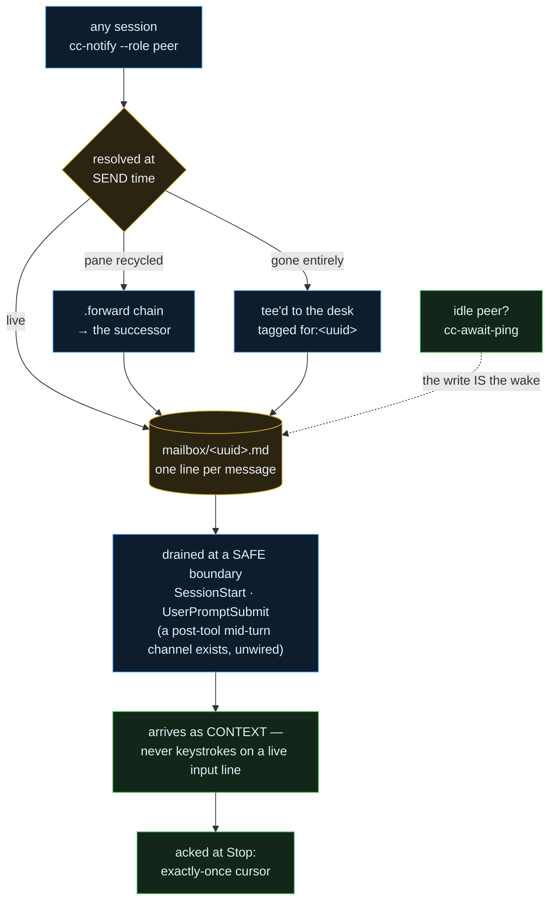
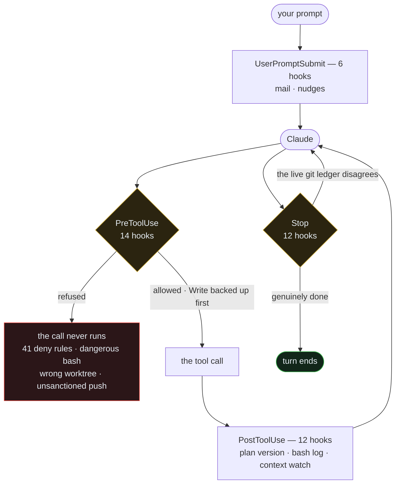
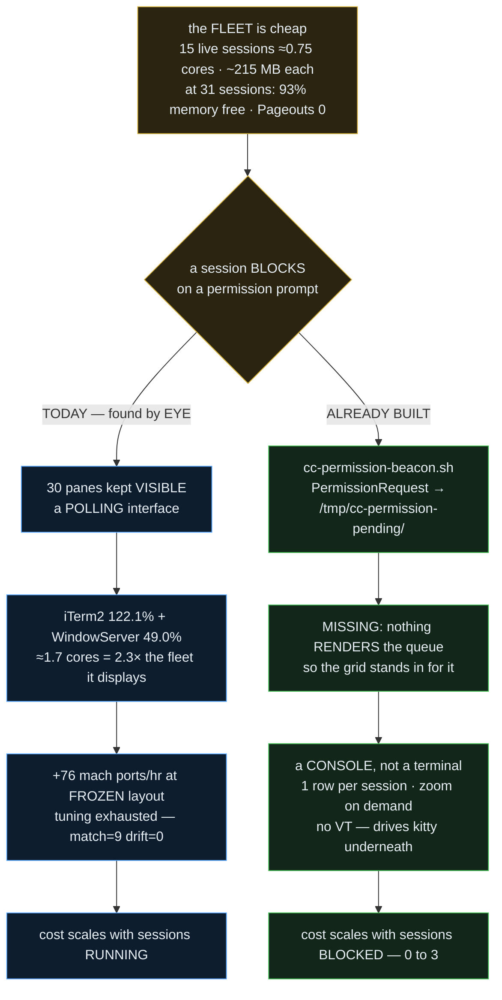
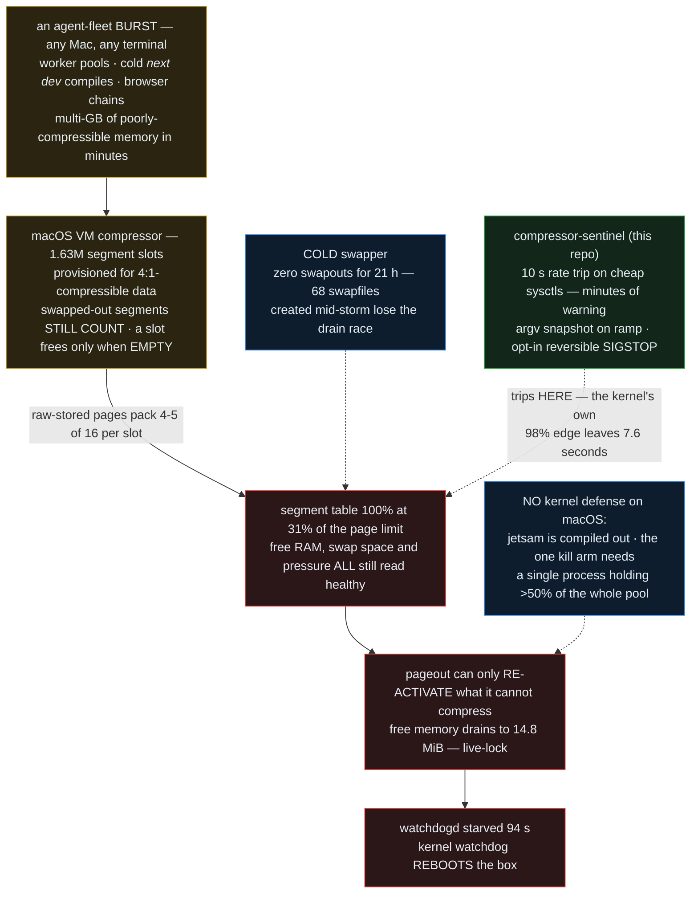
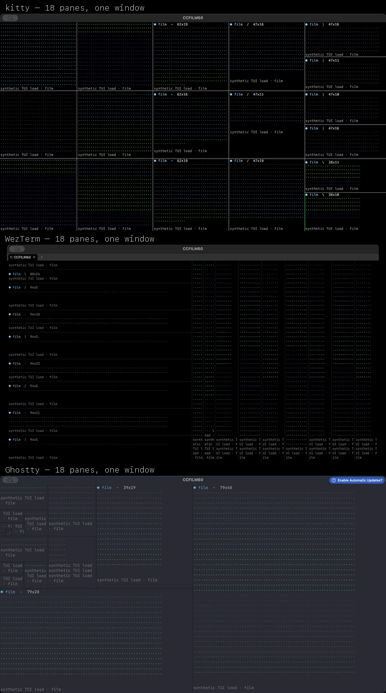
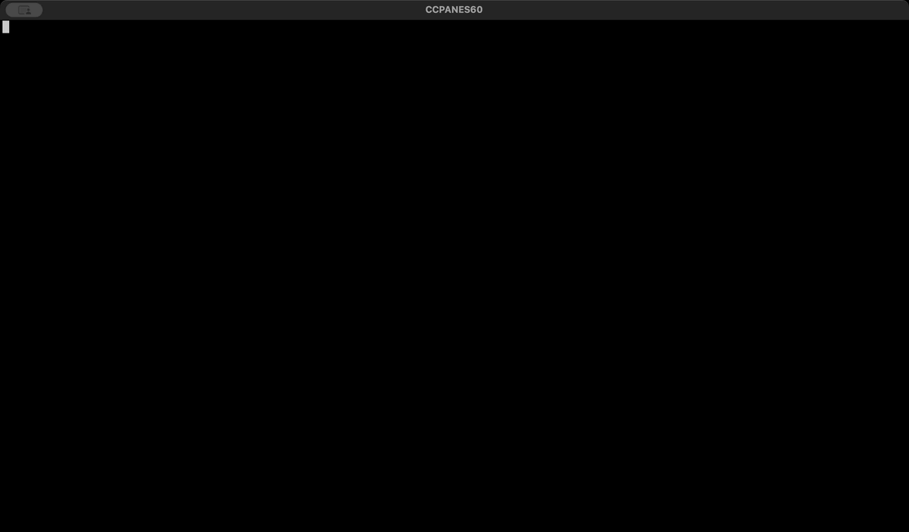

<div align="center">


### `~/.claude` becomes a system you deploy — and the sessions become the schedulers.

[](#4-nothing-a-session-did-dies-with-it)
[](#3-autonomy-is-bounded)
[](#5-the-whole-system-deploys-from-git)
[](#2-parallel-work-cannot-collide)

[**1 · Sessions run each other**](#1-sessions-run-each-other) · [**2 · No collisions**](#2-parallel-work-cannot-collide) · [**3 · Bounded autonomy**](#3-autonomy-is-bounded) · [**4 · Nothing is lost**](#4-nothing-a-session-did-dies-with-it) · [**5 · Deploys from git**](#5-the-whole-system-deploys-from-git) · [**6 · The next ceiling**](#6-the-ceiling-is-the-interface-not-the-machine) · [**Install**](#install) · [**Map**](#map--where-everything-lives) · [**Glossary**](#glossary--the-words-this-repo-uses)

</div>

Claude Code reads everything it does — permissions, hooks, commands, agents — from `~/.claude`.
But `~/.claude` is machine state: unversioned, unreviewable, and the moment a second session starts,
the two share one git index, one binary, and one operator's attention. **So how do you run many at
once, safely, unattended?**

Make `~/.claude` a *deployment* of a git repo — and make the sessions themselves the schedulers.
That is this repo: **1,301 tracked files, ~373,000 lines** of first-party work (vendored code and
generated assets excluded), held to ground truth by a **7,065-test** bats suite and exercised across
**7,939 sessions**.

<div align="center">


<sub><b>An unedited screen recording — two real Claude sessions, one window.</b> A session fires a peer, the pane <b>splits</b>, the peer answers <code>origin/main = bebd9580</code> and <b>pings back</b>; the ping arrives <b>inside the originator's chat</b> (<code>PING RECEIVED FROM PEER</code>) and the peer <b>closes its own pane</b>. One human keystroke: the first prompt. <a href="assets/demo/handoff-live.mp4">Full-resolution video</a> — 1920×1144, 60 fps.</sub>

</div>

| | The property | What it removes |
|---|---|---|
| **1** | [**Sessions run each other**](#1-sessions-run-each-other) | You are no longer the scheduler. Sessions open, message, and retire one another — and page you only when a human must decide. |
| **2** | [**Parallel work cannot collide**](#2-parallel-work-cannot-collide) | A worktree per writer, an account per lane, and exactly one machine-wide lock on landing. |
| **3** | [**Autonomy is bounded**](#3-autonomy-is-bounded) | 81 hooks on 12 lifecycle events refuse the calls that lose work — including a false "done". |
| **4** | [**Nothing a session did dies with it**](#4-nothing-a-session-did-dies-with-it) | Every Write, plan, task and transcript outlives the pane that made it. |
| **5** | [**The whole system deploys from git**](#5-the-whole-system-deploys-from-git) | No drift, no un-reviewable machine state, and an update that can't break a running session. |

[**§6 is the measured ceiling**](#6-the-ceiling-is-the-interface-not-the-machine) — and it is not the machine.

---

## Twice, this repo shipped it first — weeks before Claude Code did

**Anthropic's engineers and Claude Code's power users are the same kind of user, hitting the same
walls in the same order — so the same feature gets invented twice, weeks apart, by people who never
saw each other's work.** This repo is a dated record of that happening. Both times, the capability
was running here before it existed in Claude Code:

| What was built | Running here | Shipped in Claude Code | Lead |
|---|---|---|---|
| **A research team that attacks its own findings** — a mandatory share of every wave briefed to refute the rest, not to add more searchers | **2026-05-24** | Dynamic Workflows `2.1.154` — 2026-05-28 | **4 days** |
| **Two-way messaging between independent sessions** — open, brief, question and retire peers from any session | **2026-07-10** | `2.1.224` — 2026-08-07 | **28 days** |

Anthropic's own documentation dates cross-session messaging to `2.1.224` — *"requires Claude Code
v2.1.224 or later"* — the release that landed 28 days after it was already running here. And neither
side borrowed the other's vocabulary: **zero shared distinctive terms in either direction**.

<!-- Timeline source: tools/timeline/gen.py — edit it, run `npm run timeline`, commit the regenerated SVGs.
     The mermaid chain below is the interactive fallback and keeps its own source at
     assets/diagrams/vendor-convergence.mmd (`npm run diagrams`). -->
<picture>
  <source media="(prefers-color-scheme: dark)" srcset="assets/diagrams/convergence-timeline-dark.svg">
  
</picture>

<details>
<summary>Interactive Diagram</summary>

<!-- mermaid-fence: assets/diagrams/vendor-convergence.mmd (auto-synced by `npm run diagrams`) -->

```mermaid
flowchart TB
    A(["<b>2026-05-24</b> · this repo<br/><b>a research team that attacks its own findings</b><br/>a share of every wave briefed to refute the rest"])
    B["<b>2026-05-28</b> · Claude Code<br/>Dynamic Workflows 2.1.154<br/>the same idea, independently"]
    C(["<b>2026-07-10</b> · this repo<br/><b>two-way session messaging</b><br/>open, brief, question and retire peers"])
    D["<b>2026-08-07</b> · Claude Code 2.1.224<br/>sessions message each other"]
    A -->|"4 days later"| B
    B --> C
    C -->|"28 days later"| D
    classDef cc fill:#0d1d2e,stroke:#58a6ff,color:#e6edf3
    classDef win fill:#12261a,stroke:#3fb950,color:#e6edf3
    class B,D cc
    class A,C win
```

<sup><a href="assets/diagrams/vendor-convergence-dark.svg?raw=true">full-screen dark</a> · <a href="assets/diagrams/vendor-convergence-light.svg?raw=true">light</a> · <a href="assets/diagrams/vendor-convergence.mmd">source</a></sup>

</details>

**It is a cascade, not foresight.** Nobody here saw a roadmap. Both sides optimise the same thing —
useful agent-hours per human-hour — against the same limits, and **each fix manufactures the next
bottleneck**: relieve single-session quality and throughput binds; relieve throughput and two
sessions collide on one git index; isolate the checkouts and context runs out; recycle contexts and
the sessions can no longer hear each other. Written down as a prediction *before* this repo's history
was read, that order matched **eight of nine rungs**. The commit curve says the same thing twice —
4 in March, 24 in April, **zero in May**, 1,515 in July: the May silence is the plateau between two
ceilings, because a curiosity-driven builder trickles and a ceiling-driven one goes quiet.

**Scored against the changelog, losses published.** Six priority claims were tested, both sides dated
— first-add shas here against the npm publish timestamp of the exact version carrying each entry.
Two stand, above. Three were refuted outright, and the one place this repo ran **seven months
behind** Claude Code is in the timeline, in red. Roughly six of this repo's ~60–100 subsystems have a
vendor counterpart at all, so two leads is close to the base rate for parallel obvious needs — which
is precisely why the tally sits beside the wins instead of replacing them.

<sub><b>Full evidence, including every refuted claim and the two errors the first version of it made</b> → <a href="docs/research/vendor-convergence-2026-08-07.md"><code>docs/research/vendor-convergence-2026-08-07.md</code></a></sub>

---

## 1. Sessions run each other

**A session is not a terminal you babysit — it is an addressable process that can open, message, and retire its peers.** The mechanics are four commands.

| Touchpoint | Command | What happens |
|---|---|---|
| **Self-open** | `/handoff` → [`handoff-fire.sh --split-right`](scripts/handoff-fire.sh) | Claims a warm worktree (~3 s), ranks the four accounts on live quota, ⌘D-splits **the firing pane** (anchored to `$ITERM_SESSION_ID`, never whatever window is frontmost), then types and submits the brief. |
| **Self-recycle** | `handoff-fire.sh --recycle` | Exits and relaunches **this** pane in place — arm a detached watcher, type `/exit`, let it re-launch into the plain shell once `claude` is gone. |
| **Self-close** | `handoff-fire.sh self-close --successor <uuid>` | Retires the pane once the work is away. The successor must be **verified engaged** — resolvable, `claude` on its tty, *and* a real assistant turn in its transcript — before `/exit` is typed and again at the close instant. Focus lands on the survivor. |
| **Two-way** | [`cc-notify`](bin/cc-notify) · `--notify-back` · [`cc-await-ping`](bin/cc-await-ping) | Peers exchange messages, so a fired session can report completion, a decision gate, or a blocker back to the session that fired it. |

> **Why `/exit` and not `/clear` + a queued payload.** Claude Code's queue is type-asymmetric: a built-in slash command holds until the calling turn ends, but *plain text* is steered into the still-running turn at the next tool-result boundary — which the firing script's own Bash call guarantees. A queued payload therefore ran inline in the **old** context while `/clear` stayed armed behind it.

The same touchpoints at the command line:


<sub>Recorded with <a href="https://github.com/charmbracelet/vhs">VHS</a> from <a href="assets/demo/handoff-real.tape"><code>assets/demo/handoff-real.tape</code></a> — re-runnable, so it can never drift from the scripts it documents. The <code>/handoff</code> and <code>self-close</code> scenes run <code>--dry-run</code> (nothing is launched or closed); the mailbox round trip is real and completes against a temp inbox.</sub>

### A message is a file, not a keystroke

`cc-notify` appends one line to the target's inbox; the target drains it at a boundary where nothing can be corrupted, and acks it exactly once.

<!-- Diagram source: assets/diagrams/session-comms.mmd — edit it, run `npm run diagrams`, commit the regenerated SVGs. -->
<picture>
  <source media="(prefers-color-scheme: dark)" srcset="assets/diagrams/session-comms-dark.svg">
  
</picture>

<details>
<summary>Interactive Diagram</summary>

<!-- mermaid-fence: assets/diagrams/session-comms.mmd (auto-synced by `npm run diagrams`) -->

```mermaid
flowchart TB
    Box[("mailbox/&lt;uuid&gt;.md<br/>one line per message")]
    Send["any session<br/>cc-notify --role peer"] --> Res{"resolved at<br/>SEND time"}
    Res -->|"live"| Box
    Res -->|"pane recycled"| Fwd[".forward chain<br/>→ the successor"]
    Res -->|"gone entirely"| Desk["tee'd to the desk<br/>tagged for:&lt;uuid&gt;"]
    Fwd --> Box
    Desk --> Box
    Box --> Drain["drained at a SAFE boundary<br/>SessionStart · UserPromptSubmit<br/>(a post-tool mid-turn channel exists, unwired)"]
    Drain --> Ctx["arrives as CONTEXT —<br/>never keystrokes on a live input line"]
    Ctx --> Ack["acked at Stop:<br/>exactly-once cursor"]
    Wake["idle peer?<br/>cc-await-ping"] -.->|"the write IS the wake"| Box
    classDef k fill:#2b2410,stroke:#d4af37,color:#e6edf3
    classDef b fill:#0d1d2e,stroke:#58a6ff,color:#e6edf3
    classDef g fill:#12261a,stroke:#3fb950,color:#e6edf3
    class Res,Box k
    class Send,Fwd,Desk,Drain b
    class Ctx,Ack,Wake g
```

<sup><a href="assets/diagrams/session-comms-dark.svg?raw=true">full-screen dark</a> · <a href="assets/diagrams/session-comms-light.svg?raw=true">light</a> · <a href="assets/diagrams/session-comms.mmd">source</a></sup>

</details>

Each failure below is now structural rather than remembered:

- **A pane UUID is a stale address the moment that pane recycles.** Forensics found 570 pages looping into one dead former-desk inbox for three days. Automated senders now address a **role**, re-resolved at send time; a `.forward` chain follows successions; an undeliverable line is still recorded *and* tee'd to the desk.
- **An enqueue to a dead inbox is not a delivery.** Liveness decides the verdict, and a reroute never upgrades it — `cc-notify` reports "mailbox only", and [`cc-inbox-guard`](bin/cc-inbox-guard) fails loud on mail nothing will ever drain.
- **A drain is not a read.** The `.seen` cursor advances on delivery, but `.acked` only at the Stop *after* a turn provably carried the mail. Dup-biased by design: a crash mid-turn re-surfaces the message instead of silently losing it.

### It pages you only when a human must decide

The same addressing runs outward. Operator-owned steps are rendered as **runnable commands from disk truth**, never prose — a `▶ <exact command>` block at every turn close ([`operator-readout.sh`](hooks/operator-readout.sh)), a board of everything blocking on you ([`cc-blockers`](bin/cc-blockers)), durable decision packets that survive a recycle ([`cc-decide`](bin/cc-decide)), a daily digest with phone push ([`cc-digest`](bin/cc-digest)), and sound + desktop alerts ([`notify.sh`](hooks/notify.sh)).

<details>
<summary><b>The standing desk — what runs the machine between check-ins</b></summary>

<br>

A standing **desk** session orchestrates; launchd daemons dispatch and watch.

- **Work ledger → dispatch.** [`cc-backlog`](bin/cc-backlog) is an append-only JSONL ledger with event-keyed idempotent ids and claim/reap/thrash guards. It feeds [`cc-dispatch`](bin/cc-dispatch), which plans quota-aware waves via [`cc-wave-plan`](bin/cc-wave-plan) and [`claude-accounts`](bin/claude-accounts) ranking across the four accounts.
- **Lifecycle.** Every session self-registers ([`session-register.sh`](hooks/session-register.sh)), with [`cc-reconcile`](bin/cc-reconcile) backfilling misses. [`cc-reaper`](bin/cc-reaper) classifies idle sessions against a cause taxonomy with never-reap defaults; only identity-pinned, landed, clean panes are closed, via [`cc-teardown`](bin/cc-teardown).
- **Crash supervision.** [`lead-crash-watchdog.sh`](hooks/lead-crash-watchdog.sh) classifies per-session death (including binary-version telemetry); [`lead-supervisor.sh`](scripts/lead-supervisor.sh) pages on stalls, permission prompts, and past-threshold runs; [`cc-crash-report`](bin/cc-crash-report) keeps the ledger and dashboard.
- **Agent Teams.** The `TeammateIdle` hook exits code 2 on idle, forcing immediate shutdown so no pane is orphaned; [`bin/it2-wrapper`](bin/it2-wrapper) injects the teammate profile on split and forces modal-free closes.

This layer is audited adversarially — most recently a 15-agent verified audit: [`docs/research/infra-reliability-audit-2026-07-22/`](docs/research/infra-reliability-audit-2026-07-22/synthesis.md).

</details>

---

## 2. Parallel work cannot collide

**Concurrent sessions share one git index and one trunk.** Every writer gets its own worktree and account; every landing passes through exactly one machine-wide lock.

<!-- Diagram source: assets/diagrams/parallel-lanes.mmd — edit it, run `npm run diagrams`, commit the regenerated SVGs. -->
<picture>
  <source media="(prefers-color-scheme: dark)" srcset="assets/diagrams/parallel-lanes-dark.svg">
  
</picture>

<details>
<summary>Interactive Diagram</summary>

<!-- mermaid-fence: assets/diagrams/parallel-lanes.mmd (auto-synced by `npm run diagrams`) -->

```mermaid
flowchart LR
    A["session A<br/>own worktree · acct 1"] --> G
    B["session B<br/>own worktree · acct 2"] --> G
    C["session C<br/>own worktree · acct 3"] --> G
    G["fast gate — UNLOCKED, seconds<br/>statics + ratchets + bounded smoke<br/>(sheds by SKIPPING under load; no corpus, ever)"]
    G --> Lock{"land-lock<br/>held p50 3s (p90 5s):<br/>the CAS push window only"}
    Lock --> Push["push → verify by CONTENT,<br/>not commit count"]
    Push --> Trunk[("origin/main")]
    Trunk --> V["verifier — ONE, background band<br/>full corpus, fresh cell,<br/>host suites partitioned out"]
    V -->|"green stamp"| D["deploy autopilot<br/>fail-closed on green"]
    D --> Live[("live ~/.claude")]
    classDef w fill:#0d1d2e,stroke:#58a6ff,color:#e6edf3
    classDef k fill:#2b2410,stroke:#d4af37,color:#e6edf3
    classDef t fill:#12261a,stroke:#3fb950,color:#e6edf3
    class A,B,C w
    class G,Lock,Push,V,D k
    class Trunk,Live t
```

<sup><a href="assets/diagrams/parallel-lanes-dark.svg?raw=true">full-screen dark</a> · <a href="assets/diagrams/parallel-lanes-light.svg?raw=true">light</a> · <a href="assets/diagrams/parallel-lanes.mmd">source</a></sup>

</details>

Each trap below is defeated by a mechanism, not by discipline:

- **A shared index means a bare `git commit` sweeps another session's staged files** — plus ref-lock races and shared-file clobber. Every writer therefore gets its **own worktree**, handed out warm (`node_modules`, codegen, `.env.local`, seeded DB already built) in about three seconds.
- **The launchers are zsh functions**, carrying per-account isolation, so no script can `exec` them. `claude1`…`claude4` pin one account each; bare **`claude` routes** (interactive lane, below) and prints which way it went. Routing is skipped for `--resume`, for an explicit `CLAUDE_CONFIG_DIR`, and whenever `CC_ACCOUNT_PINNED` is set — the last of these is why a dispatched fire that charged `--assign next` cannot have its own pick silently overridden at exec. The read is cache-only (`--max-wait 0`), so a launch can never inherit the sweeper's minutes-long tail; when the cache is cold it abstains to the pinned account, which is exactly the previous behaviour. `handoff-fire.sh` **types** the launch command into a fresh surface with echo-verified keystrokes, anchored to the firing agent's own window. The surface is a real iTerm2 pane or a real kitty pane depending on where you are sitting ([§6](#so-the-question-stopped-being-which-one--it-runs-on-both)); the anchoring and the echo-verification are the same either way.
- **Four isolated quota pools mean routing decides what gets wasted: weekly quota unburned at its reset is unrecoverable, and burst fires stacking on one account slam its 5-hour window.** Both failed at once on 2026-08-10: the router *excluded* the account whose week was 81% spent with 28h left — 28 open panes, but a 5h window at 60%, and panes are not burn — while every fire inside the 90-second rank cache took the same top pick until that account capped. So [`claude-accounts`](bin/claude-accounts) now routes each new session to **the account whose weekly quota expires soonest relative to what is left, provided its 5-hour window can absorb one more *working* session** — concurrency charged on transcripts written in the last ten minutes plus fire-time phantoms, never on open panes, so a burst walks *down* the ranking inside the cache TTL. Every term is fail-soft and kill-switched. **A human's desk needs the opposite objective, so there are two lanes.** Deadline-dominant urgency would place a session that lives for days *nearest* exhaustion, so `--route interactive` maximises runway instead — same exclusions, opposite objective. Design record: [`docs/plans/ACCOUNT_ROUTING_V2.md`](docs/plans/ACCOUNT_ROUTING_V2.md) §13–§14, [`docs/plans/START_LATENCY_ROUTER.md`](docs/plans/START_LATENCY_ROUTER.md).
- **A hot trunk means N landers race — and a per-land test corpus means they starve each other.** A week of measurement proved the frame, not the tree, was the blocker: full-corpus-per-land collapsed P(green) to ~2.3% under fleet load (one branch died 37 straight times on a tree that was never red). So the verdict is **inverted** ([`docs/plans/LAND_PIPELINE_V2.md`](docs/plans/LAND_PIPELINE_V2.md)): [`ship-land.sh`](scripts/ship-land.sh) lands in seconds-to-minutes with only O(diff) statics, ratchets and a ≤120s direct-suite smoke that *skips* under load — nothing heavy can enter [`land-lock.sh`](scripts/land-lock.sh), which holds only around the CAS push window: **p50 3s, p90 5s** over the 110 holds since `145fab7d` moved the stranded-sweep and the backup-reap out of the mutex, against **p50 61s, max 6771s** before it. Every figure here has a **half-life**, so **re-derive it, do not quote it:** [`scripts/gate-red-census.sh`](scripts/gate-red-census.sh) renders the hold, the gate-red rate, end-to-end land latency and the staleness columns from [`land.log`](scripts/ship-land.sh) with each panel's own coverage. The full-suite claim belongs to one background verifier ([`postland-verify.sh`](scripts/postland-verify.sh) — fresh cell per run, [`host-suites.manifest`](scripts/host-suites.manifest) partition, progress-keyed stall bound, auto-revert of bisected culprits), and the live layer only ever advances to its green stamp ([`deploy-live.sh`](scripts/deploy-live.sh) on a launchd tick). Landing is still verified **by content** ([`land-verify.sh`](scripts/land-verify.sh)) — a commit-count check reads "landed" for work that was silently dropped, which is exactly how a 5-file commit went missing on 2026-07-11.

> **Portable vs project-specific.** `handoff-fire.sh`, the isolation policy, [`docs/WORKTREE_WORKFLOW.md`](docs/WORKTREE_WORKFLOW.md), and this repo's fail-closed landing rail are the **portable** half and live here. App repos keep their own warm pool and migration-aware `/ship` variants. Account, model and effort routing reads `~/.claude/model-config.yaml`, which is per-machine and deliberately not synced.

### Why 30+ panes freezes iTerm2 — and why the GPU can't fix it

**It isn't a memory leak — it's windows that don't die.** iTerm2 has an unfixed upstream bug (#12097, #12645, #12905): closing a tab to zero panes should destroy its `NSWindow`; on iTerm2 it doesn't. One session left 98 "closed" windows alive, and each still costs the compositor real objects: a **window** costs ~28–34 MB of backing store + ~4.9 Mach ports to WindowServer; a **pane** inside an existing window costs almost nothing (~3 IOSurfaces, ~0 net bytes). Spreading 30 sessions across 30 windows costs WindowServer **2.35× more CPU than the same 30 panes gathered into one window** — while iTerm2 itself measured **0.0% CPU** and WindowServer sat at 92–99.9%. The window is the expensive unit.

**Pushing that rendering onto the idle GPU makes it worse, and Ghostty is the proof.** The bottleneck is compositor *objects*, and GPU rendering adds them: iTerm2's Metal path allocates a `CAMetalLayer` plus dispatch queues *per pane* and caps GPU rendering at 5 panes per tab, so lighting up 30 sessions on Metal forces **six separate windows** — the exact axis that already froze the machine. Ghostty has **no CPU renderer at all**, so if "more GPU" were the fix it should be the cheapest terminal under load; byte-matched at 18 panes / 10 fps it burns **27.3% app CPU against kitty's 9.5%**, because submitting frames to a GPU is itself CPU work, paid on every pane. kitty wins by putting all panes in **one** window, not by avoiding the GPU — and the axis is not the graphics API at all, which [§6](#the-interface-is) fits to cadence, then windows, then surfaces.

Full evidence and the migration plan: [`docs/research/terminal-for-30-panes-2026-07-31.md`](docs/research/terminal-for-30-panes-2026-07-31.md).

---

## 3. Autonomy is bounded

**Every prompt, tool call and turn-ending passes through hooks that can refuse it.** This repo ships 90 hook scripts; the live config wires **81 hook entries across 12 lifecycle events**. All exit 0 by default — a hook failure never blocks a tool — *except* deliberate `PreToolUse` denials and fact-bound `Stop` blocks.

<!-- Diagram source: assets/diagrams/guardrail-pipeline.mmd — edit it, run `npm run diagrams`, commit the regenerated SVGs. -->
<picture>
  <source media="(prefers-color-scheme: dark)" srcset="assets/diagrams/guardrail-pipeline-dark.svg">
  
</picture>

<details>
<summary>Interactive Diagram</summary>

<!-- mermaid-fence: assets/diagrams/guardrail-pipeline.mmd (auto-synced by `npm run diagrams`) -->

```mermaid
flowchart TB
    P(["your prompt"]) --> UPS["UserPromptSubmit — 6 hooks<br/>mail · nudges"]
    UPS --> M(["Claude"])
    M --> Pre{"PreToolUse<br/>14 hooks"}
    Pre -->|"refused"| No["the call never runs<br/>41 deny rules · dangerous bash<br/>wrong worktree · unsanctioned push"]
    Pre -->|"allowed · Write backed up first"| Tool["the tool call"]
    Tool --> Post["PostToolUse — 12 hooks<br/>plan version · bash log · context watch"]
    Post --> M
    M --> Stop{"Stop<br/>12 hooks"}
    Stop -->|"the live git ledger disagrees"| M
    Stop -->|"genuinely done"| End(["turn ends"])
    classDef gate fill:#2b2410,stroke:#d4af37,color:#e6edf3
    classDef no fill:#2b1618,stroke:#f85149,color:#e6edf3
    classDef ok fill:#12261a,stroke:#3fb950,color:#e6edf3
    class Pre,Stop gate
    class No no
    class End ok
```

<sup><a href="assets/diagrams/guardrail-pipeline-dark.svg?raw=true">full-screen dark</a> · <a href="assets/diagrams/guardrail-pipeline-light.svg?raw=true">light</a> · <a href="assets/diagrams/guardrail-pipeline.mmd">source</a></sup>

</details>

| Hook | Fires on | What it refuses, or guarantees |
|---|---|---|
| [`backup-before-write.sh`](hooks/backup-before-write.sh) | Write · Edit | No file is modified before a nanosecond+PID-stamped backup exists; injects the OVERWRITE GUARD and plan rules into context. |
| [`validate-bash.sh`](hooks/validate-bash.sh) | Bash | Pattern-blocks destructive commands, and audit-logs the rest. |
| [`git-worktree-guard.sh`](hooks/git-worktree-guard.sh) | Bash · Write | Refuses writes aimed at the wrong worktree. |
| [`completion-assert.sh`](hooks/completion-assert.sh) | Stop | **Refuses a false "done"** that contradicts the live git and gate ledger. |
| [`operator-readout.sh`](hooks/operator-readout.sh) | Stop | Renders every operator-owned step as a `▶ runnable command`, from disk truth. |
| [`teammate-auto-shutdown.sh`](hooks/teammate-auto-shutdown.sh) | TeammateIdle | Exit code 2 → immediate shutdown; zero orphaned panes. |

<details>
<summary><b>Full hook roster, by lifecycle event</b></summary>

<br>

```
SessionStart (15)     session-start · session-register · live-session-registry · desk-brief-inject · dod-persist ·
                      mailbox-drain · mailbox-wake-arm · setup-plan/task-symlinks · session-index-start · pre-session-validate ·
                      config-mirror-assert · activation-watch · frontier-status · lead-crash-watchdog
UserPromptSubmit (6)  mailbox-drain · handoff-intent-nudge · research-precognition-nudge · memory-nudge ·
                      cache-expiry-warning · session-beat
PreToolUse (14)       validate-bash · backup-before-write (OVERWRITE GUARD) · git-worktree-guard · agent-teams-enforce ·
                      rm-safe-allowlist · check-edit-boundary · plan-agent-teams-default · frontier-spawn-gate ·
                      cc-unattended-ask-guard · keychain-guard · curl-gate · enforce-email-formatting ·
                      ship-rail-push-allow · qos-rewrite
PostToolUse (12)      post-file-edit · plan-index-update · plan-version-commit · plan-pin-session · validate-plan-structure ·
                      log-bash · task-mutation-index · teammate-checkpoint · waiting-recycle · relay-verbatim ·
                      cc-permission-beacon · mailbox-drain (post-tool — the mechanical wake path)
Stop (12)             completion-assert (blocks a false "done") · operator-readout · session-continue · boundary-handoff ·
                      anti-deference-nudge · dispatch-assert · teammate-checkpoint · cache-expiry-tracker · notify ·
                      session-beat · goal-inert-watch · cc-permission-beacon
SessionEnd (7)        session-end (watchdog handshake) · session-deregister · session-index-end · session-save-id ·
                      live-session-registry · harvest-skill-end · cc-permission-beacon
Notification (5)      notify ×2 (audio + desktop) · push-critical ×3    PermissionRequest (4)  notify ×3 (Bash · question · plan) ·
                      cc-permission-beacon — WIRED on 4 events (PostToolUse · Stop · SessionEnd · PermissionRequest)
PreCompact (3)        dod-persist · compact logging                   TeammateIdle (1)       teammate-auto-shutdown
WorktreeCreate (1)    worktree-setup                                  TaskCompleted (1)      task-quality-gate
```

</details>

<details>
<summary><b>Permissions and auto mode — what the classifier may and may not decide</b></summary>

<br>

`claude --permission-mode auto` lets the classifier resolve `ask`-tier calls instead of prompting you. Every other layer still applies:

| Layer | Count | Behavior in auto mode |
|---|---|---|
| `deny` rules | 41 | **Always enforced** — the classifier cannot override |
| `ask` rules | 6 | Classifier decides instead of prompting (collapsed from 45 as autonomy moved routine calls behind classifier + hook rails) |
| `allow` rules | 339 | Auto-approved: read-only commands, WebFetch domains, Edit/Write, MCP tools |
| PreToolUse hooks | 14 | Always fire — a hook deny is an absolute block |
| PostToolUse hooks | 12 | Always fire — logging, plan versioning, task indexing |

Key deny rules, enforced even in auto mode: `git push --force`, `sudo`/`su`, `eval`/`exec`, `git clean`, `wget`, `dd`, and reads of `.env*` / `*.key` / `*.pem`.

Teammate models must be on the account's auto-mode allowlist, or the spawn silently demotes to `acceptEdits`. That allowlist is deliberately **not** written down here: it lives in `~/.claude/model-config.yaml` under `auto_mode_allowlist`, the single source of truth for model, effort and frontier routing — and [`claude-lint-models.sh`](scripts/claude-lint-models.sh) fails any file in this repo that pins a superseded model literal, this README included. Inspect the classifier with `claude auto-mode defaults | config | critique`.

</details>

---

## 4. Nothing a session did dies with it

**Panes are disposable; their output is not.**

| What survives | How | Recover it with |
|---|---|---|
| **Every file version** | [`backup-before-write.sh`](hooks/backup-before-write.sh) stamps a backup before every Write/Edit — nanosecond+PID names (parallel-agent-safe), sidecar `.path` files for basename collisions, atomic `mktemp`+`mv` restore, capped at 10/file — but only **3** for `*.sh`, the file type this repo is mostly made of — with a 30-day TTL by [`prune-backups.sh`](scripts/prune-backups.sh) | [`restore-file`](scripts/restore-file.sh) `<path>` · `--diff` · `--pick N` · `--recent 10` |
| **Every plan revision** | [`plan-version-commit.sh`](hooks/plan-version-commit.sh) writes two layers: an append-only `MANIFEST.jsonl` (timestamp, session, SHA256, line count) and full snapshots in a separate git repo | `cd ~/.claude/plan-history && git log` |
| **Every task list** | Claude Code uses UUID task dirs and ignores `CLAUDE_CODE_TASK_LIST_ID`; [`setup-task-symlinks.sh`](hooks/setup-task-symlinks.sh) detects the active list at SessionStart, symlinks it to `.claude-tasks/_current/`, and generates a readable `TASKS.md` beside it | `.claude-tasks/TASKS.md` |
| **Every conversation** | SQLite FTS5 index — 3,001 sessions, kept self-maintaining by three hooks: a crash-safe stub at SessionStart, rich metadata at SessionEnd, and a 60-second sweep daemon catching misses. Retention drops rows whose transcript Claude Code has since deleted, so a hit is always openable | `claude-search "<query>"` · `--fzf` · `--stats` |
| **Every interrupted session** | A killed session is not a lost one — the transcript stays resumable. [`resume-sessions`](skills/resume-sessions/SKILL.md) is the runbook: it finds resumable transcripts across all four account stores, dedups the `.claude`/`.claude-next` mirror, and ranks by each transcript's **internal** max timestamp — never file mtime, because a bulk mirror touch is not activity. [`lr-select.py`](scripts/limit-recover/lr-select.py) then consolidates to **one session per worktree** (the same selector `lr-reset-poller.sh` and `boot-resume.sh` consult, so all three paths obey one policy) — without it, a project with a long history resurrects proportionally many sessions: 14 for one project, 39 live sessions and zero free RAM, 2026-07-21. Panes anchor to the *calling* pane via [`kitty-split-launch.sh`](bin/kitty-split-launch.sh), never wherever kitty's focus drifted | `/resume-sessions` |

```bash
restore-file path/to/file --diff     # unified diff against the latest backup
restore-file --recent 10             # 10 most recent backups across all files
claude-search "replicache mutation"  # full-text across every session, <5 ms
```

Session search is its own project: **[claude-session-search](https://github.com/renchris/claude-session-search)**.

---

## 5. The whole system deploys from git

**The repo is the source of truth; your `~/.claude` is its deployment.** The primary config dir is *symlinked*, so editing a live hook edits this repo.

<!-- Diagram source: assets/diagrams/deploy-model.mmd — edit it, run `npm run diagrams`, commit the regenerated SVGs. -->
<picture>
  <source media="(prefers-color-scheme: dark)" srcset="assets/diagrams/deploy-model-dark.svg">
  
</picture>

<details>
<summary>Interactive Diagram</summary>

<!-- mermaid-fence: assets/diagrams/deploy-model.mmd (auto-synced by `npm run diagrams`) -->
```mermaid
flowchart TB
    Repo["claude-infrastructure<br/>1,301 files · one reviewable history"]
    Repo &lt;--&gt;|"install.sh · SYMLINK<br/>editing the live hook IS editing the repo"| Prim["~/.claude<br/>hooks · commands · scripts"]
    Repo -->|"--config-dir · code SYMLINKED<br/>auth + settings per-account"| Alt["~/.claude-secondary … 4<br/>4 billing-isolated accounts"]
    Repo -->|"COPY<br/>sync.sh pulls hand-edits back"| Glob["~/bin · LaunchAgents<br/>68 tools · 21 daemons · statusline"]
    classDef src fill:#2b2410,stroke:#d4af37,color:#e6edf3
    classDef dep fill:#0d1d2e,stroke:#58a6ff,color:#e6edf3
    class Repo src
    class Prim,Alt,Glob dep
```

<sup><a href="assets/diagrams/deploy-model-dark.svg?raw=true">full-screen dark</a> · <a href="assets/diagrams/deploy-model-light.svg?raw=true">light</a> · <a href="assets/diagrams/deploy-model.mmd">source</a></sup>

</details>

The symlink rule came from a failure: on 2026-07-03 a *copied* `handoff-fire.sh` had drifted +198 lines in the deployment and was one `install.sh` away from being clobbered. The four account dirs isolate **auth and settings, not code** — as deployed, their `hooks/`, `commands/` and `scripts/` symlink into this checkout too, so one landing moves every account. Global surfaces stay copies, and `sync.sh` pulls hand-edits of those back.

**Landed is not live — the gap is closed by proof, not by hand.** Because the primary dir symlinks into the checkout, a trunk commit only reaches running sessions when the checkout advances — and it advances *autonomously and fail-closed*: a launchd verifier ([`postland-verify.sh`](scripts/postland-verify.sh), every 5 min) proves each trunk tree with the full corpus in a fresh cell and stamps it; a deploy autopilot ([`deploy-live.sh`](scripts/deploy-live.sh)` --auto`, every 10 min) fast-forwards the checkout **only to a green-stamped tree**, re-runs `install.sh` (so brand-new files get their symlinks), and then runs the [host suites](scripts/host-suites.manifest) against the live layer — the one place suites that assert the deployed world can honestly run. A red trunk auto-reverts its bisected culprit; a dead verifier or a lagging deploy is surfaced by fact-bound alarms in [`cc-blockers`](bin/cc-blockers) rather than assumed healthy.

<details>
<summary><b>What lives in <code>~/.claude/</code></b></summary>

<br>

```
~/.claude/                       # config dir — machine state + the deployed system
├── settings.json · .mcp.json    # permissions, hooks, env · MCP servers
├── CLAUDE.md                    # global instructions (synced)
├── model-config.yaml            # model / effort / frontier SSOT (per-machine, NOT synced)
├── hooks/  commands/  scripts/  # SYMLINKED from this repo — edits go live
├── skills/  agents/             # SYMLINKED — 15 skills, 4 custom agents
├── bin/it2                      # teammate pane wrapper (copied) — iTerm2, or kitty via it2-kitty
├── mailbox/  cc-roles/          # per-pane inboxes · role → pane resolution
├── backups/                     # auto-backups (10/file, 30-day TTL)
├── plan-history/                # plan snapshots (its own git repo)
├── session-index.db             # FTS5 session search
└── projects/                    # per-project memory + transcripts

~/.claude-versions/   current -> 2.1.114      # atomically-symlinked installs
~/bin/                claude-latest · claude-update · claude-versions   (the 68 cc-* fleet tools live in ~/.claude/bin)
~/Library/LaunchAgents/   21 daemons installed, 17 loaded — dispatcher · reapers · verifier · deploy · search · …
```

</details>

### Install

```bash
git clone <your fork's URL> claude-infrastructure
cd claude-infrastructure
cp accounts.json.example accounts.json   # then edit it: your email(s), one entry per Max account
./install.sh --dry-run   # preview
./install.sh             # idempotent
```

It symlinks hooks, commands and scripts into `~/.claude`; copies `bin/` tools, `statusline.sh` and the LaunchAgents; loads the daemons; and validates `settings.json`. For an alternate account: `./install.sh --config-dir ~/.claude-secondary`. Re-run it after every trunk fast-forward — it links **brand-new** files, which per-file symlink directories otherwise never pick up. `--wire-hooks` additively merges the template hook roster into a live `settings.json`, with backup and validation.

**However many Claude accounts you have (1-N, not just the 4 this repo was built against):** `accounts.json`'s `accounts[]` array is the single source of truth — every account-aware tool (`claude-accounts`, `cc-board`, `handoff-fire.sh`, `lr-*`, …) reads through `scripts/gen-account-map.sh`'s generated map or the array itself, never a hardcoded account list. One entry is enough to start; add more later by appending to the array (`install.sh` regenerates the map automatically). `accounts.json` is gitignored on a fresh clone — it holds real email addresses — so it never shows up in `git status`.

**Terminal: iTerm2 or kitty.** `install.sh` runs [`scripts/kitty-setup.sh`](scripts/kitty-setup.sh) automatically whenever kitty is present; run it by hand to wire or inspect kitty on its own:

```bash
scripts/kitty-setup.sh --check   # report only — exits 1 if anything is missing or INERT
scripts/kitty-setup.sh           # apply (idempotent) · --undo reverts
```

It reports **live** state separately from on-disk state, because config present is not config loaded: `allow_remote_control` and `listen_on` are the only two options kitty refuses to reload, so a kitty older than its config is **INERT** and `--check` exits 1 rather than reporting green. It never clobbers a hand-written `kitty.conf`, and `install.sh` does not propagate its exit status — non-zero means *restart kitty*, not *the install failed*. What it wires is in [§6](#so-the-question-stopped-being-which-one--it-runs-on-both).

```bash
./sync.sh          # pull hand-edits of COPIED surfaces back into the repo
./sync.sh --diff   # preview only
```

### An update can't break a running session

npm overwrites Claude's binary in place, which throws `ENOTEMPTY` when live sessions hold file handles. The fix is Homebrew-style parallel installs — every version in its own directory, one symlink pointing at the active one:

```
~/.claude-versions/
├── 2.1.113/           # rollback target
├── 2.1.114/           # current — the pinned stable track
├── 2.1.183/           # kept, not current
└── current -> 2.1.114 # atomic symlink — rename(2), NOT ln -sfn
```

`ln -sfn` is wrong because it is two syscalls (`unlink` + `symlink`) with an ENOENT window between them. The atomic swap:

```bash
ln -s "$new_version" "${current}.tmp_$$"
mv -f "${current}.tmp_$$" "$current"   # rename(2) is POSIX-atomic
```

Running processes survive `rm -rf` of their own version via POSIX vnode semantics — the kernel keeps the `mmap`'d binary alive until the last fd closes. [`bin/claude-latest`](bin/claude-latest) wraps all of it: rotate log → check npm (10-min cache) → clean stale versions *before* install (disk-full resilience) → install under a `mkdir` lock → validate the binary → swap → `exec` with `DISABLE_AUTOUPDATER=1`. GC never deletes the symlink target, skips versions with live processes (`pgrep`), and recovers by scanning for any working version if `current` is broken.

| Command | Purpose |
|---|---|
| `claude` | Auto-update + GC + launch (via `claude-latest`) |
| `claude-update [version]` | Install latest, or pin a specific version |
| `claude-update --cleanup` | Manual GC (keep current + N previous) |
| `claude-versions` | List installed versions with disk usage |
| `CLAUDE_SKIP_UPDATE=1 claude` | Skip the update check once |

### Held to ground truth

**7,065 bats tests across 380 files (112,248 lines)** prove every tree — continuously by the background verifier ([`postland-verify.sh`](scripts/postland-verify.sh), the sole owner of the full-suite claim). A nightly full-suite regression daemon is declared but **staged, not loaded** — `com.claude.nightly-regression` is absent from `launchctl list`, and `launchd/fleet.manifest` marks it `staged`. Diagrams have their own guard: `npm run diagrams:check` fails CI if a rendered SVG or an embedded mermaid fence has drifted from its `.mmd` source.

---

## 6. The ceiling is the interface, not the machine

Everything above runs ~30 sessions unattended. At that concurrency this box lagged and froze — both now root-caused (below and [§the machine](#the-machine-is-not-the-constraint)) — and every pane must stay visible, because a blocked permission prompt is found *by eye*. On [Boris Cherny's adoption ladder](https://claude.ai/code/artifact/bfdfaef9-bc62-4dfe-ba9e-c58a26c9accf) that puts this system at **Step 3 in mechanism and Step 2 in human loop**: worktrees, subagents, dynamic workflows, `/loop`, `/batch`, `/goal`, Skills and launchd routines are all here, but the operator is still a *poller*.

**Running 30 sessions is not the ceiling — finding the one that is blocked is.** The notifier that would replace the grid is already wired ([`cc-permission-beacon.sh`](hooks/cc-permission-beacon.sh)) and simply has no face, so the operator polls 30 panes to discover a prompt. What binds the *fleet* toward 150 resident sessions is **not** memory: an axis-L red-team ranked resident memory **fifth of five** binding constraints, and its verdict is that *"RAM total has never been the binding constraint"* ([`bottleneck-refute.md`](docs/research/memory-econ-rearchitecture-2026-08-10/bottleneck-refute.md)). The arrival constants stand as *sizing* figures — ≈340 MB per session arrival, plus ≈507 MB/session of MCP children no budget had counted — but they never bind first. What **refuses** a session is self-imposed (router `KMAX=8×4=32`, dispatcher ceiling 6); what the box *feels* limited by is simultaneously-**active** load at ~4–8 sessions, which is also what four Max accounts' quotas sustain.

*A 13-axis adversarial audit ([`scaling-bottlenecks-2026-08-09.md`](docs/research/scaling-bottlenecks-2026-08-09.md)) refuted this section's original lag story: the render "wall" was an instrument artifact — the census summed iTerm2 CPU on a kitty fleet, and occluded panes are never composited — and 92% of the lag an operator actually feels was one backlog query on the turn-end hook path, since cached, 8.1 s → 2.3 s per turn end. The interface ceiling below survives that correction; the renderer figures it cites are 2026-07-31, from [`l3-l4-terminal-and-workflow-2026-07-31.md`](docs/research/l3-l4-terminal-and-workflow-2026-07-31.md).*

<!-- Diagram source: assets/diagrams/interface-ceiling.mmd — edit it, run `npm run diagrams`, commit the regenerated SVGs. -->
<picture>
  <source media="(prefers-color-scheme: dark)" srcset="assets/diagrams/interface-ceiling-dark.svg">
  
</picture>

<details>
<summary>Interactive Diagram</summary>

<!-- mermaid-fence: assets/diagrams/interface-ceiling.mmd (auto-synced by `npm run diagrams`) -->

```mermaid
flowchart TB
    Fleet["the FLEET is cheap<br/>15 live sessions ≈0.75 cores · ~215 MB each<br/>at 31 sessions: 93% memory free · Pageouts 0"]
    Block{"a session BLOCKS<br/>on a permission prompt"}
    Fleet --> Block

    Block -->|"TODAY — found by EYE"| Poll["30 panes kept VISIBLE<br/>a POLLING interface"]
    Block -->|"ALREADY BUILT"| Beacon["cc-permission-beacon.sh<br/>PermissionRequest →<br/>/tmp/cc-permission-pending/"]

    Poll --> Cost["iTerm2 122.1% + WindowServer 49.0%<br/>≈1.7 cores = 2.3× the fleet it displays"]
    Cost --> Leak["+76 mach ports/hr at FROZEN layout<br/>tuning exhausted — match=9 drift=0"]
    Leak --> ScaleN["cost scales with sessions RUNNING"]

    Beacon --> Face["MISSING: nothing RENDERS the queue<br/>so the grid stands in for it"]
    Face --> Console["a CONSOLE, not a terminal<br/>1 row per session · zoom on demand<br/>no VT — drives kitty underneath"]
    Console --> ScaleB["cost scales with sessions BLOCKED — 0 to 3"]

    classDef k fill:#2b2410,stroke:#d4af37,color:#e6edf3
    classDef b fill:#0d1d2e,stroke:#58a6ff,color:#e6edf3
    classDef g fill:#12261a,stroke:#3fb950,color:#e6edf3
    class Block,Fleet k
    class Poll,Cost,Leak,ScaleN b
    class Beacon,Face,Console,ScaleB g
```

<sup><a href="assets/diagrams/interface-ceiling-dark.svg?raw=true">full-screen dark</a> · <a href="assets/diagrams/interface-ceiling-light.svg?raw=true">light</a> · <a href="assets/diagrams/interface-ceiling.mmd">source</a></sup>

</details>

### The machine is not the constraint

The intuitive diagnosis — heaps grow, memory exhausts, the box swaps — is refuted four ways on this hardware:

| Evidence | Reading |
|---|---|
| **31 concurrent sessions, live** | **93% memory free · `Pageouts: 0`** — no swapping at the exact scale modelled as fatal |
| **Per-session footprint** | **~215 MB** (211–295 MB across the live fleet), so 30 sessions project to ~6.5 GB — not the ~45 GB the memory theory requires. *Re-measured 2026-08-09 across 1,194 arrival/departure transitions: **~340 MB** full arrival cost (+ ~507 MB/session of MCP children when spawned) — still nowhere near fatal at 30, but the constant that sizes any 150-resident budget* |
| **Panic 2026-07-30** | VM-compressor **segment** exhaustion with **~20 GB free**, `swap_low:0` — structural, not a load threshold |
| **Panic 2026-07-31** | kernel **spinlock timeout** from a research probe's own **8,368-thread** ladder; compressor 0% pages / 7% segments, **OK** — self-inflicted by the instrument, not by the workload |
| **Panic 2026-08-05** | the segment-exhaustion class **resolved**: a **670-process node worker burst** into a cold swapper — fleet-scale bursts only, terminal exonerated; guard shipped (below) |

The whole 15-session fleet costs **≈0.75 cores**.

**The one failure that is the machine, not the interface: macOS itself can panic under agent-fleet memory bursts.** Five kernel panics of one class in eleven days (a sixth was unrelated) traced to an undocumented weakness in *any* Mac running heavy multi-agent workloads, in any terminal — the VM compressor's *segment table* is provisioned for 4:1-compressible data, counts swapped-out segments against its limit, and (jetsam being compiled out) has **no kill path** that reaches a fleet of medium processes. A multi-GB burst of poorly-compressible memory — node worker pools, cold `next dev` compiles, browser chains — exhausts it in minutes and the box live-locks into a watchdog reboot with 20 GB still "free". No single stock Claude Code session can trip it, and the terminal is exonerated (kitty stayed ~1.4 GB throughout).

Every conventional signal reads healthy to the end, so this repo ships the guard that can see it: [`scripts/compressor-sentinel.sh`](scripts/compressor-sentinel.sh), a 10 s rate-keyed daemon on cheap sysctls that snapshots full argv on ramp and reversibly freezes the burst cohort — and the spawner minting it, which is never in that cohort. **Armed 2026-08-09**, after panics #5 and #6 proved detection-only saves nothing; the hourly reaper that removes ownerless spawners between storms was armed beside it 2026-08-10. Full forensics, including why five earlier "resolutions" never stuck: [`docs/research/crash-rootcause-2026-08-09.md`](docs/research/crash-rootcause-2026-08-09.md).

<!-- Diagram source: assets/diagrams/compressor-panic.mmd — edit it, run `npm run diagrams`, commit the regenerated SVGs. -->
<picture>
  <source media="(prefers-color-scheme: dark)" srcset="assets/diagrams/compressor-panic-dark.svg">
  
</picture>

<details>
<summary>Interactive Diagram</summary>

<!-- mermaid-fence: assets/diagrams/compressor-panic.mmd (auto-synced by `npm run diagrams`) -->

```mermaid
flowchart TB
    Burst["an agent-fleet BURST — any Mac, any terminal<br/>worker pools · cold <i>next dev</i> compiles · browser chains<br/>multi-GB of poorly-compressible memory in minutes"]
    Comp["macOS VM compressor — 1.63M segment slots<br/>provisioned for 4:1-compressible data<br/>swapped-out segments STILL COUNT · a slot frees only when EMPTY"]
    Cold["COLD swapper<br/>zero swapouts for 21 h — 68 swapfiles<br/>created mid-storm lose the drain race"]
    Full["segment table 100% at 31% of the page limit<br/>free RAM, swap space and pressure ALL still read healthy"]
    NoKill["NO kernel defense on macOS:<br/>jetsam is compiled out · the one kill arm needs<br/>a single process holding >50% of the whole pool"]
    Wedge["pageout can only RE-ACTIVATE what it cannot compress<br/>free memory drains to 14.8 MiB — live-lock"]
    Panic["watchdogd starved 94 s<br/>kernel watchdog REBOOTS the box"]
    Sent["compressor-sentinel (this repo)<br/>10 s rate trip on cheap sysctls — minutes of warning<br/>argv snapshot on ramp · opt-in reversible SIGSTOP"]

    Burst --> Comp
    Comp -->|"raw-stored pages pack 4-5 of 16 per slot"| Full
    Cold -.-> Full
    Sent -.->|"trips HERE — the kernel's own<br/>98% edge leaves 7.6 seconds"| Full
    Full --> Wedge
    NoKill -.-> Wedge
    Wedge --> Panic

    classDef k fill:#2b2410,stroke:#d4af37,color:#e6edf3
    classDef r fill:#2b1618,stroke:#f85149,color:#e6edf3
    classDef b fill:#0d1d2e,stroke:#58a6ff,color:#e6edf3
    classDef g fill:#12261a,stroke:#3fb950,color:#e6edf3
    class Burst,Comp k
    class Cold,NoKill b
    class Full,Wedge,Panic r
    class Sent g
```

<sup><a href="assets/diagrams/compressor-panic-dark.svg?raw=true">full-screen dark</a> · <a href="assets/diagrams/compressor-panic-light.svg?raw=true">light</a> · <a href="assets/diagrams/compressor-panic.mmd">source</a></sup>

</details>

### The interface is

| Measurement | Reading |
|---|---|
| **Renderer vs fleet** | iTerm2 **122.1%** + WindowServer **49.0%** ≈ **1.7 cores** — **2.3× the entire agent fleet it displays**, and that is the *conservative* end: five re-samples put the ratio at **2.74–4.08×** (median 2.89×) |
| **Leak, at frozen layout** | **+76 mach ports/hour** while RSS *falls* (−28 MB/hr) — the axis whose unbounded growth characterised the freeze |
| **Tuning headroom** | [`iterm2-perf-parity.sh`](scripts/iterm2-perf-parity.sh) → `match=9 drift=0`, and it still burns 1.2 cores at *half* load ⇒ **configuration is exhausted** |
| **The unit that costs** | the same 30 panes cost **+22.6 pp** of a core across 30 windows vs **+11.2 pp** in one — **windows are 2.35×; panes are nearly free** |

This inverts the obvious remedy **on iTerm2**. It disables Metal for any tab holding ≥6 sessions *and* for every background tab, so its only all-GPU layout for 30 sessions is **6 windows** — which forces you into the expensive unit. On *that* architecture, "more GPU" and "more compositor objects" are the same request, because iTerm2 allocates one `CAMetalLayer` **per pane** — so the cap is protecting you.

But the axis is not the graphics API — it is **cadence, then windows, then surfaces**, fitted from four compositor arms at identical geometry and pixels/second:

| Axis | Coefficient | Lever at 30 panes |
|---|---|---|
| **Presentation cadence** | **0.480 pp/Hz** | **9.6pp — dominant, 6× the surface lever** |
| OS-window count | 0.4483 pp/window | 13.0pp across 1→30 |
| Surface count *within* a window | 0.0552 pp/surface | 1.60pp ceiling — 8.1× cheaper per unit than a window |
| **Metal vs OpenGL vs CPU** | **—** | **not a term** |

**Ghostty is the falsifier.** It is **Metal-native *and* per-pane**, and measures **24 panes in one window at 0.0% idle CPU / 351 MB**. If the API were the cost axis, that reading is impossible. What survives is **surfaces per window**, not *GPU or not* — so the cheapest lever is the one nobody files under "renderer": **drop the 120 Hz display to 60 Hz.** One reversible click, and a text UI gains nothing from 120 Hz.

### Therefore: stop rendering what you do not read

Measured on this box with one ruler — [`scripts/terminal-bench.sh`](scripts/terminal-bench.sh), per-pid threads/RSS/ports from the **second** sample of `top -l 2` (never `ps %cpu`, a lifetime average that misread this box 2.3×). The decisive column is **loaded app CPU**: 18 panes repainting a byte-identical stream, every pane confirmed at 10.00 achieved fps.

| Terminal | **loaded app CPU** (18 panes @ 10 fps) | threads / pane | windows for 30 panes | per-pane scripting | console layer |
|---|---|---|---|---|---|
| **kitty** | **9.5%** — while carrying **22 % more bytes** | flat — 10 at 48 panes | **1** | `kitten @` · `$KITTY_WINDOW_ID` | — |
| iTerm2 | **10.5%** *in the cheap layout* (1 window × 20 panes, CPU renderer) | ~0.87–1.1 | 6 (forced by the Metal gate) | `ITERM_SESSION_ID` | — |
| WezTerm | 24.4% | **4.00, linear** | 1 | `wezterm cli` | — |
| Ghostty | 27.3% — highest, and 3 processes per loaded pane | **4.00, linear** | **1** | **none on macOS** (`performIpc` false; AppleScript only) | — |
| cmux | *not run under load* | **5.18, linear** (`5.18×panes + 10.6`) | 1 | **`CMUX_SURFACE_ID` + full socket API** | **built in** — sidebar row per pane, blue ring on attention, notifications panel, `notify` CLI |

**kitty wins among the challengers by 2.6–2.9× on loaded CPU — not on threads.** The thread-count rationale is **retired**: WezTerm measured **4.00** threads/pane, not the ~7.0 previously published, and the falsification test written to kill the thread finding **fired** — 87 WezTerm threads produced *fewer* context switches than kitty's 10.

**And the migration is on HOLD, because the incumbent has not been beaten.** The one iTerm2 datapoint taken in the *cheap* layout — one window, 20 panes, CPU renderer — read **10.5% against kitty's 9.5%**: within ~10% on CPU and within one thread. Every other iTerm2 figure above comes from the *expensive* layout it is normally run in, which is a statement about how it is configured, not about what it can do. Two cheaper rungs are live and unmeasured: the eight render knobs have never been benchmarked since passing their own gate, and the dismissal of plain `tmux` rested on a premise since verified **false**. See [`terminal-for-30-panes-2026-07-31.md`](docs/research/terminal-for-30-panes-2026-07-31.md) §9.

**cmux does not dominate kitty either**: it wins the console axis — it ships, natively, the *shape* of the exception surface described below — and has not been run under load at all.

#### And the RAM-efficient harness is not a terminal at all

[jcode](https://github.com/1jehuang/jcode) (Rust, MIT, ~17k stars) advertises **+10.4 MB per added session against Claude Code's +212.7 MB**, which reads like the answer to a memory ceiling. It was evaluated 2026-08-11 and **ruled out** — the full 22-agent due diligence is in [`docs/research/jcode-due-diligence-2026-08-11.md`](docs/research/jcode-due-diligence-2026-08-11.md). Four reasons, any one sufficient:

- **It replaces Claude Code, not kitty.** jcode is a harness that runs *inside* a terminal — its own `docs/TERMINAL_CAPABILITIES.md` is a matrix of kitty and iTerm2 quirks to survive, a document only a guest process writes. §6's HOLD on terminal migration is not engaged by it.
- **Its Claude path impersonates Claude Code to Anthropic.** Same OAuth `client_id`, `User-Agent: claude-cli/…`, the `claude-code-20250219` beta header, and an injected *"You are Claude Code, Anthropic's official CLI for Claude"* system block; jcode's own `OAUTH.md` states the API rejects OAuth requests without it. Anthropic prohibits consumer-plan OAuth tokens in other products. **The exposure is not a bill — it is the four Max subscriptions the fleet runs on**, and jcode's default `Auto` credential mode falls back to a metered API key on OAuth failure with only a log line.
- **It optimises the axis with headroom.** Resident memory ranks **fifth** of five binding constraints on this box ([`bottleneck-refute.md`](docs/research/memory-econ-rearchitecture-2026-08-10/bottleneck-refute.md)); what refuses a session today is router `KMAX=8×4=32` and a dispatcher ceiling of 6. Its marginal figure is Linux `/proc/smaps_rollup` PSS on cold, ~4.5 s-old sessions — **no macOS/arm64 number exists** from the vendor, this fleet, or any third party.
- **It cannot touch the Model Context Protocol term.** The shared pool is daemon-only, jcode's own guidance requires stateful browser servers to be `shared:false` — so the saving on the one server that costs anything is 0 MB — and it is stdio-only, silently skipping the HTTP servers that already cost zero processes.

What would reopen it: a measured macOS footprint under real context load, and a lane that draws on **no** Max plan. The one slot worth trialling is the opposite of a migration — jcode's headless swarm worker as an Agent-Team *assignee* runtime on a non-Claude provider, which needs none of the 81 hook commands across 12 event types that the interactive lane would have to rebuild.

#### So the question stopped being "which one" — it runs on both

**iTerm2 and kitty are both first-class**, and the same session machinery — Agent Teams, handoff, recycling, two-way comms, teardown — runs on either. One command wires the second one:

```bash
scripts/kitty-setup.sh          # idempotent · --check reports · --undo reverts
```

Every pane chord it gives you — split, focus, swap, and the detach that is the only route to another monitor — is in the **Reference** block at the foot of this file.

**The lock was never the renderer — it was a process boundary this repo already owned.** Claude Code's Agent-Teams pane backend is not linked against iTerm2 and never handshakes with it. Decompiled from the live 2.1.219 binary, its gate is an **env check plus a PATH lookup** — `TERM_PROGRAM==="iTerm.app" || !!ITERM_SESSION_ID`, then `$SHELL -lc "command -v it2"` — after which it drives panes through exactly five subcommands of whatever `it2` it resolved. So a program answering those five commands against `kitty @` gets **native kitty split panes** for assignee sessions. That is [`bin/it2-kitty`](bin/it2-kitty), and [`bin/it2-wrapper`](bin/it2-wrapper) execs it when `KITTY_WINDOW_ID` is set. No fork of either terminal — which would be legally impossible anyway: iTerm2 is GPL-2.0-only, kitty GPL-3.0.

Four seams carry the rest, and each was a measured defect before it was a design:

| Seam | What it does | The defect that proved it necessary |
|---|---|---|
| `ITERM_SESSION_ID = w0t0p0:$KITTY_WINDOW_ID` | gives a kitty pane an id the whole fleet already knows how to read | the **colon is required** — Claude Code derives the leader id as everything after the first colon, and returns `null` without one, silently splitting from whatever pane is active |
| `~/.claude/shims` first on the **login** PATH | wins the lookup Claude Code actually performs | `-lc` is login-but-not-interactive: it reads `.zprofile` and **never `.zshrc`**, and the resolved path is **cached for the process lifetime** — losing that race bypasses the wrapper on iTerm2 too |
| the divert predicate, written once | decides "am I in kitty" identically everywhere | `handoff-fire.sh` and `cc-pane` deliberately resolve the *raw* it2 to inherit a pane's profile. Inside kitty there is no profile to inherit, so that bypass is pure loss — it resolves an iTerm2 client with no iTerm2 to talk to |
| [`bin/cc-kitty-bin`](bin/cc-kitty-bin) — the kitty binary by **absolute path** | one resolver, so the seventh caller cannot reintroduce the bare name | `${CC_TERM_KITTY:-kitty}` appeared in six files, and hooks/launchd run with a PATH that excludes Homebrew — so `kitty` did not exist for exactly the callers that close panes. Measured: a teammate pane close from a hook exited `kitty: command not found`, rc 1, and the pane survived **3h09m** with its 653 MB `claude.exe` resident; the same command from the operator's shell closed it, rc 0. The worst polarity — **green where a human tests it, dead where it runs** |

Which is why the divert predicate is pinned by a test rather than trusted: a handoff that **splits the pane with one binary and addresses it with another** fails in a way no single-file test can see.

**What is verified, and on which terminal.** Every ✅ names the evidence that earned it:

| Surface | iTerm2 | kitty | Evidence |
|---|---|---|---|
| Agent-Teams assignee panes | ✅ | ✅ | **this change was written by two of them** — see below |
| Pane seam (`cc-pane` address/list/send/close) | ✅ | ✅ | live on this box; `address <gone>` correctly returns an authoritative **NO**, not indeterminate |
| Two-way comms | ✅ | ✅ | delivery is **a file, not a keystroke** (§1) — terminal-agnostic by construction; only the pane-liveness oracle touched a terminal |
| Session register · teardown · crash watchdog | ✅ | ✅ | live registry holds kitty-hosted sessions keyed by bare kitty pane ids across all four accounts; teardown resolves the shim, and the operator page is a macOS notification, not an iTerm2 call |
| Handoff / recycle — **split + type + focus** | ✅ | ✅ | argv verified verb by verb against the contract: `focus-window --match id:`, `close-window`, `send-text` preserving the raw `Ctrl-U` byte, and `run` appending `\r`. `focus` with no target **refuses** rather than hijacking the active pane |
| Handoff — tty / tab / background-tab helpers | ✅ | ✅ | pane→`pid`→`ps -o tty=` for the tty kitty does not expose; `--keep-focus` on the background tab. The **two exit states** are the contract — a failed query and an absent pane must not be confused, or a live successor reads dead — and inverting them is one of the 10 mutations the suite convicts |
| Limit-recovery · boot-resume · pane census | ✅ | ✅ | AppleScript pane-open → `kitty @ launch`. The census was *worse than inert* on kitty: it truthfully reported **0 iTerm2 panes** on a box with a dozen live ones, zeroing the operator's only load-shed lever. Every kitty failure mode now lands on **null**, never `0` |

**The Agent-Teams row is self-demonstrating.** Part of this section's own work was done by two assignee sessions spawned from a kitty pane: 19 panes before, **21 after**, the two new ones being kitty windows `30` and `31` running `claude.exe --agent-id k2-handoff@…` and `--agent-id k3-recovery@…` — the whole chain exercised with no stub in it.

**Two-way comms was already portable and nobody had noticed.** Because a message is a file that hooks read, none of it was ever terminal-coupled; the *only* terminal call in the path was asking "is that pane still alive". When that oracle broke on kitty it returned **unknown** rather than **dead**, so nothing was mis-delivered and nothing went red — invisible precisely because it failed correctly.

#### The instrument, running

<div align="center">


<sub><b>Every number in this README's terminal section came out of this instrument, on this machine.</b> Recorded with <a href="https://github.com/charmbracelet/vhs">VHS</a> from <a href="assets/demo/terminal-bench.tape"><code>assets/demo/terminal-bench.tape</code></a> — re-runnable, so it cannot drift from the script it documents. <a href="scripts/terminal-bench.sh"><code>terminal-bench.sh</code></a> is <b>read-only by construction</b> (creates no panes, closes none, writes no preference), which is the only reason it is safe to aim at a live fleet mid-session. <a href="assets/demo/terminal-bench.mp4">Full-resolution video</a> — <b>1920×1080, 60 fps</b>, an unedited <code>screencapture</code> of the same sequence at display refresh.</sub>

</div>

**Why three different verdicts are on camera.** `verdict=` has three terminal states, so a reader can always tell a measured zero from a run that never happened: `OK` (both readings + GPU profile resolved), `PARTIAL` (**every number real, but one reading cannot support a leak verdict** — the OK token is refused rather than overclaimed), and `NO-DATA` at exit 3 (the app is not running).

**The readings behind the table**, verbatim from that run, 2026-07-31, against this machine's own live fleet of 13 Claude Code sessions:

| live app | CPU | threads | mach ports | RSS | **GPU:CPU frame ratio** | verdict |
|---|---|---|---|---|---|---|
| **iTerm2** (incumbent) | **106.9%** | 12 | 700 | 800 MB | **0.53 : 1 — draws mostly on the CPU** | `PARTIAL` |
| **kitty** | **0.0%** | **8** | 362 | 321 MB | **50.0 : 1** | `OK` |
| Ghostty | 0.0% | 8 | 338 | 84 MB | 16.0 : 1 | `OK` |
| WezTerm | — | — | — | — | — | `NO-DATA` (not installed **at the time of that run**) |
| cmux | — | — | — | — | — | **not driveable by this instrument** — see below |

**WezTerm was measured under the films** (2026-08-01), and the two instruments agree:
**27.2% app CPU, 82 threads (4.56/pane), 177 MB, GPU:CPU 107.5 : 1** at 18 panes of the same load,
against the candidate table's independently-derived 24.4% and 4.00 threads/pane. The same run puts
kitty at **10.4% / 10 threads** and Ghostty at **31.7% / 139 threads**, each with the row committed
beside its film. These are 18 panes under load, not the idle fleet in the table above — two regimes,
kept in two tables.

**cmux is absent because this instrument cannot drive it** — a property of cmux, measured
2026-08-01. Its control socket refuses processes that did not start inside cmux (`Access denied -
only processes started inside cmux can connect`, with `socketPassword` empty in
`~/.config/cmux/cmux.json`), and `cmux new-split` accepts no `--command`, so even an authorised
caller cannot put the load into the panes it creates — only `workspace create` takes one, which
yields a single loaded pane and seventeen idle shells. Its only measured column is therefore the
structural one above (5.18 threads/pane, linear).

That `0.53 : 1` is **measured by profile, not read off a flag** — `sample` symbol counts, because a loaded GPU driver and a warm shader cache can only ever refute *"absent"*, never establish *"used"*. iTerm2 ships a Metal renderer and was still resolving 235 CPU frames to 125 GPU frames while burning a full core.

**The leak axis — where the evidence genuinely runs out.** iTerm2 measured **+76 mach ports/hour** at frozen layout; kitty read **+0 ports, +0 windows, +0 offscreen** over the same instrument — but a 45-second window cannot resolve a rate finer than ~80 ports/hr, so that reading **cannot exclude iTerm2's +76/hr**. A 30-minute run taken to sharpen it (at 1800 s, one port is 2/hr) did not deliver a clean bound either: the window census fell 36 → 19 while it held, so the layout was not constant and its `+5 ports` cannot be separated into leaked-versus-released — recorded as still-open in [`terminal-for-30-panes-2026-07-31.md`](docs/research/terminal-for-30-panes-2026-07-31.md) §6.1 rather than quoted as a bound it is not. What it *does* show is churn: **the window population fell by 17 and offscreen by 18** for +5 ports and +20 MB — kitty gave the windows back, where iTerm2 had **98 windows survive `close()`** ([upstream #12097](https://gitlab.com/gnachman/iterm2/-/issues/12097), open since 2025-01-01).

**The sustained-runtime question is open, and it is the largest gap in the terminal case** — the challenger is ahead of its rivals on loaded CPU, level with the incumbent in the incumbent's cheap layout, and unproven over hours. **Which is why the move below is a seam and not a migration:** a `CC_PANE_ID` abstraction costs the same whichever terminal eventually wins, so the question need not be answered before anything else can proceed.

**Reproduce any row yourself** — one read-only command per terminal:

```bash
scripts/terminal-bench.sh --app kitty  --interval 1800   # full row + drift  → verdict=OK
scripts/terminal-bench.sh --app iTerm2 --interval 0      # single reading    → verdict=PARTIAL
scripts/terminal-bench.sh --app wezterm --interval 0     # not running       → verdict=NO-DATA, exit 3
```

The first command is the one that failed above, and **it can no longer fail that way quietly**. `verdict=OK` never certified the constant-layout precondition, so the instrument now measures that precondition itself, re-checks it every `--watch` seconds, and **aborts with `verdict=LAYOUT-DRIFT` (exit 4) instead of printing a confounded row**. The gate keys on the *onscreen* count, and on offscreen only when offscreen **falls**: a *rising* offscreen count is the leak being measured, so a gate keyed on the `windows` total would make a leaking terminal abort its own measurement and become structurally unable to report the leak.

**The raw transcripts are committed**, so every number above is auditable against the run that produced it rather than against this table: [`bench-live-3way-2026-07-31.txt`](docs/research/data/bench-live-3way-2026-07-31.txt) (the kitty/Ghostty/cmux readings) and [`kitty-drift-30min-2026-07-31.txt`](docs/research/data/kitty-drift-30min-2026-07-31.txt) (the 30-minute run, including the window census that invalidates it as a drift bound).

Full method, per-candidate rows and the falsification plan: [`terminal-for-30-panes-2026-07-31.md`](docs/research/terminal-for-30-panes-2026-07-31.md) · adjudication of the two outside reports: [`l3-l4-terminal-and-workflow-2026-07-31.md`](docs/research/l3-l4-terminal-and-workflow-2026-07-31.md) · the plan this feeds: [`TERMINAL_AGNOSTIC_L3_L4.md`](docs/plans/TERMINAL_AGNOSTIC_L3_L4.md).

#### And the renderers themselves, under the load — one film per terminal

This films the *subject*: 18 panes of the identical
Ink-shaped load ([`tui-load.sh`](scripts/tui-load.sh) — alternate screen, 24-bit colour, full-frame
repaint at 10 fps) repainting in each candidate, recorded at **1920×1080, 60 fps**, with that
terminal's [`terminal-bench.sh`](scripts/terminal-bench.sh) row taken **during the same take** so the
film and the numbers describe one event rather than two.

<div align="center">



<sub><b>The films themselves, playing — 18 panes, one window, the same load, this machine.</b> 3 s of each take at 10 fps, 900 px per tile. <b>Full 1080p60 masters</b> (1920×1080, 60/1, ~15 s): <a href="assets/demo/renderer-kitty.mp4">kitty</a> · <a href="assets/demo/renderer-wezterm.mp4">WezTerm</a> · <a href="assets/demo/renderer-ghostty.mp4">Ghostty</a> · <a href="assets/demo/renderer-itermbench.mp4">iTerm2</a> Measurement row taken during each take: <a href="assets/demo/renderer-kitty.txt">kitty</a> · <a href="assets/demo/renderer-wezterm.txt">WezTerm</a> · <a href="assets/demo/renderer-ghostty.txt">Ghostty</a> · <a href="assets/demo/renderer-itermbench.txt">iTerm2</a>. Reproduce: <a href="assets/demo/renderer-film.sh"><code>renderer-film.sh --app kitty</code></a>, then <a href="assets/demo/renderer-grid.sh"><code>renderer-grid.sh</code></a>.</sub>

<sub><b>Ghostty's tile is lighter than kitty's</b> because its default background is <code>#282c34</code> against kitty's true black — not because that window was unfocused (checked: the background sits at 42–44 across all 48 spatial blocks). <b>iTerm2 is the isolated clone</b> built by <a href="scripts/iterm-metal-bench-app.sh"><code>iterm-metal-bench-app.sh</code></a>, never the real one.</sub>

</div>

**The films show that the load really ran, in that terminal, on this box** — not that one terminal
beat another on looks. Three caveats:

- **The pane geometry differs because the terminals differ.** kitty is run with its `grid` layout,
  which is what an 18-pane kitty user would actually use; WezTerm and Ghostty have no grid layout, so
  they get their own binary split trees and their cells come out uneven.
- **Each pane's header shows its own measured geometry** (`62x19`, `94x22`, `79x40`…), because it
  was once wrong: `tui-load.sh` sized itself with `tput cols`, which inside a command substitution
  reports the terminfo default **80×24** instead of the pane, so WezTerm panes painted a small fixed
  frame while kitty painted full-size ones — an *identical*-load generator silently not delivering
  one. Fixed to read `stty size`; geometry and the answering probe are now recorded per pane.
- **Ghostty's row is app-wide, not per-pane.** Ghostty is a single shared process that was already
  running the operator's own surfaces, so its totals include panes these films did not create. The
  row says so; the per-pane division there is an upper bound.

**The incumbent is not filmed, because launching it is already destructive.** A "film it only when
iTerm2 is not running" guard passes and is still not enough: window restoration fires **at launch**,
before any check can run, and it reopened three of the operator's windows and landed 18 splits in
*their* live sessions. So [`renderer-film.sh`](assets/demo/renderer-film.sh) refuses `--app iterm2`
outright and implements the isolated route itself as `--app itermbench`, driving
[`iterm-metal-bench-app.sh`](scripts/iterm-metal-bench-app.sh), which clones iTerm2 under its own
bundle id and defaults domain — the only route that restores nothing.

**Stalls are measured at the source, and every candidate has none.** ScreenCaptureKit emits a frame
only when the window's content changes, so the gap between delivered frames *is* how long that window
sat unchanged: kitty, WezTerm and Ghostty each recorded **0 gaps over 1.5 s**, with longest gaps of
**0.07 s, 0.06 s and 0.04 s**. A pixel-based `freezedetect` reading is not usable here — it averages
over the whole frame, so on sparse coloured text it called a 20-second film containing 808 distinct
frames "frozen from t=0".

But the renderer is the *second*-order fix: a 30-pane grid is a **polling** interface, so its cost scales with agent count, and exception routing does not. The beacon already writes every blocked session to `/tmp/cc-permission-pending/` and nothing reads it — caught live while this section was written, two sessions blocked at once under full three-monitor visibility, one unattended for **6.6 minutes**.

Nor can the allow-list close the gap: **88.3% of prompting Bash calls are compound**, so a `Bash(prefix:*)` list caps at ~2.4% coverage regardless of rule count — already at `defaultMode: auto` with **339 allow / 6 ask / 41 deny**. The residue is the guardrail working. The defect is not that it blocks; it is that *discovering* the block costs a full-screen poll.

### Roadmap

| When | Move | Why it is sized this way |
|---|---|---|
| **Now** | Do **not** cap V8 heaps; stop the automation minting **windows**; add a window-count rung to `capacity-alarm.sh` (warn 25 / page 60, measured as *drift*) | free, reversible, and windows are the 2.35× unit |
| **Done** | Support **both** terminals, behind one seam ([§6](#so-the-question-stopped-being-which-one--it-runs-on-both)) | a seam costs the same as a migration and does not require winning the argument first; `scripts/kitty-setup.sh` wires it in one command |
| **Then** | Give the beacon a face — **a console, not a terminal**: one row per session, a queue fed by the beacon, zoom-to-full-screen on demand, a dispatch composer | implements no VT at all; rendering then scales with sessions *blocked* (0–3), not sessions *running* (30+) |

**Writing a terminal from scratch was considered and rejected.** WindowServer is the ceiling and it is Apple's — 30 panes in one window cost ~+11.2 pp of a core inside the compositor, the floor for *any* application, and kitty already sits on it. A from-scratch emulator's best case is matching something already installed, while owning VT correctness under Ink's alternate-screen/resize/wide-char usage forever.

---

<details>
<summary><b>Reference</b> — daemons, browser automation, shell aliases, agents and commands</summary>

<br>

**21 launchd daemons** (`launchd/`, all low-priority; `install.sh` copies and loads them):

| Plist | Schedule | Purpose |
|---|---|---|
| `com.claude.dispatcher` | 15 min | open backlog → quota-aware wave plan → fire worker sessions |
| `com.claude.discovery` | 60 min | scan ledgers, plans and gates for new work → feed the backlog |
| `com.chrisren.autonomy-sweep` | 5 min | alarms, pages and decision-packet sweep → operator escalation |
| `com.claude.desk-invariant` | 5 min | desk liveness + recycle-armedness fail-loud monitor |
| `com.claude.boot-resume` | 5 min | post-reboot ghost-session detection + consolidated resume |
| `com.claude.team-orphan-reaper` | 10 min | archive dead teammate panes and worktrees (identity-pinned) |
| `com.claude.postland-verify` | 5 min | assert a landing actually reached trunk, by content |
| `com.claude.log-rotation` | 60 min | size-gated rotation of `idl.jsonl` + bash command logs |
| `com.claude.caffeinate-floor` | KeepAlive | sleep-prevention floor while sessions run |
| `com.claude.power-policy-verify` | 60 min | assert pmset/caffeinate continuity posture |
| `com.claude.nightly-regression` | 4 am | full bats suite against the live deployment — **staged, not loaded** (`fleet.manifest`) |
| `com.claude.session-search-sweep` | 60 s | catch missed session transcripts |
| `com.claude.session-search-backfill` | Sun 3 am | full backfill of all sessions |
| `com.claude.deploy-live` | 10 min | advance the live `~/.claude` layer once the green stamp allows it |
| `com.claude.lead-supervisor` | KeepAlive | watch the leads; reap stranded panes and beacons |
| `com.claude.capacity-alarm` | 60 s | fail-loud when the box runs out of headroom — or out of scheduler |
| `com.claude.qos-census` | 10 min | census the fleet's QoS bands (the PRI-4 ratchet is one-way) |
| `com.claude.worktree-gc-infra` | 4:15 am | reap merged and stale worktrees of this repo |
| `com.chrisren.cc-reaper` | 5 min | reap dead sessions the registry still lists |
| `com.chrisren.screenshot-clipboard` | WatchPaths | put new screenshots on the clipboard |
| `com.chrisren.watch-claude-code-2118-hold` | 9:12 am | hold the CC 2.1.18 pin until the upgrade gate clears it |

**Status line.** [`statusline.sh`](statusline.sh) shows `(n) dir (commit) branch* · effort · N%`. The leading `(n)` is the **parallel-instance marker** — which `claude-next<n>` launcher this session is, derived from its `CLAUDE_CONFIG_DIR` (`~/.claude-next` → 1, `-secondary` → 2, `-tertiary` → 3, `-quaternary` → 4; stable `claude`/`cc` shows nothing). It is left-anchored so a narrow terminal's ellipsis cannot eat it. The marker is **per-terminal**: iTerm2 gets the circled glyph `①..⑳`, everything else gets the ASCII ring, because a circle drawn inside one cell is bounded by the cell's *width* — iTerm2 draws fallback glyphs at natural size and lets them overflow (~27 px, larger than the text), while kitty squeezes them into one cell (18 px, unreadable). The context percentage subtracts a **reserved-token** allowance — 97k absolute (64k output buffer, 13k auto-compact, 20k warning) scaled against the window size the payload reports, so it costs 48 points on a 200k window but only ~9 on a 1M one. It was a fixed 48 until 2026-07-13, which overstated usage ~2.3× on 1M-window models. Under 60% gray, 60–90% default, over 90% red. [`notify.sh`](hooks/notify.sh) pairs a system sound with a desktop alert that **names the session it came from** — `Permission · <dir>` over `<session> · <tool>` over the actual blocked command — debounced 2 s **per session**, so two sessions blocking at once are two alerts rather than one. Funk for a permission request, Blow for a question, Glass for a plan ready to review, Purr for task completion (sound only).

**Browser automation** goes through the **`agent-browser` CLI** (and `chrome-devtools-mcp --browserUrl` when a session genuinely needs the MCP tool surface against an already-running Chrome). **BrowserMCP was retired on 2026-08-11** — wrapper `git rm`'d, and every config site cleared: `mcpServers.browsermcp` in `~/.claude.json` (user + `reso-upgrade-dependencies`), `enabledMcpjsonServers` across five config dirs and five project `settings.local.json`, and the `~/.claude/.mcp.json` entry four config dirs symlink into. The evidence was that it was **not being used and could not be**: 0 invocations across 3,504 transcripts / 30 days, upstream frozen 2025-04-11, and a port-9009 `kill -9` singleton that makes per-session spawning invalid by construction. A wrapper that fixes NVM-path connection failures for a server nothing connects to is pure carrying cost. Provenance: [`docs/research/mcp-memory-groundup-2026-08-10.md`](docs/research/mcp-memory-groundup-2026-08-10.md) §3.

**Shell launchers** (`~/.zshrc`) — two tracks, one name each. `claude` is THE entrypoint: pinned eval binary, Opus 5, `--permission-mode auto`, `--effort high`, config `~/.claude-next`, auto-updater off, nested-subagent depth capped at 1. `claude-prev` is the pinned **stable 2.1.114** track on `~/.claude`. Each fans out per account as `claude2`/`3`/`4` and `claude-prev2`/`3`/`4` — the same body with `CLAUDE_CONFIG_DIR` set, never a second entrypoint. Around them: `claude-plan` (plan mode + "ultrathink") · `claude-x`/`-h` (effort tiers) · `cc`/`cc-prev`/`ccr` (resume: per-track and cross-worktree) · `claude-desk*` (orchestrator desk) · `claude-which` (active config dir). No-auto-mode is `CLAUDE_PERM_MODE=default claude`. The frontier tier is a **model, not a name**, and it has two live routes: pick `Fable` in the in-session `/model` picker (row 3 — the normal way in), or start pinned with `claude --model claude-fable-5-1` when a session must *be* Fable from turn one, as fired peers and headless runs must (the id is whatever `model-config.yaml` `frontier_access.model` says — `claude-fable-5-1` since the 2026-09-03 flip; the bare alias `--model fable` resolves to the same model on 2.1.260, measured). The ~2×-cost warning is printed by `claude` itself when it sees that model selected. Six other name families (`claude-next*`, `claude-opus5*`, `cc-next*`, `claude-fable*`, `claude-previous*`, `claude-stable`) were deleted in the 2026-08-01 consolidation: they were one launcher body wearing six spellings, so each was a thing to keep in sync and none was a thing anyone ran. Gate check 5 now asserts their **absence** beside its effect-read of `claude`, because a deleted launcher name comes back silently otherwise.

**`claude --resume <id>` works from anywhere** (2026-08-02). Claude Code resolves a session id in exactly one place — `$CLAUDE_CONFIG_DIR/projects/<cwd-hashed>/<id>.jsonl` — and on this machine *both* halves of that path are ambient: four account config dirs, and a project dir per worktree. So the line Claude prints at the end of every session, `Resume this session with: claude --resume <id>`, failed from anywhere but the pane that printed it, on either axis, with the same undiagnostic `No conversation found`. `bin/cc-resume-resolve` searches every account store (from the `accounts.json` SSOT), finds the transcript, and reads the cwd the session actually recorded; `lib/cc-resume-shell.sh`'s `_cc_resume_pin` — called by `claude` and `claude-prev` — redirects the config dir and launches in that cwd via a subshell, so your own pane never moves. It accepts an 8-char id prefix, refuses an ambiguous one by name, recreates a reaped worktree path so a stranded transcript still loads, and **fails open**: an id it cannot resolve is passed through untouched for Claude to report itself. A bare `--resume` (the interactive picker) is deliberately left alone, because that one is cwd-scoped by design. Escape hatch for a deliberate cross-account transplant: `CC_RESUME_NO_RESOLVE=1`. **It redirects, it does not transplant** — the launcher name you type is irrelevant (`claude4 --resume <id>` on an account-3 session was verified to run on account 3), so a resumed session always spends the *owning* account's auth and quota. That makes an account's sessions unresumable while it sits past its login cliff or its weekly limit, and no redirect can route around that — you are picking a session, not an account.

Which binary any of that actually runs is resolved by **one** reader, [`bin/cc-claude-bin`](bin/cc-claude-bin), which parses the launcher's own `_bin=` pin rather than restating it — so repointing the launcher moves every consumer in the same edit. Before advancing a version, [`scripts/cc-upgrade-gate.sh`](scripts/cc-upgrade-gate.sh) runs 13 empirical checks against the *candidate* binary (model registration, auto-mode non-blocking, effort ladder, spawn-depth containment, teammate/workflow/subagent spawn, lifecycle hooks, resume routing, MCP) and returns one GREEN/RED verdict — which is what carries the decision when a release ships a one-line changelog.

**19 commands** (`commands/`) — `/handoff`, `/ship`, `/wrap`, `/desk`, `/accounts`, `/limit-recover`, `/research`, `/review`, `/commit`, `/harvest-skill` and more. **15 skills** (`skills/`) — agent-teams, research-subagents, frontier-routing, coding-standards, plan-conventions, cc-upgrade-gate and others. **4 agents** (`agents/`) — `deep-research` (frontier/adversarial research), `deep-research-sonnet` (bulk-fan-out worker, currently benched), `frontier-derivation` (baseline-blind derivation panelist for `/frontier-run`), `research-decomposition-critic` (pre-spawn decomposition critic). Symlinked into `~/.claude/agents/` like the skills beside them, so editing the repo file edits the live agent.

**Driving kitty's panes — every gesture, and the two the keyboard cannot reach.**

<div align="center">



<sub><b>One kitty window, one sequence, every chord below.</b> The narration pane prints each chord as it fires, so the frame that shows a change already names the action that caused it. Each beat is the mappable action the chord is bound to, driven over that window's own remote-control socket — <b>keystrokes are deliberately not synthesised</b>, because macOS sends them to the frontmost process and on this box that is usually one of ~30 live agent panes. <a href="assets/demo/kitty-panes.mp4">Full-resolution video</a> — <b>1920×1080, 60 fps</b> (the window-scoped capture delivered <b>41.7 fps</b> of distinct frames; the container is 60). Reproduce with <a href="assets/demo/kitty-panes-capture.sh"><code>assets/demo/kitty-panes-capture.sh</code></a>.</sub>

</div>

**The chords.** All of them live in [`config/kitty.conf`](config/kitty.conf) and are pinned by
[`tests/kitty-conf-bindings.bats`](tests/kitty-conf-bindings.bats) against kitty's *own* config
loader — so a rename in a future kitty fails there rather than under your fingers. After editing,
`kitten @ load-config` applies everything except `allow_remote_control` and `listen_on`.

| | Chord | Action | Note |
|---|---|---|---|
| **Split** | ⌘D · ⌘⇧D | `launch --location=vsplit\|hsplit` | right · below, inheriting the cwd |
| | ⌘W | `close_window` | last pane closes the tab, then the window |
| | ⌘⇧↩ | `toggle_layout stack` | zoom one pane to fill the tab |
| **Focus** | ⌘⌥←→↑↓ | `neighboring_window` | split-aware; ⌘] ⌘[ cycle |
| **Move the pane** | ⌘⇧←→↑↓ | `move_window` | a **swap** with the neighbouring slot |
| | ⌘⌃←→↑↓ | `layout_action move_to_screen_edge` | the placement a swap cannot express |
| | ⌘⌃R · ⌘⌃E | `layout_action rotate` · `equalize` | flip a split's axis · even them out |
| | ⌘R | `start_resizing_window` | arrows, then Esc |
| **Leave the tab** | ⌘⇧O | `detach_window ask` | chooser — **this is the cross-monitor move** |
| | ⌘⌥O · ⌘⌃O | `detach_window` · `detach_tab ask` | into a new OS window · move the whole tab |
| **Mouse** | drag a divider | resize | needs `window_drag_tolerance` above kitty's 2 pt |
| | ⌘⇧B, then drag a title bar | re-order | ⌘⇧B is what *draws* the handle |

**Three that are not guessable.**

- **`move_window` is a swap, and a silent no-op with no neighbour.** In a two-pane side-by-side
  tab, ⌘⇧↑ and ⌘⇧↓ are correctly dead — no beep, no message, nothing — which is indistinguishable
  from a binding that failed to load. `move_to_screen_edge` is the action for "put it *there*".
- **kitty has no action that sends a window to a display.** A pane's monitor is simply wherever its
  OS window sits, so the route to the other screen is to *detach into a window that is already
  there* — ⌘⇧O, pick the tab. Measured on kitty 0.48.2: window id and child pid are **unchanged**
  across a detach into a new OS window and then into an existing tab, so a running Claude Code
  session moves with its pty, scrollback and process intact.
- **The mouse can drag a pane only by a title bar kitty does not draw** — hence ⌘⇧B — and only
  **tabs**, never panes, can be dragged *between* OS windows. That gesture also needs
  `tab_bar_min_tabs 1`, which is deliberately off here: a permanently visible tab bar costs one
  text row in every OS window, and at 30 panes that row is screen space this repo will not spend.

**Clicking a claude.ai link opens it as the account that owns the pane.** Every pane used to share
one `open_url_with open -b company.thebrowser.dia`, and LaunchServices has no profile argument — so
an artifact published by the account-3 session opened in the account-1 Dia Space and rendered *Page
not found*. The link was never broken; it was handed to a browser identity that could not see it.
[`bin/cc-url-open`](bin/cc-url-open) closes that: it reads the **focused kitty window**, looks that
pane's account up in `cc-registry` (the same row `cc-notify` reads), maps it through `accounts.json`
→ Dia's `Local State` to that account's Space, and opens the link *there*. Nothing else changes —
non-`claude.ai` URLs, a pane with no registry row, an unknown account and every error take the
`open -b` path this used to be, so the worst case is exactly the old behaviour.

The transport is the interesting part, and two obvious routes are dead ends worth naming: Dia's
binary **will not forward a URL to a running Dia at all** (with *or* without `--profile-directory` —
both launches sit alive and open nothing), and `Target.createTarget({browserContextId})` is
**refused across profiles** even though `Target.getTargets` reports the id. What works is attaching
to a page that already lives in the target Space and having *it* `window.open` the link — the new
tab inherits its opener's profile by construction. That needs Dia's remote-debugging port, which is
unauthenticated and exposes every Space, so this **never enables it** and never asks you to: port
down (or a consent dialog pending) is just another fallback. Pinned by
[`tests/cc-url-open.bats`](tests/cc-url-open.bats), where every unhappy path asserts the same thing
— the URL still reaches `open`. A handler that can swallow a click is worse than one that routes it
wrong.

**Editing the diagrams.** Sources live in `assets/diagrams/*.mmd` and render through [beautiful-mermaid](https://www.npmjs.com/package/beautiful-mermaid) — the ELK-based engine behind Cursor's agent panel — into per-mode SVGs, because GitHub cannot swap its own dagre renderer. Edit the `.mmd`, run `npm run diagrams`, commit the regenerated SVGs.

**Re-recording the demos.** `assets/demo/handoff-real.webp` regenerates from its committed tape — `vhs assets/demo/handoff-real.tape`, then `gif2webp -m 6 -min_size` — so the command output in the README can never drift from the scripts. `assets/demo/handoff-live.webp` is a screen recording of an actual `/handoff`; it is captured by hand (`screencapture -v`, cropped to the iTerm2 window with `ffmpeg`) because it depends on a live fleet, so there is no script for it, and it is encoded `img2webp -near_lossless 40`. The two routes differ because the content does: flat terminal output converts losslessly (`gif2webp`, 10.6 % smaller), while a live screen recording must be **near-lossless** — ordinary lossy WebP encodes each frame as a partial update rectangle, and the flat grey of an unfocused pane re-quantizes differently inside that rectangle than outside, leaving a visible vertical seam. Measurements in the `demo-recording` skill.

`assets/demo/terminal-bench.*` is the third, and it is the only one needing **two** routes. The inline WebP takes the VHS path like the first — `vhs assets/demo/terminal-bench.tape`, then `gif2webp -m 6 -min_size -mt`. The linked MP4 **cannot**: VHS 0.11 ignores `Set Framerate` for its mp4 muxer and emits 25 fps whatever the tape asks — probed directly, since a tool's documented option silently not applying is exactly the kind of thing that ships as a false caption. So the 1080p60 master is a real `screencapture` of [`terminal-bench-capture.sh`](assets/demo/terminal-bench-capture.sh) at display refresh, and the tape deliberately emits no mp4 that could overwrite it. GitHub's sanitizer strips `<video>`, so the MP4 is only ever a link beside the image.

**That capture route can film the operator's screen: three separate leaks were caught by the mandatory contact sheet.** `screencapture -l<window-id>` does *not* scope **video** to that window (it recorded the whole display, Dock and other windows — use `-R x,y,w,h` with your own window covering the rect); a macOS notification banner carrying live session ids landed in the top-right (banners are right-aligned — keep the rect's right edge clear of them); and the window closed before the `-V` budget expired, so the tail filmed the desktop. Scan **every** second for that last one rather than sampling — mean luma separates the states unambiguously (terminal ≈ 6.4k, wallpaper ≈ 22.8k of 65535). Rect geometry and the full recipe are in the tape header.

Unlike the other two, this clip has a **live dependency it does not control**: it measures whatever terminals are running when it is recorded, so a re-record on another day legitimately produces different numbers, and the `verdict=NO-DATA` scene stays honest only while WezTerm is genuinely absent. Re-check the scene comments against reality first. And note `pgrep -x iTerm2` **cannot see iTerm2 on macOS** — its accounting name is the first 16 chars of its full path — which is why the script and the tape both match on the `ps` comm basename.

`assets/demo/kitty-panes.*` is the fourth, and it settles the capture problem the one above only worked around. It is filmed **window-scoped** — `tools/terminal-bench/window-film.swift` (ScreenCaptureKit, compiled with `swiftc`; interpreted, the same call aborts inside swift-frontend), resolved by title through `window-rect.swift`, exactly as [`renderer-film.sh`](assets/demo/renderer-film.sh) does. That is a **safety property, not a convenience**: a `-R` rect films whatever is on top of it — the first attempt at this demo recorded the operator's browser, because the demo window was behind it. Positioning the window to fix the rect is not available either: it needs Accessibility, and `osascript` here answers *"not allowed assistive access"* (-1719). The window-scoped filter composites the window's own content, so occlusion, the Dock and notification banners become **impossible** to film rather than something a contact sheet has to catch — and it works while the window is on no visible Space at all, which is where a freshly launched window on this four-display box actually lands.

It also takes **two routes for one sequence**, for a measured reason. The linked 1080p60 master is filmed with the panes running [`tui-load.sh`](scripts/tui-load.sh) at 60 Hz, because ScreenCaptureKit is **change-driven**: with still panes the same take delivered **26 frames in 38 s (0.68 fps)** while the container could still be muxed at 60, which would have made "1080p60" true of the file and false of the pixels. With the panes repainting it delivers **41.7 fps**, and the caption states that number beside the container's. The inline WebP is built from a **still-pane** take (`CC_PANES_STATIC=1`) because that same 60 Hz churn is close to incompressible — the animated WebP of the moving take came out **38 MB**, against **167 KB** for the still one, whose 144 sampled frames the encoder merges into **11** stored frames with no loss of anything the image exists to show: the pane moves are discrete state changes, not motion.

**Rebuilding the banner.** It is generated, never hand-drawn: `python3 tools/banner/gen.py --out assets/banner`. The generator refuses to emit rather than ship a subtly wrong asset — periods that do not divide the master loop, a loop whose first and last frame differ, a stride that drifts out of lock with the ground it walks on. Verify one with `scripts/banner-verify.sh <asset> --period <P>` (six checks, all able to fail; the hero loop is `--period 240`), and prove every beat is actually VISIBLE with `scripts/banner-beat-ink.py assets/banner/v6*.svg` — it renders each beat whole and again with that beat suppressed, and requires a real pixel difference at the README's own 838 px width. That gate exists because every other one is structural: a meteor trail once shipped painting **zero pixels** — a horizontal path's bounding box has no height, so the gradient filling it was never drawn — and the markup parsed, the animation was singular and the loop still sealed shut. Sabotage every gate at once with `scripts/banner-gate-redproof.py` (37 cases, each required to fire on its own message). **The animated SVG is the deliverable, not a fallback** — GitHub serves it through camo as an image, and CSS animations inside an SVG loaded as an image do run, which is why the inline asset is vector.

</details>

---

### Map — where everything lives

**Sections 1-6 argue the design; this table is the index to it.** Every subsystem, the file you
would actually open, and the section that explains it — `—` means the subsystem is deliberately
not part of the argument above.

| Subsystem | Entry point | Explained in |
|---|---|---|
| **Firing & handoff** | [`scripts/handoff-fire.sh`](scripts/handoff-fire.sh) · [`/handoff`](commands/handoff.md) | [§1](#1-sessions-run-each-other) |
| **Peer messaging** | [`cc-notify`](bin/cc-notify) · [`cc-await-ping`](bin/cc-await-ping) · [`mailbox-drain.sh`](hooks/mailbox-drain.sh) | [§1](#a-message-is-a-file-not-a-keystroke) |
| **Registry & reaping** | [`cc-sessions`](bin/cc-sessions) · [`cc-reaper`](bin/cc-reaper) · [`cc-classify`](bin/cc-classify) | [§1](#1-sessions-run-each-other) |
| **Work ledger & dispatch** | [`cc-backlog`](bin/cc-backlog) · [`cc-dispatch`](bin/cc-dispatch) | — the autonomy spine: launchd wakes the dispatcher, it pulls open items, places each on an account with quota, and fires |
| **Off-box execution** | [`cc-cloud`](bin/cc-cloud) | — one honest verdict per declared cloud session, read entirely from the repo side |
| **Operator surface** | [`cc-board`](bin/cc-board) · [`cc-blockers`](bin/cc-blockers) · [`cc-do`](bin/cc-do) · [`operator-readout.sh`](hooks/operator-readout.sh) | [§3](#it-pages-you-only-when-a-human-must-decide) |
| **Decision queue** | [`cc-decide`](bin/cc-decide) | — a STOP-ASK with no human present writes a packet that survives a recycle, instead of idling in context |
| **Hooks** | [`hooks/`](hooks) · [`settings.example.json`](settings-templates/settings.example.json) | [§3](#3-autonomy-is-bounded) |
| **Landing** | [`ship-land.sh`](scripts/ship-land.sh) · `/ship` — [this repo's fail-closed override](.claude/commands/ship.md), and [the global one](commands/ship.md) it replaces here | [§5](#5-the-whole-system-deploys-from-git) |
| **Verification** | [`postland-verify.sh`](scripts/postland-verify.sh) · [`tests/`](tests) · [`test-hermeticity-lint.sh`](scripts/test-hermeticity-lint.sh) | [§5](#held-to-ground-truth) |
| **Live deploy** | [`deploy-live.sh`](scripts/deploy-live.sh) · [`migrations/`](migrations) | [§5](#5-the-whole-system-deploys-from-git) |
| **Close ledger** | [`wrap-ledger.sh`](scripts/wrap-ledger.sh) · [`/wrap`](commands/wrap.md) · [`completion-assert.sh`](hooks/completion-assert.sh) | [§3](#3-autonomy-is-bounded) |
| **Accounts & quota** | [`claude-accounts`](bin/claude-accounts) · `accounts.json` · [`cc-relogin`](bin/cc-relogin) | [§2](#2-parallel-work-cannot-collide) |
| **Limit recovery** | [`scripts/limit-recover/`](scripts/limit-recover) · [`/limit-recover`](commands/limit-recover.md) | [§4](#4-nothing-a-session-did-dies-with-it) |
| **Terminal & panes** | [`cc-pane`](bin/cc-pane) · [`it2-wrapper`](bin/it2-wrapper) · [`it2-kitty`](bin/it2-kitty) · [`kitty-setup.sh`](scripts/kitty-setup.sh) | [§6](#so-the-question-stopped-being-which-one--it-runs-on-both) |
| **Capacity & QoS** | [`capacity-alarm.sh`](scripts/capacity-alarm.sh) · [`cc-cpubound`](bin/cc-cpubound) | [§6](#the-machine-is-not-the-constraint) |
| **Backups & history** | [`backup-before-write.sh`](hooks/backup-before-write.sh) · [`restore-file.sh`](scripts/restore-file.sh) · [`plan-version-commit.sh`](hooks/plan-version-commit.sh) | [§4](#4-nothing-a-session-did-dies-with-it) |
| **Audit trail** | [`cc-idl`](bin/cc-idl) | — a tamper-evident hash chain over every autonomous decision |
| **Version manager** | [`claude-latest`](bin/claude-latest) · `claude-update` · `claude-versions` | [§5](#an-update-cant-break-a-running-session) |

<details>
<summary><b>What lives in each directory of this repo</b></summary>

<br>

| Directory | Holds | Size |
|---|---|---|
| [`bin/`](bin) | the fleet tools you type — `cc-*` plus the account launchers | 86 files, 68 of them `cc-*` |
| [`hooks/`](hooks) | one script per lifecycle refusal or record | 90 scripts; 81 wired across 12 events |
| [`scripts/`](scripts) | orchestration — fire, land, verify, deploy, recover | 192 files |
| [`commands/`](commands) | slash commands (`/ship`, `/handoff`, `/wrap`, `/desk`, …) | 19 |
| [`skills/`](skills) · [`agents/`](agents) | loadable capabilities · custom subagent definitions | 15 · 4 |
| [`tests/`](tests) | the bats corpus that gates every land | 380 files, 7,065 tests |
| [`migrations/`](migrations) | idempotent converge steps for machine state | 8 |
| [`launchd/`](launchd) | daemon definitions — dispatcher, reapers, verifier, search | 28 plists (21 installed, 17 loaded) |
| [`config/`](config) · [`settings-templates/`](settings-templates) | deny rules, hook roster, `kitty.conf`, QoS patterns | 9 · 3 |
| [`lib/`](lib) | shared shell libraries + the generated account map | 19 |
| [`docs/`](docs) | plans, and the research each decision actually came from | 380 |
| [`tools/`](tools) · [`assets/`](assets) | generators (banner, timeline, benchmarks) · their generated output | 26 · 86 |
| [`vendor/`](vendor) | third-party code, kept separate from every count above | 89 |

</details>

### Glossary — the words this repo uses

<details>
<summary><b>19 terms that appear above and mean something specific here</b></summary>

<br>

| Term | Here it means |
|---|---|
| **fire** | launch a *new* session in a new pane, briefed and auto-submitted — [`handoff-fire.sh`](scripts/handoff-fire.sh) |
| **recycle** | relaunch **this** pane in place with a fresh context; the same worktree or a new one |
| **handoff** | a fire whose purpose is succession — the successor must be *verified engaged* before the origin closes |
| **desk** | the standing orchestrator session: the default recipient of peer mail and the operator's console |
| **peer / role** | any addressable session; a role name resolves to a pane through [`cc-registry`](bin/cc-notify) rather than a pid |
| **land** | merge onto `origin/main` through [`/ship`](commands/ship.md) — never a bare `git push` |
| **deploy / live layer** | advance the checkout `~/.claude` symlinks into. **Landed is not live** |
| **gate-green** | the stamp that says a *specific trunk tree* passed the full corpus; `deploy-live.sh` moves for nothing else |
| **the rungs** | the seven close states — ⛔ blocked · 📤 handoff · 🔧 loose ends · 📦 parked · 🚀 landed-not-live · 👤 yours · ✅ live — computed from live git reads by [`wrap-ledger.sh`](scripts/wrap-ledger.sh) |
| **frozen DoD** | the scope restated at intake; completeness is a diff against it, never a fresh judgment |
| **backlog item** | one durable unit of work in the append-only ledger — claimed by a session, never by a person |
| **dispatch** | the launchd-woken loop that turns open backlog items into fired sessions |
| **capacity gate** | the admission check that refuses to fire rather than deepen a queue. It asks about *reclaimable memory, compressor segments and sessions mid-turn* — **not** load: load1 counts runnable threads, every resident session sits in `S`, so a spawn moves it by ~0 and a gate keyed on it refuses for reasons unrelated to the spawn ([§6](#6-the-ceiling-is-the-interface-not-the-machine) is the same finding, and until 2026-08-21 this gate contradicted it) |
| **account slot** | one billing-isolated config dir (`~/.claude-secondary` …) — auth and settings only; the code is shared |
| **login cliff** | `refreshTokenExpiresAt` — a wall no refresh moves, so it needs a human `/login`, unlike a quota reset |
| **worktree** | one writer's own checkout; two writers sharing a git index is the collision [§2](#2-parallel-work-cannot-collide) exists to prevent |
| **beacon** | the notifier that fires when a session is *blocked on you* — the thing that replaces watching panes |
| **reap** | conclude a session is gone and release what it held; a claim of death always names its evidence |
| **IDL** | the append-only autonomy journal, hash-chained by [`cc-idl`](bin/cc-idl) so an entry cannot be rewritten |

</details>

<!-- Map + Glossary derived 2026-08-10 from the DeepWiki (Devin) generated wiki for this repo — 59 pages
     crawled and reconciled against the tree; every entry point above was existence-checked before it
     was written. Figures published in this README are measured, not remembered:
       files/lines   git ls-files | grep -vE '^(vendor|assets|node_modules)/' | (wc -l; xargs wc -l | tail -1)
       tests         git ls-files 'tests/*.bats' | xargs grep -h '^@test' | wc -l
       hooks         python3 -c "…sum over ~/.claude/settings.json .hooks[*][].hooks"
       sessions      find ~/.claude*/projects -name '*.jsonl' | wc -l
     Re-run them before editing any number here; they drift within days. -->

<div align="center">
<sub>Structure of this README derived with the full Minto Pyramid Principle — audit trail in <a href="docs/research/README-rewrite-2026-07-28.pyramid-worklog.md"><code>docs/research/README-rewrite-2026-07-28.pyramid-worklog.md</code></a>, and <a href="docs/research/README-section6.pyramid-worklog.md"><code>README-section6.pyramid-worklog.md</code></a> for §6</sub>
</div>
