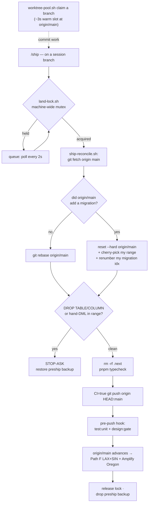

# Running unlimited parallel Claude sessions safely through worktree isolation and autonomous launch

> Pyramid-structured (Minto). Governing thought first, then the four legs that prove it,
> evidence under each. Written 2026-07-02; artifacts referenced live in this repo
> (`commands/handoff.md`, `scripts/handoff-fire.sh`) and in `~/.zshrc` / per-project scripts.

## SCQA

- **Situation** — One machine, one repo, many concurrent Claude Code sessions: a lead, Agent-Teams
  teammates, and parallel handoff tracks, spread across 4 isolated billing accounts.
- **Complication** — Concurrent sessions on ONE checkout share the git index: bare commits sweep
  another session's staged files, `cannot lock ref 'HEAD'` races, shared-file clobber (observed
  repeatedly, 2026-06-01). Opening each new session was a manual, error-prone ceremony: create a
  worktree, pick a non-saturated account, remember model/effort ladders, open a pane, paste a prompt.
  The native shortcut is broken here (`claude -w` dies on repos with a `WorktreeCreate` hook), and
  the per-account launchers are zsh functions that no script can exec directly.
- **Question** — How do we run N parallel sessions safely without the per-session manual ceremony?
- **Answer** — Isolate every WRITER session in its own worktree, and automate the entire launch —
  surface, account, model, effort, prompt — down to one script call per session.

## Governing thought

**Every concurrent writer gets its own worktree, and every session launch is one command:**
`handoff-fire.sh` opens the pane, picks the account, composes model+effort, and auto-submits the
prompt — the same lifecycle Agent Teams gives teammates, generalized to peer sessions.

## 1 · Isolation policy decides WHERE work runs — conditional, never always-on

Always-worktree taxes the 90% single-session case (cold `.next` rebuild, gitignored-state
divergence, stale litter). The rule (SSOT: `CLAUDE.md` § Concurrent Sessions, synced in this repo):

- **Single session** → repo root, default branch. No worktree.
- **Read-only sessions** (research/audit/planning writing no tracked file) → share the root freely.
  Classify by *write footprint*, not intent.
- **2+ concurrent writers** → one worktree + branch EACH. Agent-Teams teammates are already
  worktree-isolated by the harness; peer sessions get theirs from the launch tooling below.

## 2 · Launch mechanics decide HOW a session starts — type into an interactive pane, never exec

Three traps make naive automation fail, and the tooling encodes all three
(memory `reference-parallel-session-launch-playbook`, paid for on 2026-07-02):

- **Worktree acquisition prefers the WARM POOL, colds-build as fallback.** Where the repo ships
  `scripts/worktree-pool.sh` (reso does, since 2026-07-02 eve), `handoff-fire.sh --worktree <slug>`
  CLAIMS a pre-provisioned slot (~3s: node_modules, codegen, `.env.local`, seeded DB all pre-built;
  claims are slot-locked and never run `git worktree add`, keeping the historical parallel-add races
  off the hot path). Cold fallback (no pool / custom `--base` for frozen fork refs): the spawner runs
  the fast, race-prone `git worktree add` serially and leaves the ~16-19s `pnpm install` to run
  INSIDE the pane, so N parallel setups overlap — wall-clock ≈ one setup, not N. (Historical note:
  `claude -w` was broken by the repo's `WorktreeCreate` hook printing human text — FIXED 2026-07-02,
  the hook now prints a plain path and claims from the pool; the explicit-path flow here remains
  preferred because the spawner needs the path to compose the typed command.)
- **Launchers are zsh functions/aliases** (`claude-next`, `-next2/3/4`, `claude-fable*`) carrying
  per-account `CLAUDE_CONFIG_DIR` isolation — they resolve ONLY in an interactive shell. So the
  spawner types the command into a fresh iTerm2 surface via osascript `write text`; it never execs.
- **The prompt travels by file** (`launcher "$(cat /tmp/fire-<slug>.txt)"`): command-substitution
  output is never re-expanded, so payload content is injection-safe verbatim; the typed line stays
  short and single-line.

Surfaces: `--split-right` default (⌘D — same view, same profile, like a teammate pane),
`--split-down`, `--tab`, `--window`; all fall back to a fresh window when none is open.

## 3 · Routing decides WHO runs it — account by live load, model+effort by SSOT ladder

- **Account** (4 isolated accounts = 4 quota pools): explicit choice wins; else LIVE-LIMIT ranking
  via `claude-accounts --rank general|fable` (real 5h/weekly/Fable headroom + resets + live session
  spread, 90s shared cache; SSOT `~/.claude/accounts.json`, dashboard `/accounts`). Rank exit 2
  (data fine, NO account routable by policy) HALTS the fire — never fire blind; only unreadable
  limits (exit 3) degrade to the trailing-5h transcript-activity proxy. Static hint orders are
  retired — they went stale in the dangerous direction within 48h. `--probe` adds a headless
  liveness check that walks the ranking and classifies rejections (rate-limited / auth-expired /
  model-unavailable).
- **Model + effort** (SSOT: `~/.claude/model-config.yaml`): Opus 4.8 @ **max** is the default lead
  ladder (xhigh is a certified regression on grounding-heavy work); Fable 5 runs a DIFFERENT ladder —
  **high** default, xhigh capability-sensitive, medium routine, never max (over-deliberates, burns
  the window). Flags append last-wins after the launcher's injected defaults, so overrides always
  stick; Fable is window-gated (`frontier_access.active`) with the API rejection as the hard gate.

## 4 · `/handoff` fire closes the loop — readiness-gated autonomy, wave-scale by default

- **Fire is the default close of `/handoff`**, gated by READINESS not permission: no open
  discussion/question/decision → it fires; anything open → it names the blocker, holds, fires after.
  "paste only" / "hold fire" always suppresses; the paste block remains the manual fallback.
- **A single same-worktree continuation RECYCLES the current session** (`--recycle`): keystrokes
  queued into the session's own pane — `/clear`, optional `/model`+`/effort` (only when re-tiering;
  typed re-tiers mutate the account's saved defaults), then the one-line-flattened payload — execute
  in order after the closing turn ends (verified on CC 2.1.183: a queued `/clear` runs and
  later-queued lines survive it; a detached bare-Enter watchdog covers the ~1-in-6 swallowed-submit
  flake). Zero new panes, same account/worktree; the visible transcript is wiped by design.
  Multi-track waves, forks, and account switches spawn panes instead.
- **Waves are first-class**: N handoff tracks → N sessions, one script call each, fired serially
  (installs overlap in-pane). Account spread is the LEAD's job for waves — auto-ranking can't see
  sessions that haven't started yet, so rank once and assign round-robin, ≤2 tracks per account.
- **Prompt composition is positional**: `ultracode` prepended opts the receiver into Dynamic
  Workflows (prompt-level keyword); a skill-backed slash command (`/goal …`) must be the payload's
  very FIRST line — the CLI never parses it; the receiving model dispatches a leading `/x` via its
  Skill tool.
- **The emptied main session retires ITSELF** (`handoff-fire.sh self-close`): once a pane-spawn wave
  is away and exhaustively nothing remains open, it types `/exit` + an anti-strand Enter into its own
  pane foreground (queued behind the closing turn), and a detached watcher ps-polls the tty until CC
  exits, then closes the pane via the it2 shim — graceful-first (SessionEnd hooks, resumable
  transcript; 9s measured), teammate-style force only at the 180s ceiling. Constraint baked in:
  detached osascript AppleEvents to iTerm2 fail silently (3/3 observed) — keystrokes are foreground-
  only; the watcher uses only ps + the shim's websocket API. Dirty-tree and no-CC-on-tty guards.
  Never after `--recycle`.
- **Prior art**: this is the session-level analog of the Agent-Teams teammate lifecycle
  (`it2 session split -s <lead>` → `tmuxPaneId` in team config → shimmed force-close +
  checkpoint-first idle reaping). Fired sessions differ deliberately: they are PEERS on their own
  accounts — self-retired via the graceful self-close above once fully handed off (or human-closed),
  never reaped by an idle hook.

## 5 · `/ship` lands the work on the trunk — serialized, migration-safe, one gate

The mirror image of launch. Once a worktree's work is committed, `/ship` reconciles it onto
`origin/main` — the SOLE trunk, since auto-deploy ships from it — and pushes `HEAD:main`, with the
whole fetch→reconcile→gate→push folded into ONE machine-wide-locked child so the trunk cannot move
underneath the push. That fold collapses the old CAS-replay storm (N unserialized landers racing a
hot trunk, each re-running the gate) to a no-op: exactly one gate runs machine-wide per landing.

**One lock, one pusher** (`scripts/land-lock.sh`) — a machine-wide `mkdir` mutex
(`~/.reso/landing.lock.d`, pid-alive + 1200 s TTL reap) means at most one gate+push runs on the box
at a time; since only this machine pushes `origin/main`, trunk advancement is serialized and
non-fast-forwards can't happen. Kill switch `LAND_SERIALIZE=off`; every landing appends
`{ts,branch,wait_s,hold_s,exit}` to `~/.reso/land.log`.

**Migration-aware reconcile** (`scripts/ship-reconcile.sh`) is the load-bearing subtlety, and the
reason a naive rebase is unsafe: if `origin/main` added no migration a linear `git rebase` suffices,
but if it DID, a rebase would silently drop the concurrent migration through the `_journal.json`
`merge=union` driver (a production regression). So reconcile instead `reset --hard origin/main` +
cherry-picks the session's range, and the ported idx auto-resolver renumbers this branch's migration
to the next free index via `pnpm generate`. `rerere` is disabled whenever the range touches
`drizzle/` so a stale cached resolution can't be staged into a migration. Three guards STOP-ASK
rather than guess — a hand-written `-- lint:allow-dml` migration in the colliding set, a regenerated
delta containing `DROP `, or a DDL body that differs beyond its index/journal. This is the automated
form of the durable rule: **single owner per shared file, serialize migration-generating sessions.**

**One inline gate, the rest at the hook**: the wrapped pipeline runs `pnpm typecheck` only;
`test:unit` + `design:gate` (Playwright VRT + axe) live in the `pre-push` hook
(`core.hooksPath=scripts/hooks`), and the push carries `CI=true` so the gate gets CI's retry
tolerance (2 retries) instead of failing on the first timing-flake — NOT a `--no-verify` bypass; a
real regression still fails all three attempts.

**Warm pool feeds the front** (`scripts/worktree-pool.sh`): 10 pre-provisioned slots at
`~/Development/.worktrees/wt-pool-N` sit on `pool/slot-N` at `origin/main` with `node_modules`,
styled-system codegen, `.env.local`, and a seeded `sqlite.db` already built; `claim <branch>`
`git switch -C`es a slot in ~3 s (no `git worktree add` on the hot path — that races, GH #34645), and
a launchd job replenishes on a `WatchPaths` wake touched by every SessionStart / SessionEnd / claim.

**Retired local-`main` layer**: `/land`, `/deploy`, `pnpm land`, `land-to-main.sh`, `merge-to-main.sh`
are gone. Auto-deploy ships `origin/main`; concurrent sessions advance it with `HEAD:main` pushes that
never move local `main`, so landing on local `main` first just rebuilt work. Local `main` is now a
lagging ff-mirror; `origin/main` is the only push target.

**Teardown**: a rate-limited session `/exit`s and relaunches the SAME worktree on another account
(worktrees are account-agnostic, zero rework); `pnpm worktree:gc` prunes landed `backup/*` + `cc-*` +
stale teammate checkpoint refs (self-debounced ≤ 1×/day, pool slots skipped).

## Artifact map

| Concern | Artifact |
|---|---|
| Autonomous launch (spawner) | `scripts/handoff-fire.sh` (this repo; live at `~/.claude/scripts/`) |
| Handoff protocol + fire mode | `commands/handoff.md` (this repo; live at `~/.claude/commands/`) |
| Isolation rule (SSOT) | `CLAUDE.md` § Concurrent Sessions — Worktree Isolation (this repo, synced) |
| Per-account launchers | `~/.zshrc` (`claude-next*`, `claude-fable*`; not synced — contains account wiring) |
| Model/effort/window SSOT | `~/.claude/model-config.yaml` (not synced) |
| Per-repo worktree setup | `<repo>/scripts/new-worktree.sh` (repo-specific, e.g. reso) |
| Warm worktree pool (fast path) | `<repo>/scripts/worktree-pool.sh` — `claim <branch>` prints a provisioned path (repo-specific, reso) |
| Trunk landing (`/ship`) | `<repo>/.claude/commands/ship.md` + `scripts/ship-reconcile.sh` + `scripts/land-lock.sh` (repo-specific, reso) |
| Landing serializer log | `~/.reso/landing.lock.d` (machine-wide mutex) · `~/.reso/land.log` (per-landing JSON) |
| Launch traps provenance | memory `reference-parallel-session-launch-playbook` |
