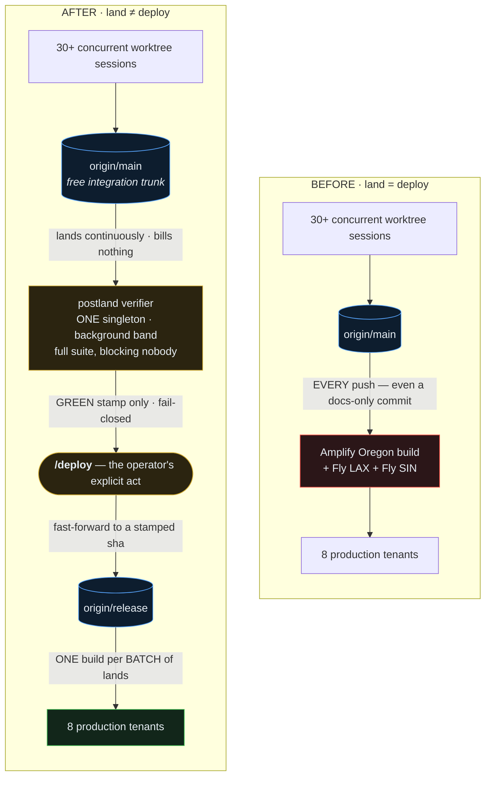
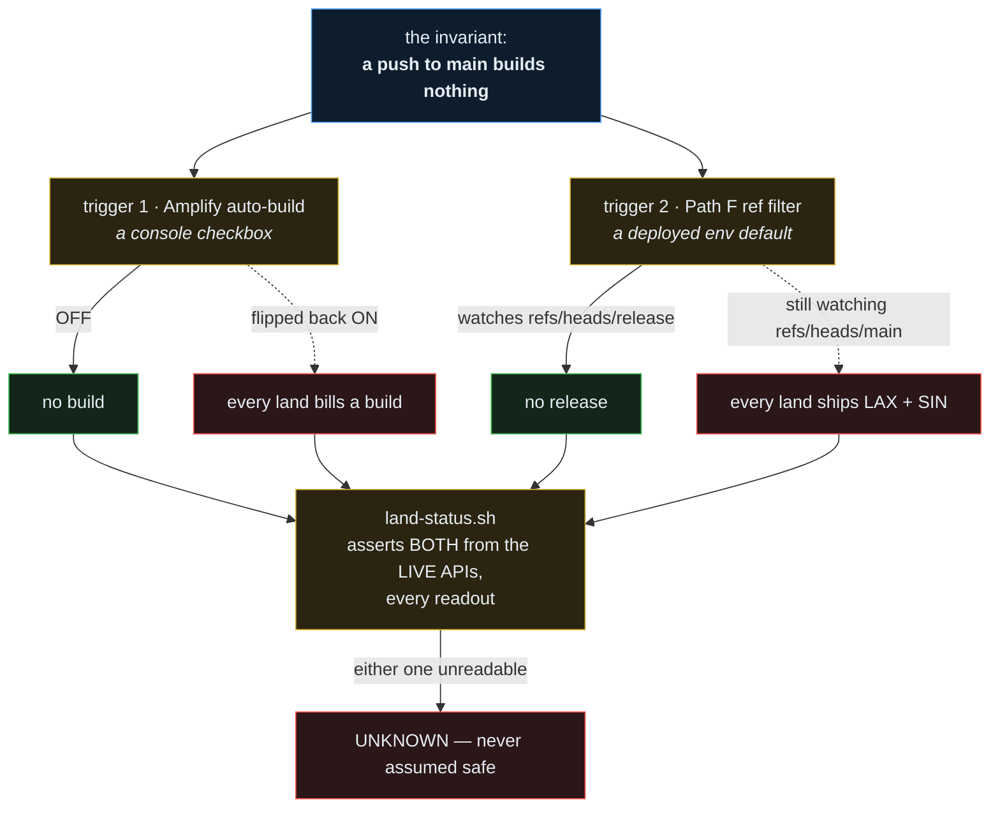
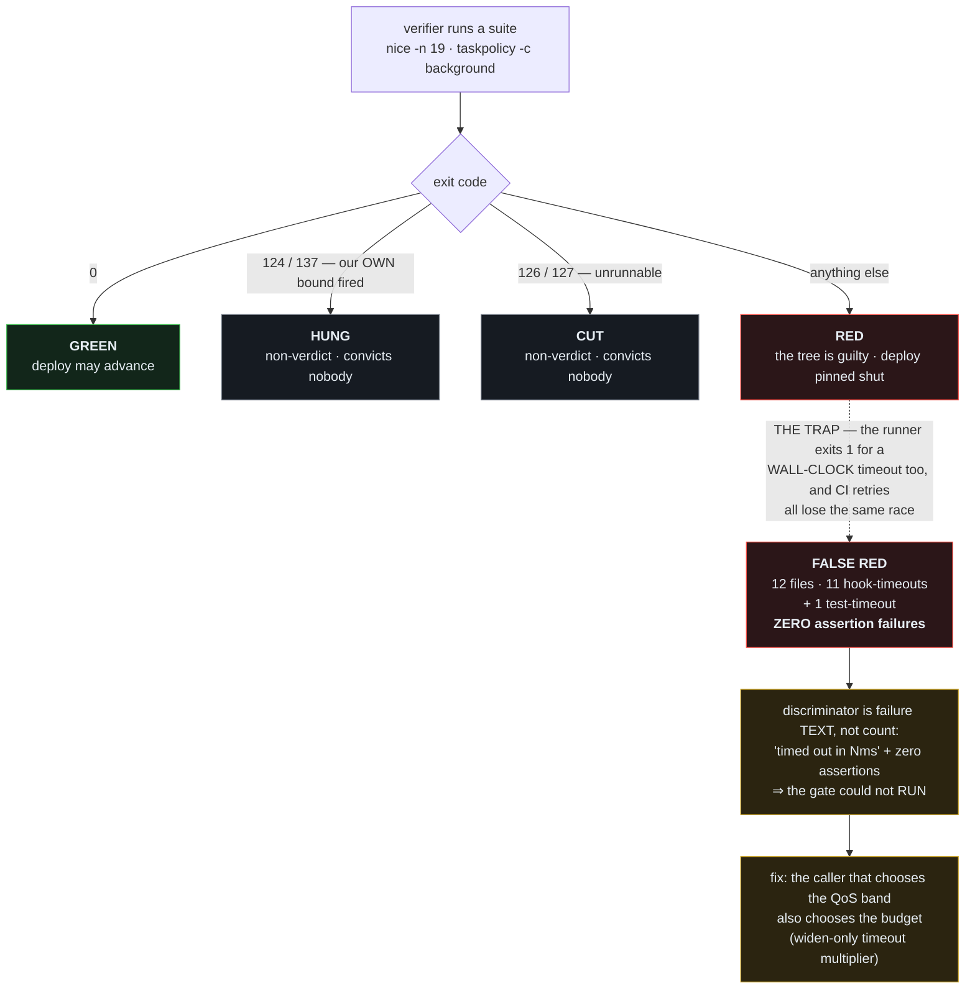

<!-- markdownlint-configure-file { "MD013": false, "MD033": false, "MD024": false, "MD041": false } -->

# DEPLOY DECOUPLING V2 — the trunk is not the deploy trigger

**The rule, in one line: if landing spends money, landing becomes rare — and every
pathology of a shared trunk follows from that, not from git.**

`LAND_PIPELINE_V2.md` (this repo, 2026-07-28) moved the *proof* off the land path: land
carries only O(diff) work, one singleton verifier proves the tip afterwards, deploy is
fail-closed on a green stamp. That is **axis 1**, and it is the harder half.

This document records **axis 2**, added by the second implementation of the pattern
(`reso-management-app`, 2026-08-02) and now proven in production: **the integration trunk
is not the deploy trigger.** Axis 2 is not a cost optimization bolted onto axis 1 — it is
what makes axis 1 *reachable* in a repo where a push bills real money.

> **No Phase 0 here, deliberately.** This is a pattern record with its implementation
> already shipped and measured elsewhere, not an implementation plan — there are no
> code-writing tasks to orchestrate. The build log lives in
> `reso-management-app/docs/plans/LAND_SHIP_V2.md`.

---

## §1 The inversion

<!-- Diagram source: assets/diagrams/deploy-trigger-decoupling.mmd — edit it, run `npm run diagrams`, commit the regenerated SVGs. -->
<picture>
  <source media="(prefers-color-scheme: dark)" srcset="../../assets/diagrams/deploy-trigger-decoupling-dark.svg">
  
</picture>

Interactive Diagram

<!-- mermaid-fence: assets/diagrams/deploy-trigger-decoupling.mmd (auto-synced by `npm run diagrams`) -->

<a href="../../assets/diagrams/deploy-trigger-decoupling-dark.svg?raw=true">full-screen dark</a> · <a href="../../assets/diagrams/deploy-trigger-decoupling-light.svg?raw=true">light</a> · <a href="../../assets/diagrams/deploy-trigger-decoupling.mmd">source</a>

`/ship` used to be **one atomic act that meant two different things**: *integrate my work
with everyone else's* (cheap, should be constant, is a durability act) and *update
production for paying users* (expensive, risky, should be deliberate). Because act 2 costs
money, the operator correctly gated the whole command — and gating act 2 gated act 1.

The measured consequence in reso before the cutover: **1,811 commits across 168 branches
that existed on exactly one Mac's disk**, 176 branches diverged from trunk, and a
**50.2% first-attempt land success rate** over 277 attempts. None of that is a merge
problem. Merge-conflict probability is a function of *divergence time*, and divergence
time was being set by a cost gate that has nothing to do with merging.

So the causal chain runs the other way from how it looks:

> Landing stops costing money ⇒ the reason to gate `/ship` evaporates ⇒ agents land
> continuously ⇒ branches stay 0–3 commits from trunk ⇒ **the merge-conflict class
> collapses on its own.**

And production safety goes **up**, not down. Before: production received whatever was
pushed, gated only by a local pre-push hook that could be flaky, skipped, or SIGPIPE'd.
After: production advances only to a sha a singleton verifier stamped green, fail-closed.

---

## §2 The invariant has N triggers — assert all of them

<!-- Diagram source: assets/diagrams/two-trigger-invariant.mmd — edit it, run `npm run diagrams`, commit the regenerated SVGs. -->
<picture>
  <source media="(prefers-color-scheme: dark)" srcset="../../assets/diagrams/two-trigger-invariant-dark.svg">
  
</picture>

Interactive Diagram

<!-- mermaid-fence: assets/diagrams/two-trigger-invariant.mmd (auto-synced by `npm run diagrams`) -->

<a href="../../assets/diagrams/two-trigger-invariant-dark.svg?raw=true">full-screen dark</a> · <a href="../../assets/diagrams/two-trigger-invariant-light.svg?raw=true">light</a> · <a href="../../assets/diagrams/two-trigger-invariant.mmd">source</a>

**The expensive failure is the half-cutover, and it is quiet.** reso cut Amplify over and
not Fly. The Amplify assertion went green, the docs asserted the finished state — and
`reso-lax`/`reso-sin` took **13 production releases in 24 hours**, the last four fired by
**documentation-only commits**. Neither half was visible from the other, so one ✓ was not
merely incomplete, it was *actively misleading*.

Three rules follow, and they generalize past deploys to any multi-mechanism invariant:

1. **Enumerate the triggers, then assert every one from the live API.** A cutover with N
   triggers and one assertion reports success at 1/N done.
2. **A setting someone can flip back is not an invariant, it is a hope.** Amplify
   auto-build is a console checkbox; the Path F ref is a deployed default. Both are
   asserted every readout, and a broken one carries its own fix command.
3. **Unreadable is UNKNOWN, never "assumed safe."** Absence-is-loud applies to a *setting*
   exactly as it applies to a stamp.

Make the remote state self-reporting where you can. reso's runner exposes its watched ref
on an unauthenticated `/health`, so the assertion is one `curl` with no credentials — and
the endpoint and the filter read from **one function**, because two independent readers of
the same setting agree on the default and diverge only once someone rolls back, i.e.
during the incident.

**Verify the alarm as a live positive control.** reso's Path F assertion read RED against
real production before the deploy and green after, in the same readout on the same run.
An alarm never seen to fire is not evidence of health.

---

## §3 A scheduling decision is a timeout decision

<!-- Diagram source: assets/diagrams/verdict-vocabulary.mmd — edit it, run `npm run diagrams`, commit the regenerated SVGs. -->
<picture>
  <source media="(prefers-color-scheme: dark)" srcset="../../assets/diagrams/verdict-vocabulary-dark.svg">
  
</picture>

Interactive Diagram

<!-- mermaid-fence: assets/diagrams/verdict-vocabulary.mmd (auto-synced by `npm run diagrams`) -->

<a href="../../assets/diagrams/verdict-vocabulary-dark.svg?raw=true">full-screen dark</a> · <a href="../../assets/diagrams/verdict-vocabulary-light.svg?raw=true">light</a> · <a href="../../assets/diagrams/verdict-vocabulary.mmd">source</a>

`LAND_PIPELINE_V2.md` R7 says *a non-verdict is never a RED*. reso implemented it against
**exit codes** — and it walked straight back in through the **scheduler**.

The verifier runs under `nice -n 19` + `taskpolicy -c background`, deliberately the lowest
band on the box, so it can never block a colleague (R8). But **vitest's per-test and
per-hook budgets are wall clock.** Deprioritising a process whose deadlines are wall-clock
does not slow it gracefully — it *fails* it, and the more loaded the box, the more likely
an innocent tree is convicted.

reso's first real verifier run stamped the trunk **RED** on a tree that is 2,122/2,122
green at normal priority. Both individually-correct decisions; the seam between them
belonged to neither.

**The transferable rule:** *whenever you deprioritise a process — `nice`, `taskpolicy`,
cgroups, a cheaper CI runner class — you have implicitly re-specified every wall-clock
timeout inside it.* The caller that picks the band must also pick the budget. Make the
multiplier **widen-only** (`Math.max(1, …)`), so an outside caller can never tighten a
calibrated budget into flakiness.

**And a fail-closed verdict must carry its evidence.** reso's verifier sent all suite
output to `/dev/null`, so a RED that pinned the deploy shut had no recoverable reason —
the cheapest route to the truth was re-creating the whole cell by hand. **No-verdict says
"unknown"; evidence-free-RED says "guilty" and destroys the appeal.** Persist the output,
carry its path in the stamp, and print it at the moment the verdict is announced.

---

## §4 What transfers, and what does not

| | transfers | notes |
| --- | --- | --- |
| trunk ≠ deploy trigger | **yes, wherever a push bills** | claude-infrastructure's "deploy" is a symlink refresh — near-free — so axis 2 buys it little. The pattern is for repos with paid build/deploy on push. |
| assert every trigger of an invariant from the live API | **yes, universally** | already the shape of this repo's `deploy-parity` and launchctl self-verify checks |
| band-and-budget chosen together | **yes, universally** | this repo's verifier uses the same band (`postland-verify.sh:185-193`), but bats has **no per-test deadline**, so the framework-level bug cannot occur here. Our version is the **16 of 269 `tests/*.bats` files that hardcode a `timeout N`, shortest 2-3s** — recorded, not yet observed failing |
| evidence travels with a fail-closed verdict | **yes, universally** | check any stamp emitter that discards subprocess output |
| operator-gated deploy | **repo-specific** | reso keeps `/deploy` manual (door staff mid-shift). This repo auto-deploys on green. |

**Deploy cadence stays a values call, not an architecture one.** reso rejected
auto-deploy-on-green: build count would climb back toward commit volume, and production
would move while door staff are mid-shift without anyone choosing it. The architecture
supports either; pick per repo.

---

## §5 Proof (reso, 2026-08-02 — disk truth, not narration)

| # | Criterion | Result |
| --- | --- | --- |
| A5 | a land fires **zero** builds and **zero** releases | ✅ landed `6c39f09a7`; Amplify stayed at job `1456`; both tenants still reported `deployedCommit cbb3317` |
| — | both halves of the invariant assert green from the live APIs | ✅ `land-status.sh` — Amplify auto-build OFF, Path F watching `refs/heads/release` |
| — | the trigger alarm is a true positive control | ✅ read RED against real production pre-deploy, green post-deploy, same readout |
| — | the QoS timeout fix, controlled comparison | ✅ same cell, same band, load 19–23.6: **12 files failed → 188/188 files, 2,125/2,125 tests, zero timeouts** |

Read the deployed sha from the app's **public health endpoint**, not from
`flyctl releases` / the platform API: no credentials, and it reports what is actually
*serving* rather than what was last released.

**One operator note worth carrying:** an agent could observe Fly throughout but could not
deploy it — the permission classifier refuses production deploys, independent of
credentials. Where that matters, grant a **narrow** allow rule anchored to the one gated
script, never a broad `<tool> deploy:*`.

---

## Cross-references

- `docs/plans/LAND_PIPELINE_V2.md` — axis 1, this repo's own landing architecture (the exemplar)
- `reso-management-app/docs/plans/LAND_SHIP_V2.md` — the full axis-2 design, build log, and activation record
- `docs/plans/DEPLOY_GATE_CONVERGENCE.md`, `docs/plans/SHIP_LAND_HARDENING_PLAN.md` — the safety rails both inherit

## Learnings (accumulate; never delete)

- 2026-08-02: the frozen-DoD framing that unlocked axis 2 was refusing to treat "land" and
  "ship" as one verb. Every prior attempt optimized the *coupled* pipeline and therefore
  had to buy back, with machinery, a landing frequency the coupling had taken away.
- 2026-08-02: **a requirement can re-enter through a layer it never names.** R7 was written
  about gates, implemented against exit codes, and returned via the scheduler. When a
  requirement is implemented, ask which *other* layers can produce the same symptom.
- 2026-08-02: **half-cutovers are the expensive state and they are silent** — the finished
  half reports ✓ and the repo's own docs assert completion. Any cutover with N triggers
  needs a readout that reads all N.
- 2026-08-02: **an untested rollback lever is one you discover during the incident.** The
  test worth writing was not "does the override work" but "does it *switch* rather than
  *widen*" — a widened filter passes the naive test while leaving every land deploying.
